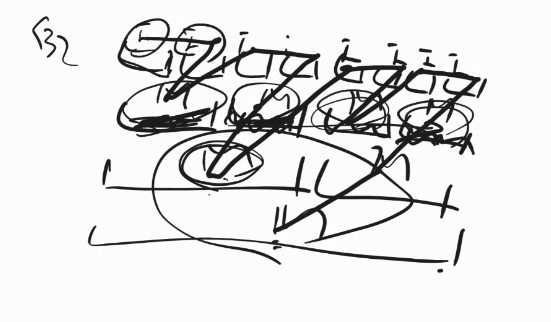
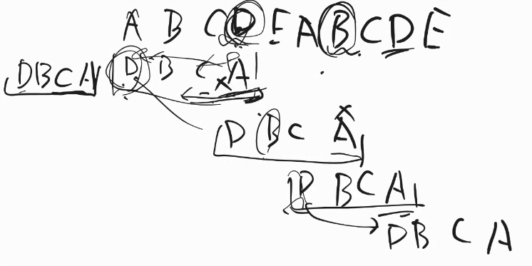

https://dl.acm.org/doi/pdf/10.1145/3664191 のp88-90前半


# データ構造
データの入れ物の作り方
過去の賢い人たちが考えた便利な入れ物
ここにあるもので3階建ての家は建てられるが、東京タワー建てるにはとくちゅな道具がいるかも。
もめり食うけど、速い、とかたまに見つけてないのに見つけたって言っちゃうけど、速い、みたいなものはある
ref ブルームフィルター、スキップテーブル


# わかってないこと
- dfsやbfsはO(N+M)では？O(logbN)と書いてあるのは何？
    - いく先候補としてリストに追加(辺の数N)、もう行ったよとしてリストから削除(ノードの数M)
- 辞書やsetをハッシュテーブル以外の木などで実装する方法
- なぜhashの衝突対策のchainは連結リストでやるのか。普通の配列ではダメなのか

    - ~~→削除するときにO(1)で消せる。(+Pythonは違うけど)配列は固定サイズのメモリを確保して作る言語もあるので勿体無い。~~
    - メモリがもったいないから。削除するときは、リストだけど順番に関係ないから、実は消したところ埋めたりすれば良いから、そこまで困らない。
- ヒープや赤黒などの木、ハッシュテーブルの実装をそらで。
    - 一度手を動かした方が良さそう。赤黒木は一回書いてみるでよい。(空でかける必要はない)
- (要復習)リスト表現と行列表現の効率の話
- (要復習)AVL木の操作
- ベルマンフォード法の計算量がなぜ(nm)なのか。(頂点数n、変数m)。つまり、なぜn回のループで終わることがわかっているのか。
- ダイクストラ法の計算量
- (復習)隣接リストとかの表現方法→これもleetcode通して


## Abstract Data Type

抽象的なもの。銀行的な感じ。お金預けることと引き出すことができることはみんな知ってるけど、中身は知らない。


Abstract Data Type (ADT、抽象データ型)は、データとそのデータに対する操作を一つの単位として定義したものです。ADTの主な特徴と利点は以下の通りです：

## 基本概念

**データ抽象化**
ADTは、データの内部構造や実装の詳細を隠し、データを操作するためのインターフェースのみを公開します[1]。

**インターフェース**
ADTは、データ型が提供する操作の集合を定義します。これにより、ユーザーは実装の詳細を知らなくても、データ型を使用できます[1]。

**カプセル化**
データとその操作を一つの単位にまとめ、外部から直接アクセスできないようにします。これにより、データの整合性と安全性が保たれます[1]。

## 利点

**モジュール性の向上**
ADTは、データとその操作を一つのモジュールにまとめるため、コードのモジュール性が向上します[1]。

**再利用性の向上**
ADTは汎用的な操作を定義するため、異なるプログラムやプロジェクトで再利用しやすくなります[1]。

**実装の隠蔽**
ADTは実装の詳細を隠すため、内部の実装を変更してもインターフェースを使用するコードに影響を与えません[2]。

## 例

スタックを例に取ると、ADTとしてのスタックは以下のような操作を定義します：

- push: データをスタックに追加
- pop: スタックの一番上のデータを取り出す
- peek: スタックの一番上のデータを参照する（取り出さない）

これらの操作を使用することで、スタックの内部実装（配列や連結リストなど）を知らなくても、スタックを操作できます[3]。

ADTを使用することで、プログラムの構造化、保守性の向上、そしてより安全なデータ操作が可能になります。

Citations:
[1] https://www.sitc.ac/kanren/tyusyodetagata_toha.htm
[2] https://ja.wikipedia.org/wiki/%E6%8A%BD%E8%B1%A1%E3%83%87%E3%83%BC%E3%82%BF%E5%9E%8B
[3] https://e-words.jp/w/%E6%8A%BD%E8%B1%A1%E3%83%87%E3%83%BC%E3%82%BF%E5%9E%8B.html
[4] https://nous.web.nitech.ac.jp/individual/inuzuka/lecture/PLT/PLT07/PLT4-4up.pdf
[5] https://karino2.github.io/2022/07/28/abstract_data_type.html
[6] https://java2005.cis.k.hosei.ac.jp/materials/lecture15/adt.html
[7] https://www.ibm.com/docs/ja/z-netview/6.4.0?topic=types-abstract-data-type-reference
[8] https://www.nc.ii.konan-u.ac.jp/members/kamada/old/scheme_web/sexpr_app.html


ADT/データ構造
a.
- 定義
- プロパティ
- 具体の実装方法
- ADT操作にどんなものがあるか
b.
- ADT操作がどんな変形を起こすのか、step bystepで説明

アルゴリズム
    どうオペレーションされるか説明し、典型的な例を実装


## 1-a:Dictionary operations (insert, delete, find)
Dictionary (辞書) ADTの主要な操作について説明します。

    ## a. 定義、プロパティ、実装、ADT操作

    **定義**
    Dictionaryは、キーと値のペアを格納するデータ構造です。各キーは一意であり、対応する値にアクセスするために使用されます。

    **プロパティ**
    - キーと値のペアを格納
    - キーは一意
    - 高速な検索、挿入、削除が可能

    **具体の実装方法**
    - ハッシュテーブル
    - 平衡二分探索木（例：Red-Black木、AVL木）
    - 連想配列

    **ADT操作**
    1. insert(key, value): キーと値のペアを挿入
    2. delete(key): 指定されたキーとその値を削除
    3. find(key): 指定されたキーに対応する値を検索
    4. clear(): 全ての要素を削除
    5. size(): 要素数を返す

    ## b. ADT操作の変形プロセス

    **insert(key, value)操作**

    1. キーのハッシュ値を計算
    2. ハッシュ値に基づいて格納位置を決定
    3. 衝突がある場合は解決方法（チェイニングやオープンアドレス法）を適用
    4. キーと値のペアを格納

    **delete(key)操作**

    1. キーのハッシュ値を計算
    2. 該当する格納位置を特定
    3. キーと値のペアを削除
    4. 必要に応じて、データ構造を再調整（例：チェイニングの場合、リンクを更新）

    **find(key)操作**

    1. キーのハッシュ値を計算
    2. 該当する格納位置を特定
    3. キーが一致する要素を探索
    4. 見つかった場合は値を返し、見つからない場合はnullまたは例外を返す

    これらの操作は、ハッシュテーブルを使用した実装の場合、平均的にO(1)の時間複雑度で実行できます[1][3]。ただし、最悪の場合（多数の衝突が発生する場合）はO(n)になる可能性があります。

    平衡二分探索木を使用した実装の場合、これらの操作はO(log n)の時間複雑度で実行されます[5]。

    Citations:
    [1] https://opendsa-server.cs.vt.edu/OpenDSA/Books/CS3/html/Dictionary.html
    [2] https://www.javatpoint.com/dictionary-data-structure
    [3] https://www.geeksforgeeks.org/design-a-data-structure-that-supports-insert-delete-search-and-getrandom-in-constant-time/
    [4] https://stackoverflow.com/questions/60446154/python-dictionary-insertion-and-deletion
    [5] https://courses.cs.washington.edu/courses/cse373/15au/lecture4.pdf
    [6] https://xlinux.nist.gov/dads/HTML/dictionary.html
    [7] https://docs.python.org/zh-cn/3.12/tutorial/datastructures.html
    [8] https://nous.web.nitech.ac.jp/individual/inuzuka/lecture/PLT/PLT07/PLT4-4up.pdf


# Array
- 配列には同じ型の要素を入れる。文字列と数字を混ぜたりしない。(引き出しに何を入れるか。)
- 文字列も配列。文字の配列
- １byteは7だったり９だったりしたマシンもあったが、いろいろあって8が残った?
- 理論的裏付けはないが、今の常識的に8
- 32bitマシン
    addとかの引数に渡せる数が32bitのコンピューター
    昔は8bitを何個も組み合わせて頑張って32bitの計算をしていたりした
データのサイズによって、こんな感じに並べる
    

2種類の持ち方
    
    上の方が効率が良い(基本的にはこちらでデータをおく)
    したはメモリからとってくる作業が2回になったり、メモリが近い方がとってきやすい的な話にも反する
    下は、一個目の配列と二個目の配列の長さが違くてもアクセスできる(が、別にやりたいわけではない)
        →文字列は長さ違うからこう言うことする
        
        
    言語によって並べ方は違うが、二つのやり方があることを覚えておく。

配列オブジェクト(dynamic array)
    
    
    
    普通の配列(よりコンピュータの仕組みに近い)だと、入れすぎてメモリが足りないって困る。だから、このよりリッチな配列を作った。これならメモリ足りないかどうかを心配せずに、入れたりできる。
    サイズは増えたら基本増えっぱなし。中身が減ってもcapacityが減ることはない。
    オブジェクトという構造体でまとめてる

計算量
    サイズとキャパシティが一致しているかによって計算量が違う
    いっぱいだったら、全部一個ずつコピーして2倍のサイズのリストにお引越しする必要あるのでO(n)かかる
    
    キャパシティの増やし方が一個ずつじゃなくて、2倍ずつなのは、いっぱいの時の全コピーが発生する頻度を抑えるため。
    
    コピーの回数とキャパシティーが同じくらいの数になる。
    
    一瞬はO(n)かかるけど、コピーしなきゃいけないのは時々しか発生しないから、平均するとO(1)
    償却(amortized)定数という
    40万のpcを4年使うから、今年は10マンだけ使ったことにしよう
    sizeとcapacityが同じ時だけ、capacityを買ってくる(コピーする)コストが数年に一度発生する、みたいなイメージ
    EBITDAのAはamortixed
    まとめ:はじめとか真ん中に足すのはコストかかるが、最後だったら平均1でいける


    find:1って入ってる?pythonでいうところのin
    


    ## a. 定義、プロパティ、実装、ADT操作

    **定義**
    配列は、同じデータ型の要素を連続したメモリ領域に格納するデータ構造です。各要素は整数のインデックスでアクセスできます[1]。

    **プロパティ**
    - 固定サイズ（多くの言語では）
    - インデックスは0から始まる
    - 連続したメモリ領域に格納
    - 要素への直接アクセスが可能

    **具体の実装方法**
    - 静的配列：コンパイル時にサイズが決定
    - 動的配列：実行時にサイズを変更可能

    **ADT操作**
    1. Traverse（走査）：全要素の表示
    2. Insert（挿入）：指定インデックスに要素を追加
    3. Delete（削除）：指定インデックスの要素を削除
    4. Search（検索）：指定値または指定インデックスの要素を探索
    5. Update（更新）：指定インデックスの要素を更新
    6. Display（表示）：配列の内容を表示[1]

    ## b. ADT操作の変形プロセス

    **Insert操作**
    1. 挿入位置を決定
    2. 挿入位置以降の要素を1つ後ろにシフト
    3. 指定位置に新しい要素を挿入
    4. 配列の長さを1増加[2]

    **Delete操作**
    1. 削除する要素の位置を特定
    2. 削除位置以降の要素を1つ前にシフト
    3. 配列の長さを1減少[1]

    **Search操作**
    1. インデックス0から順に各要素を確認
    2. 目的の要素が見つかればその位置を返す
    3. 見つからない場合は適切な値（例：-1）を返す[1]

    **Traverse操作**
    1. インデックス0から配列の長さまでループ
    2. 各要素にアクセスして処理（例：表示）[1]

    これらの操作により、配列の内容が変更され、データ構造全体が変形します。挿入と削除操作は特に、要素のシフトを伴うため、配列の構造に大きな影響を与えます。

    Citations:
    [1] https://www.tutorialspoint.com/data_structures_algorithms/array_data_structure.htm
    [2] https://dotnettutorials.net/lesson/array-abstract-data-type-in-c/
    [3] https://www.geeksforgeeks.org/abstract-data-types/
    [4] https://brilliant.org/wiki/arrays-adt/
    [5] https://nitinranganath.gitbook.io/data-structures/arrays/array-adt
    [6] https://opendsa-server.cs.vt.edu/OpenDSA/Books/CS3/html/Dictionary.html
    [7] https://www.javatpoint.com/dictionary-data-structure
    [8] https://stackoverflow.com/questions/61569478/print-numeric-and-non-numeric-in-java

# Records、Structs、Tuples、Objects
Records、Structs(構造体)はここでは同じ意味
昔の言語ではこういう構造体をrecordと呼んでいた(fortranとか)でも最近はrecordを別の意味で使う。
変更不可能なデータみたいな意味で最近は使う


Structに加えて、操作を加えたものをオブジェクトということが多い


関数ポインタを使って、メソッドとかを持つ。(関数ポインタを使わない方法もある)。
構造体の中にfという関数ポインタを持つ。この関数はここにあるよ。というのが関数ポインタ。


structだけ作っておいて、外から関数を噛ませても良いし、内部的に関数を持たせても良い。


loadするときは、32bitloadしろ、みたいになってるから、始まりのアドレスを渡せば、欲しいところまで取れる。


Tuple
いろんなデータを組み合わせる(配列と違って、(1,"bob")とか形月ものも入れる)
名前がないことが多い
要素が2つのタプルを2タプル、nはnタプル
順番に意味がある
わざわざ名前をつけるほどの意味がない自明なペア
構造体使った方が、要素が何なのかわかりやすいので良いコードになる


    Records、Structs、Tuples、Objectsは、データをグループ化して扱うための異なるデータ構造です。それぞれの特徴を説明します。

    ## Records & Structs

    Recordsとstructsは非常に似ており、名前付きのフィールドを持つデータ構造です。

    - 固定数のフィールドを持ちます
    - 各フィールドに名前をつけることができます
    - フィールドは異なる型を持つことができます
    - 通常イミュータブル(変更不可)です

    例えば、JavaScriptでは以下のようにRecordを定義できます:

    ```javascript
    const person = #{
    name: "Alice",
    age: 30,
    city: "New York"
    };
    ```

    ## Tuples

    Tupleは順序付けられた要素の集合です。

    - 固定長の配列のようなものです
    - 要素にはインデックスでアクセスします
    - 通常イミュータブルです
    - 異なる型の要素を含むことができます

    Pythonでのタプルの例:

    ```python
    person = ("Alice", 30, "New York")
    ```

    ## Objects

    Objectsは最も柔軟なデータ構造です。

    - 動的にプロパティを追加・削除できます
    - メソッドを持つことができます
    - 継承やカプセル化などのOOP概念をサポートします
    - 通常ミュータブル(変更可能)です

    JavaScriptでのオブジェクトの例:

    ```javascript
    const person = {
    name: "Alice",
    age: 30,
    greet() {
        console.log(`Hello, I'm ${this.name}`);
    }
    };
    ```

    ## 比較

    | 特徴 | Records/Structs | Tuples | Objects |
    |------|-----------------|--------|---------|
    | 名前付きフィールド | ✓ | ✗ | ✓ |
    | イミュータブル | 通常 ✓ | ✓ | ✗ |
    | 動的プロパティ追加 | ✗ | ✗ | ✓ |
    | メソッド | ✗ | ✗ | ✓ |

    Records/Structsは単純なデータのグループ化に適しており、Tuplesは順序が重要な場合に使用されます。Objectsは最も柔軟で、複雑なデータと振る舞いを組み合わせる必要がある場合に適しています[1][2].

    Citations:
    [1] https://www.wantedly.com/companies/wantedly/post_articles/511889
    [2] https://zenn.dev/pixiv/articles/f07f48139d9ba1
    [3] https://magazine.techacademy.jp/magazine/21230
    [4] https://docs.python.org/ja/3/c-api/tuple.html
    [5] https://dbader.org/blog/records-structs-and-data-transfer-objects-in-python
    [6] https://zenn.dev/uttk/articles/bd264fa884e026
    [7] https://qiita.com/kaitolucifer/items/926ed9bc08426ad8e835
    [8] https://docs.python.org/ja/3.10/c-api/tuple.html

    Records/Structs/Tuples と Objects に関する情報を以下にまとめます。

    ## a. 定義、プロパティ、実装、ADT操作

    **定義**
    - Record/Struct: 異なるデータ型の要素をまとめた複合データ型
    - Tuple: 順序付けられた不変の要素の集合
    - Object: データと関連するメソッドをカプセル化した構造

    **プロパティ**
    - Record/Struct: 名前付きフィールドを持つ
    - Tuple: インデックスでアクセス可能、不変
    - Object: プロパティとメソッドを持つ、カプセル化、継承可能

    **具体の実装方法**
    - Record/Struct: 連続したメモリ領域に各フィールドを配置
    - Tuple: 固定長の配列として実装
    - Object: クラス定義に基づくインスタンス生成

    **ADT操作**
    1. create(): 新しいインスタンスを作成
    2. get(field): 特定のフィールド/要素の値を取得
    3. set(field, value): フィールドの値を設定（Tupleを除く）
    4. equals(other): 他のインスタンスと比較
    5. copy(): 深いコピーを作成

    ## b. ADT操作の変形プロセス

    **create()操作**
    1. メモリを確保
    2. 各フィールド/要素の初期化
    3. 必要に応じてコンストラクタを呼び出す

    **get(field)操作**
    1. フィールド名またはインデックスの有効性を確認
    2. 対応するメモリ位置にアクセス
    3. 値を返す

    **set(field, value)操作** (Tupleを除く)
    1. フィールド名の有効性を確認
    2. 対応するメモリ位置に新しい値を書き込む

    **equals(other)操作**
    1. 型の一致を確認
    2. 各フィールド/要素を順に比較
    3. すべて一致すればtrueを返す、それ以外はfalse

    **copy()操作**
    1. 新しいメモリ領域を確保
    2. 元のインスタンスの各フィールド/要素を深くコピー
    3. 新しいインスタンスを返す

    これらの操作により、データ構造の内容が変更されたり、新しいインスタンスが生成されたりします。特にObjectsの場合、メソッド呼び出しによって内部状態が複雑に変化する可能性があります。Tupleは不変なので、set操作は許可されず、新しいインスタンスの作成が必要になります。

    Citations:
    [1] https://tc39.es/proposal-record-tuple/
    [2] https://github.com/tc39/proposal-record-tuple?tab=readme-ov-file
    [3] https://www.eecs.yorku.ca/course_archive/2016-17/F/3311/examples/07-TupleADT.pdf
    [4] https://realpython.com/python-data-structures/
    [5] https://www.savemyexams.com/a-level/computer-science/ocr/17/revision-notes/4-data-types-data-structures-and-algorithms/4-2-data-structures/records-lists-and-tuples/
    [6] https://en.wikipedia.org/wiki/Algebraic_data_type
    [7] https://www.geeksforgeeks.org/abstract-data-types/
    [8] https://opendsa-server.cs.vt.edu/OpenDSA/Books/CS3/html/Dictionary.html

# Linked List

ポインタはNodeの番地を持っている


delete middleのthisが大変なのは、手前のやつ(previous)を見つけるのがSingleだと先頭から全部見るしかないのでO(n)
find nthがO(n)かかるのが配列との大きな違い。あと、最初とか途中に足すのがリストだとみんな引越しだけど、こっちは発生しない。


Doubleとsingleの差がdeleteの差分だけでなら、double使った方が良さそうで実際そうだが、singleなら、下記みたいに再利用しながら先頭にパッと足せる見たいなケースも一応あることを頭の片隅に置いておくと良い。関数型。


Linkedlistは後から一つ足したり削ったりが得意。listはn番目だーれが得意。


Linked listsの主な種類について説明します。

    ## Single vs Double Linked Lists

    **Single Linked List (単方向リスト)**
    - 各ノードがデータと次のノードへの参照を持つ
    - 一方向のみの走査が可能
    - メモリ使用量が少ない
    - 実装がシンプル

    **Double Linked List (双方向リスト)**
    - 各ノードがデータと前後のノードへの参照を持つ
    - 双方向の走査が可能
    - メモリ使用量が多い
    - 実装がやや複雑だが、柔軟性が高い

    ## Linear vs Circular Linked Lists

    **Linear Linked List (線形リスト)**
    - 最後のノードがnullを指す
    - 明確な始点と終点がある

    **Circular Linked List (循環リスト)**
    - 最後のノードが最初のノードを指す
    - 単方向または双方向の循環リストが可能
    - 明確な終点がなく、連続的な走査が可能

    ## 主な特徴と比較

    1. 走査:
    - 単方向リスト: 前方のみ
    - 双方向リスト: 前後両方向
    - 循環リスト: 連続的な走査が可能

    2. メモリ使用:
    - 単方向リスト < 双方向リスト

    3. 操作の複雑さ:
    - 挿入/削除: 双方向リストの方が効率的（O(1)）
    - 逆順走査: 双方向リストの方が効率的

    4. 用途:
    - 単方向リスト: スタック、キューの実装
    - 双方向リスト: 複雑なデータ構造（ヒープ、二分木など）の実装
    - 循環リスト: バッファ、スケジューリングアルゴリズムなど

    5. 実装の複雑さ:
    単方向リスト < 循環リスト < 双方向リスト

    これらの特性を考慮し、具体的な要件や制約に応じて適切なリスト構造を選択することが重要です。

    Citations:
    [1] https://testbook.com/key-differences/difference-between-singly-linked-list-doubly-linked-list
    [2] https://byjus.com/gate/difference-between-singly-linked-list-doubly-linked-list/
    [3] https://www.javatpoint.com/singly-linked-list-vs-doubly-linked-list
    [4] https://www.geeksforgeeks.org/difference-between-singly-linked-list-and-doubly-linked-list/
    [5] https://www.scaler.in/difference-between-singly-and-doubly-linked-list/
    [6] https://www.shiksha.com/online-courses/articles/difference-between-singly-and-doubly-linked-list-blogId-158227
    [7] https://www.geeksforgeeks.org/when-is-doubly-linked-list-more-efficient-than-singly-linked-list/
    [8] https://www.reddit.com/r/learnprogramming/comments/yh3c4d/singly_linked_list_vs_doubly_linked_list/

# Stacks


    Stacksに関する情報を以下にまとめます。

    ## a. 定義、プロパティ、実装、ADT操作

    **定義**
    Stackは、Last-In-First-Out (LIFO) の原則に従ってデータを格納および取り出す線形データ構造です[1][5]。

    **プロパティ**
    - LIFO (Last-In-First-Out) 原則
    - 一端（トップ）でのみ操作が可能
    - 要素の挿入と削除が常にO(1)の時間複雑度

    **具体の実装方法**
    1. 配列ベース：固定サイズの配列を使用[1][4]
    2. 連結リストベース：動的なサイズ変更が可能[6]

    **ADT操作**
    1. push(item): スタックの上部に要素を追加[1][5]
    2. pop(): スタックの上部から要素を削除して返す[1][5]
    3. peek() / top(): スタックの上部の要素を返す（削除せず）[1][5]
    4. isEmpty(): スタックが空かどうかを確認[1][5]
    5. size(): スタック内の要素数を返す[1][5]

    ## b. ADT操作の変形プロセス

    **push(item)操作**
    1. スタックが満杯でないか確認（配列実装の場合）
    2. トップポインタをインクリメント
    3. 新しい要素をトップ位置に追加[1][4]

    **pop()操作**
    1. スタックが空でないか確認
    2. トップ要素を取得
    3. トップポインタをデクリメント
    4. 取得した要素を返す[1][4]

    **peek() / top()操作**
    1. スタックが空でないか確認
    2. トップ要素を返す（スタックの状態は変更しない）[5]

    **isEmpty()操作**
    1. トップポインタが初期位置（通常は-1）かどうかを確認
    2. 結果をブール値で返す[5]

    **size()操作**
    1. トップポインタの値+1を返す（配列実装の場合）
    2. または、別途サイズカウンタを維持して返す[5]

    これらの操作により、スタックのデータ構造が変形されます。push操作はスタックのサイズを増加させ、pop操作はサイズを減少させます。peek、isEmpty、size操作はスタックの構造を変更せず、情報の取得のみを行います。

    スタックは、関数呼び出し、式の評価、ブラウザの履歴管理など、多くのアプリケーションで使用される重要なデータ構造です[4][6]。

    Citations:
    [1] https://www.tutorialspoint.com/data_structures_algorithms/stack_algorithm.htm
    [2] https://ebooks.inflibnet.ac.in/csp01/chapter/stack-adt/
    [3] https://eng.libretexts.org/Bookshelves/Computer_Science/Programming_Languages/Java_Java_Java_-_Object-Oriented_Programming_(Morelli_and_Walde)/16:_Data_Structures-_Lists_Stacks_and_Queues/16.03:_Section_3-
    [4] http://comet.lehman.cuny.edu/sfakhouri/teaching/cmp/cmp338/lecturenotes-3rdEdition/Chapter-07.pdf
    [5] https://runestone.academy/ns/books/published/pythonds/BasicDS/TheStackAbstractDataType.html
    [6] https://homepage.divms.uiowa.edu/~ghosh/2116.61.pdf
    [7] https://www.geeksforgeeks.org/basic-operations-in-stack-data-structure-with-implementations/
    [8] https://en.wikipedia.org/wiki/Stack_(abstract_data_type)

# Queue


Queueは配列でも、
配列への追加だと、平均はO(1)だけど、たまにおそくなる。
車のブレーキとか急に動いて欲しいものの時は

dequeをデックと呼ぶときは、どっちからも並ぶqueueのこと。　デキューと呼んだら、それはqueueからのpopのこと。


Queuesに関する情報を以下にまとめます。

    ## a. 定義、プロパティ、実装、ADT操作

    **定義**
    Queueは、First-In-First-Out (FIFO) の原則に従ってデータを格納および取り出す線形データ構造です。

    **プロパティ**
    - FIFO (First-In-First-Out) 原則
    - 一方の端（rear）で挿入、他方の端（front）で削除
    - 要素の挿入と削除が常にO(1)の時間複雑度

    **具体の実装方法**
    1. 配列ベース：循環配列を使用
    2. 連結リストベース：動的なサイズ変更が可能

    **ADT操作**
    1. enqueue(item): キューの末尾に要素を追加
    2. dequeue(): キューの先頭から要素を削除して返す
    3. front(): キューの先頭の要素を返す（削除せず）
    4. isEmpty(): キューが空かどうかを確認
    5. size(): キュー内の要素数を返す

    ## b. ADT操作の変形プロセス

    **enqueue(item)操作**
    1. キューが満杯でないか確認（配列実装の場合）
    2. rearポインタをインクリメント（循環配列の場合は循環的に）
    3. 新しい要素をrear位置に追加
    4. サイズカウンタを増加

    **dequeue()操作**
    1. キューが空でないか確認
    2. front位置の要素を取得
    3. frontポインタをインクリメント（循環配列の場合は循環的に）
    4. サイズカウンタを減少
    5. 取得した要素を返す

    **front()操作**
    1. キューが空でないか確認
    2. front位置の要素を返す（キューの状態は変更しない）

    **isEmpty()操作**
    1. サイズカウンタが0かどうかを確認
    2. 結果をブール値で返す

    **size()操作**
    1. サイズカウンタの値を返す

    これらの操作により、キューのデータ構造が変形されます。enqueue操作はキューのサイズを増加させ、dequeue操作はサイズを減少させます。front、isEmpty、size操作はキューの構造を変更せず、情報の取得のみを行います[1][2][4]。

    キューは、プリンタのジョブ管理、プロセススケジューリング、ネットワークパケット処理など、多くのコンピューティングアプリケーションで使用される重要なデータ構造です[5][6]。

    Citations:
    [1] https://www.tutorialspoint.com/data_structures_algorithms/dsa_queue.htm
    [2] https://www.cs.kent.edu/~durand/CS2/Notes/08_Queues/ds_queue.html
    [3] https://homepage.divms.uiowa.edu/~ghosh/2116.61.pdf
    [4] http://www.btechsmartclass.com/data_structures/queue-adt.html
    [5] https://www.csd.uwo.ca/courses/CS1027b/notes/CS1027-Queues-W17.pdf
    [6] https://www2.seas.gwu.edu/~mtdiab/Courses/CS1112/slides/QUEUES-ADT.pdf
    [7] https://runestone.academy/ns/books/published/pythonds/BasicDS/TheQueueAbstractDataType.html
    [8] https://www.javatpoint.com/ds-deque


# Dequeue(Double-ended queues)
    Deques (Double-ended queues) に関する情報を以下にまとめます。

    ## a. 定義、プロパティ、実装、ADT操作

    **定義**
    Dequeは、両端で要素の挿入と削除が可能な線形データ構造です。スタックとキューの機能を組み合わせたものと考えることができます。

    **プロパティ**
    - 両端での挿入と削除が可能
    - FIFO（First-In-First-Out）とLIFO（Last-In-First-Out）の両方の動作が可能
    - 要素の挿入と削除が両端でO(1)の時間複雑度

    **具体の実装方法**
    1. 循環配列：両端での効率的な操作が可能
    2. 双方向連結リスト：動的なサイズ変更が容易

    **ADT操作**
    1. addFront(item): デックの前端に要素を追加
    2. addRear(item): デックの後端に要素を追加
    3. removeFront(): デックの前端から要素を削除して返す
    4. removeRear(): デックの後端から要素を削除して返す
    5. front(): デックの前端の要素を返す（削除せず）
    6. rear(): デックの後端の要素を返す（削除せず）
    7. isEmpty(): デックが空かどうかを確認
    8. size(): デック内の要素数を返す

    ## b. ADT操作の変形プロセス

    **addFront(item)操作**
    1. デックが満杯でないか確認（配列実装の場合）
    2. frontポインタをデクリメント（循環的に）
    3. 新しい要素をfront位置に追加
    4. サイズカウンタを増加

    **addRear(item)操作**
    1. デックが満杯でないか確認（配列実装の場合）
    2. rearポインタをインクリメント（循環的に）
    3. 新しい要素をrear位置に追加
    4. サイズカウンタを増加

    **removeFront()操作**
    1. デックが空でないか確認
    2. front位置の要素を取得
    3. frontポインタをインクリメント（循環的に）
    4. サイズカウンタを減少
    5. 取得した要素を返す

    **removeRear()操作**
    1. デックが空でないか確認
    2. rear位置の要素を取得
    3. rearポインタをデクリメント（循環的に）
    4. サイズカウンタを減少
    5. 取得した要素を返す

    **front()操作**
    1. デックが空でないか確認
    2. front位置の要素を返す（デックの状態は変更しない）

    **rear()操作**
    1. デックが空でないか確認
    2. rear位置の要素を返す（デックの状態は変更しない）

    **isEmpty()操作**
    1. サイズカウンタが0かどうかを確認
    2. 結果をブール値で返す

    **size()操作**
    1. サイズカウンタの値を返す

    これらの操作により、デックのデータ構造が変形されます。addFrontとaddRear操作はデックのサイズを増加させ、removeFrontとremoveRear操作はサイズを減少させます。front、rear、isEmpty、size操作はデックの構造を変更せず、情報の取得のみを行います。

    デックは、その柔軟性から、パリンドロームチェック、ブラウザの履歴管理、作業盗取アルゴリズムなど、様々なアプリケーションで使用される強力なデータ構造です。

    Citations:
    [1] https://www.tutorialspoint.com/data_structures_algorithms/dsa_queue.htm
    [2] https://user.ceng.metu.edu.tr/~tcan/ceng301_s1516/Schedule/week9.pdf
    [3] https://www.cs.kent.edu/~durand/CS2/Notes/08_Queues/ds_queue.html
    [4] https://homepage.divms.uiowa.edu/~ghosh/2116.61.pdf
    [5] http://www.btechsmartclass.com/data_structures/queue-adt.html
    [6] https://bradfieldcs.com/algos/deques/introduction/
    [7] https://www.javatpoint.com/ds-deque
    [8] https://www.csd.uwo.ca/courses/CS1027b/notes/CS1027-Queues-W17.pdf


# Heap-based priority queue

エコノミークラス、ビジネスクラス、ファーストクラスみたいなもの


3段目までのノードの数は2の３乘-1 
→2の三乗個くらいノードがあったら3段必要
だから、log2N


    Heap-based priority queueに関する情報を以下にまとめます。

    ## a. 定義、プロパティ、実装、ADT操作

    **定義**
    Heap-based priority queueは、ヒープデータ構造を使用して実装された優先度付きキューです。各要素は優先度を持ち、最高（または最低）優先度の要素が常に先頭に位置します[1][4]。

    **プロパティ**
    - 完全二分木構造
    - ヒープ条件（親ノードが子ノードより大きい（max-heap）または小さい（min-heap））を満たす
    - 最高（または最低）優先度の要素への高速アクセス（O(1)）
    - 挿入と削除の操作が効率的（O(log n)）[1][4]

    **具体の実装方法**
    - 配列を使用した完全二分木の表現
    - インデックスiの要素の左子は2i+1、右子は2i+2に位置する[4]

    **ADT操作**
    1. insert(element): 新しい要素を挿入
    2. extractMax()/extractMin(): 最高/最低優先度の要素を取り出し
    3. peek(): 最高/最低優先度の要素を参照（削除せず）
    4. size(): キューのサイズを返す
    5. isEmpty(): キューが空かどうかを確認[1][4]

    ## b. ADT操作の変形プロセス

    **insert(element)操作**
    1. 要素を配列の最後に追加
    2. 追加した要素を親と比較し、ヒープ条件を満たすまで上方向に移動（上向きヒーピファイ）

    **extractMax()/extractMin()操作**
    1. ルート要素（配列の先頭）を取り出す
    2. 配列の最後の要素をルートに移動
    3. 新しいルート要素を子と比較し、ヒープ条件を満たすまで下方向に移動（下向きヒーピファイ）

    **peek()操作**
    1. 配列の先頭要素（ルート）を返す（構造は変更しない）

    **size()操作**
    1. 配列の現在の要素数を返す

    **isEmpty()操作**
    1. 配列の要素数が0かどうかを確認

    これらの操作により、ヒープ構造が維持されながら、優先度に基づいた要素の管理が効率的に行われます。insertとextract操作は、ヒープの再構築（ヒーピファイ）を伴うため、ログ線形時間O(log n)で実行されます[1][4]。

    Heap-based priority queueは、効率的なスケジューリング、グラフアルゴリズム（ダイクストラ法など）、データ圧縮（ハフマン符号化）など、様々なアプリケーションで使用される重要なデータ構造です[2][4]。

    Citations:
    [1] https://itnext.io/heap-priority-queue-identify-pattern-aaedda7b3f6b?gi=b4eba9fa645d
    [2] https://www.linkedin.com/advice/0/what-difference-between-heap-priority-queue-skills-data-engineering-kmtbe
    [3] https://www.geeksforgeeks.org/priority-queue-set-1-introduction/
    [4] https://en.wikipedia.org/wiki/Priority_queue
    [5] https://www.geeksforgeeks.org/priority-queue-using-binary-heap/
    [6] https://stackoverflow.com/questions/18993269/difference-between-priority-queue-and-a-heap
    [7] https://ebooks.inflibnet.ac.in/csp01/chapter/priority-queue-and-heaps/
    [8] http://www.btechsmartclass.com/data_structures/queue-adt.html


    下記のように、配列にしまっていけば実装できる。tree書いて、左から番号振っていく感じ。
```py

class PriorityQueue:
    def __init__(self):
        self.heap = []

    def parent(self, i):
        return (i - 1) // 2

    def left_child(self, i):
        return 2 * i + 1

    def right_child(self, i):
        return 2 * i + 2

    def swap(self, i, j):
        self.heap[i], self.heap[j] = self.heap[j], self.heap[i]

    def insert(self, key):
        self.heap.append(key)
        self._sift_up(len(self.heap) - 1)

    def extract_min(self):
        if not self.heap:
            return None
        if len(self.heap) == 1:
            return self.heap.pop()
        
        min_element = self.heap[0]
        self.heap[0] = self.heap.pop()
        self._sift_down(0)
        return min_element

    def peek(self):
        return self.heap[0] if self.heap else None

    def is_empty(self):
        return len(self.heap) == 0

    def size(self):
        return len(self.heap)

    def _sift_up(self, i):
        parent = self.parent(i)
        if i > 0 and self.heap[i] < self.heap[parent]:
            self.swap(i, parent)
            self._sift_up(parent)

    def _sift_down(self, i):
        min_index = i
        left = self.left_child(i)
        right = self.right_child(i)

        if left < len(self.heap) and self.heap[left] < self.heap[min_index]:
            min_index = left
        if right < len(self.heap) and self.heap[right] < self.heap[min_index]:
            min_index = right

        if i != min_index:
            self.swap(i, min_index)
            self._sift_down(min_index)

```

# hash(table/map)
ハッシュは刻む。
ハッシュドポテト、ハッシュドビーフ
ハッシュドポテトからどういう形のじゃがいもだったかを考えるのは難しいが、任意のジャガイモをハッシュすることは簡単
関数はintを返す。(stringとかpbjectとか何もらっても)


probingの時の計算量
CとSが大きい時、何回動かなければならないかを期待値求めると↓


c/1-sになる
50%埋まってる時、2回probing
75%埋まってる時、4回probing
90%→10回
99%→100回
ある程度までは、高々4回までですよ、と言えるが、ある一定を超えた時、途端に効率が悪くなる
→75%くらい埋まってきたらcapacity倍にすれば、平均4回いかに抑えられる
→配列は倍にしても平均O(1)(償却の話)
つまり、この方法（サイズを倍々にしていく）なら、addが平均O(1)でできる
いつ倍々にするかはライブラリによるが、70%とか８０%
ハッシュのアルゴリズムはノンコア(SHA256とか)
この倍々操作をリハッシュと呼ぶ


    ハッシュテーブル（ハッシュマップ）は、キーと値のペアを効率的に格納・検索するためのデータ構造です。主な特徴と実装について説明します。

    ## 定義

    ハッシュテーブルは、キーを使って値を高速に検索、挿入、削除できる連想配列の一種です[1][3]。

    ## プロパティ

    - キーと値のペアを格納
    - ハッシュ関数を使用してキーをインデックスに変換
    - 平均的な操作時間複雑度はO(1)
    - 衝突解決のメカニズムが必要

    ## 具体の実装方法

    1. 配列をベースにした実装
    2. ハッシュ関数の使用
    3. 衝突解決法（チェイニングまたはオープンアドレス法）

    ## ADT操作

    1. put(key, value): キーと値のペアを挿入
    2. get(key): キーに対応する値を取得
    3. remove(key): キーと対応する値を削除
    4. contains(key): キーが存在するか確認
    5. size(): 格納されているペアの数を返す

    ## ADT操作の変形プロセス

    **put(key, value)操作**:
    1. キーのハッシュ値を計算
    2. ハッシュ値を配列のインデックスに変換
    3. 衝突がある場合は解決法を適用
    4. キーと値のペアを格納

    **get(key)操作**:
    1. キーのハッシュ値を計算
    2. ハッシュ値を配列のインデックスに変換
    3. インデックスの位置から値を取得（衝突解決法を考慮）

    **remove(key)操作**:
    1. キーのハッシュ値を計算
    2. ハッシュ値を配列のインデックスに変換
    3. インデックスの位置からキーと値のペアを削除（衝突解決法を考慮）

    ハッシュテーブルは、適切なハッシュ関数と衝突解決法を使用することで、大量のデータを効率的に管理できます[2][5]。ただし、最悪の場合（多数の衝突が発生する場合）の時間複雑度はO(n)になる可能性があります[6]。

    Citations:
    [1] https://en.wikipedia.org/wiki/Rehash
    [2] https://www.freecodecamp.org/news/what-is-a-hash-map/
    [3] https://e-words.jp/w/%E3%83%8F%E3%83%83%E3%82%B7%E3%83%A5%E3%83%86%E3%83%BC%E3%83%96%E3%83%AB.html
    [4] https://www.w3schools.com/dsa/dsa_data_hashmaps.php
    [5] https://www.interviewcake.com/concept/java/hash-map
    [6] https://ja.wikipedia.org/wiki/%E3%83%8F%E3%83%83%E3%82%B7%E3%83%A5%E3%83%86%E3%83%BC%E3%83%96%E3%83%AB
    [7] https://qiita.com/alswnd/items/428014509e52297b3a1b
    [8] https://www.geeksforgeeks.org/priority-queue-using-binary-heap/

## hashの衝突
    ハッシュテーブルにおける衝突解決の主な方法である、プロービング、チェイニング、リハッシュについて説明します。

    ## プロービング (Open Addressing)

    プロービングは、衝突が発生した際に別の空きスロットを探す方法です。

    **主な種類:**
    1. 線形プロービング (Linear Probing):
    - 衝突時に次の連続したスロットを探索
    - 実装が簡単だが、クラスタリングの問題がある

    2. 二次プロービング (Quadratic Probing):
    - 衝突時に二次関数を使って次のスロットを決定
    - クラスタリングを軽減するが、全てのスロットを探索できない可能性がある

    3. ダブルハッシング (Double Hashing):
    - 二つのハッシュ関数を使用
    - 良好な分散を実現するが、計算コストが高い

    **特徴:**
    - テーブル内に直接データを格納
    - メモリ効率が良い
    - キャッシュ性能が高い

    ## チェイニング (Separate Chaining)

    チェイニングは、各バケットに連結リストや他のデータ構造を用いて複数の要素を格納する方法です。

    **特徴:**
    - 各バケットに複数の要素を格納可能
    - 実装が比較的簡単
    - メモリ使用量が増加する可能性がある
    - 高い負荷率でも性能が安定

    **実装:**
    - 各バケットに連結リスト、動的配列、平衡二分探索木などを使用

    ## リハッシュ (Rehashing)

    リハッシュは、ハッシュテーブルが一定の負荷率を超えた際にテーブルサイズを拡大し、全ての要素を再配置する操作です。

    **プロセス:**
    1. 新しい、より大きなテーブルを作成
    2. 古いテーブルの全要素を新しいテーブルにハッシュし直して挿入
    3. 古いテーブルを破棄

    **特徴:**
    - テーブルの性能を維持
    - 一時的に大きな計算コストが発生
    - 適切なタイミングでの実行が重要

    これらの方法は、ハッシュテーブルの性能と効率を最適化するために使用されます。適切な方法の選択は、アプリケーションの要件、予想される負荷、メモリ制約などに依存します[1][2][3][4][5][6]。

    Citations:
    [1] https://www.geeksforgeeks.org/open-addressing-collision-handling-technique-in-hashing/
    [2] https://opendsa-server.cs.vt.edu/ODSA/Books/Everything/html/HashCSimple.html
    [3] https://en.wikipedia.org/wiki/Open_addressing
    [4] https://opendsa-server.cs.vt.edu/OpenDSA/Books/CS3/html/HashCImproved.html
    [5] https://en.wikipedia.org/wiki/Linear_probing
    [6] https://www.freecodecamp.org/news/what-is-a-hash-map/
    [7] https://www.baeldung.com/cs/hashing-linear-probing
    [8] https://en.wikipedia.org/wiki/Priority_queue

チェーン法とオープンアドレス法のpython実装
    https://zenn.dev/fikastudio/articles/efcfe246642553


>オープンアドレス法: http://www3.nit.ac.jp/~tamura/algorithm/lesson09.html
    オープンアドレス法では，衝突が起こった場合には，再ハッシュを行う方式である．再ハッシュには，そのための別関数を用意する．別関数は任意だが，単純なものでは，元のハッシュ値に+1して表のサイズとの剰余をとったものなどがある．つまり，基本的に衝突したらとなりの場所を探させるわけである．再ハッシュしても衝突した場合には，再ハッシュを繰り返すことになる．

    これにより，データを格納しようとした時にすでに別データが格納されている場合には，再ハッシュし，再ハッシュ先が空ならばそこに格納する．もしもそこも別データで埋まっていたら，空きを見つけるまで再ハッシュを繰り返す．もしも表の大きさに等しい回数再ハッシュを行っても空きが見つからない場合には，表が全部埋まっているため格納は失敗と判断させる．

    データを探索する時には，ハッシュした値で探索し，目的のデータでなかった場合には，再ハッシュし，再ハッシュ先が目的のデータかどうか確認する．もしもそこも別データであったら，見つけるまで再ハッシュを繰り返す．もしも表の大きさに等しい回数再ハッシュを行っても目的のデータが見つからない場合，表が全部調べても見つからなかったとして失敗と判断させる．また，再ハッシュのいずれかで空に出会った時には，目的のデータがそもそも格納されていないとして，失敗と判断する．

オープンアドレス法では、「データあり」「空」「データ削除済み」と言う状態を管理することで、要素削除した後もうまく探索できるようにしている
    - https://qiita.com/kotaito/items/b12d2c3b554f03429296
    - お墓を建てる。新しい人がきたら、お墓のある事故物件でも気にせず入れる。

# Graphs
vertex = node
edge 枝　辺


有向グラフで矢印両向きにしたら実質無向グラフ
cyclicはループできるか。

リスト表現:私は誰と隣接しています、をまとめてる。
下は行列表現。こっちの方が数学的な性質は良い。2と3が隣接しているか、とかに簡単にアクセスできる。
リスト表現だと、2の配列取ってきて、一個ずつ、3がいるか確かめないといけない。


1ステップで行ける場所、2ステップで行ける場所

https://qiita.com/shinichi1729/items/e5884f040fa4dbffcb5d　?


    グラフ理論における主要な種類のグラフについて説明します。

    ## 有向グラフ (Directed Graph) vs 無向グラフ (Undirected Graph)

    **有向グラフ (Directed Graph)**
    - 辺に方向性がある
    - 辺は順序付きペア (u, v) で表される
    - 例: ソーシャルネットワークのフォロー関係

    **無向グラフ (Undirected Graph)**
    - 辺に方向性がない
    - 辺は順序なしペア {u, v} で表される
    - 例: 友人関係ネットワーク

    ## 巡回グラフ (Cyclic Graph) vs 非巡回グラフ (Acyclic Graph)

    **巡回グラフ (Cyclic Graph)**
    - 少なくとも1つのサイクル（閉路）を含む
    - 例: 道路ネットワーク

    **非巡回グラフ (Acyclic Graph)**
    - サイクルを含まない
    - 例: 系統樹、作業の依存関係

    特に重要なのが**有向非巡回グラフ (Directed Acyclic Graph, DAG)**です[1]。DAGは多くの応用があり、タスクスケジューリングやデータフロー分析などに使用されます[2]。

    ## 連結グラフ (Connected Graph) vs 非連結グラフ (Unconnected Graph)

    **連結グラフ (Connected Graph)**
    - 任意の2頂点間に経路が存在する
    - 例: インターネットのネットワークトポロジ

    **非連結グラフ (Unconnected Graph)**
    - 互いに到達不可能な頂点対が存在する
    - 例: 独立したコミュニティを持つソーシャルネットワーク

    ## 重み付きグラフ (Weighted Graph) vs 重みなしグラフ (Unweighted Graph)

    **重み付きグラフ (Weighted Graph)**
    - 辺に数値（重み）が割り当てられている
    - 例: 都市間の距離を表す交通ネットワーク

    **重みなしグラフ (Unweighted Graph)**
    - 辺に重みがない、または全ての辺の重みが同じ
    - 例: 単純な友人関係ネットワーク

    これらのグラフの特性は、問題の性質や解決したい課題に応じて選択されます。例えば、DAGはトポロジカルソートが可能で、スケジューリング問題に適しています[2]。重み付きグラフは最短経路問題やネットワークフロー問題によく使用されます。

    グラフの選択と適用は、データ構造、アルゴリズム設計、そして実世界の問題のモデリングにおいて重要な役割を果たします[3]。

    Citations:
    [1] https://en.wikipedia.org/wiki/Directed_Acyclic_Graph
    [2] https://www.geeksforgeeks.org/introduction-to-directed-acyclic-graph/
    [3] https://hazelcast.com/glossary/directed-acyclic-graph/
    [4] https://www.youtube.com/watch?v=1Yh5S-S6wsI
    [5] https://www.ncbi.nlm.nih.gov/pmc/articles/PMC8821727/
    [6] https://ja.wikipedia.org/wiki/%E6%9C%89%E5%90%91%E9%9D%9E%E5%B7%A1%E5%9B%9E%E3%82%B0%E3%83%A9%E3%83%95
    [7] https://qiita.com/maebaru/items/5b6cb981777624ab843c
    [8] https://hostman.com/tutorials/implementing-a-priority-queue-in-python/


# グラフの表現方法 : adjacency list vs matrix


    グラフの表現方法として、隣接リスト（Adjacency List）と隣接行列（Adjacency Matrix）の比較について説明します。

    ## 隣接リスト（Adjacency List）

    **定義:**
    各頂点に対して、その頂点に隣接する頂点のリストを保持する方法です。

    **特徴:**
    - スペース効率: O(|V| + |E|)（|V|は頂点数、|E|は辺数）
    - 疎なグラフ（辺が少ない）に適している
    - 頂点の隣接頂点を高速に列挙できる

    **実装例:**
    ```python
    graph = {
        0: [1, 2],
        1: [0, 2],
        2: [0, 1, 3],
        3: [2]
    }
    ```

    **長所:**
    - スペース効率が良い（特に疎なグラフで）
    - 頂点の追加が容易
    - 全ての辺を走査する操作が効率的

    **短所:**
    - 特定の辺の存在確認に時間がかかる（最悪の場合O(V)）

    ## 隣接行列（Adjacency Matrix）

    **定義:**
    頂点間の接続関係を2次元配列（行列）で表現する方法です。

    **特徴:**
    - スペース効率: O(|V|^2)
    - 密なグラフ（辺が多い）に適している
    - 辺の存在確認が高速（O(1)）

    **実装例:**
    ```python
    graph = [
        [0, 1, 1, 0],
        [1, 0, 1, 0],
        [1, 1, 0, 1],
        [0, 0, 1, 0]
    ]
    ```

    **長所:**
    - 辺の存在確認が非常に高速（O(1)）
    - 辺の追加・削除が簡単（O(1)）
    - 密なグラフでは効率的

    **短所:**
    - スペース効率が悪い（特に疎なグラフで）
    - 頂点の追加・削除に時間がかかる

    ## 選択基準

    1. グラフの密度：疎なグラフなら隣接リスト、密なグラフなら隣接行列
    2. 主な操作：辺の存在確認が多いなら隣接行列、全辺の走査が多いなら隣接リスト
    3. メモリ制約：厳しい場合は通常隣接リストが有利
    4. 動的な変更：頻繁に頂点を追加・削除する場合は隣接リストが有利

    適切な表現方法の選択は、問題の性質やグラフの特性に大きく依存します。多くの場合、隣接リストが汎用的で使いやすいですが、特定の問題では隣接行列が適している場合もあります。

    Citations:
    [1] https://www.geeksforgeeks.org/adjacency-list-meaning-definition-in-dsa/
    [2] https://www.log2base2.com/data-structures/graph/adjacency-list-representation-of-graph.html
    [3] https://en.wikipedia.org/wiki/Adjacency_list_model
    [4] https://github.com/bradtraversy/traversy-js-challenges/blob/main/08-binary-trees-graphs/11-adjacency-matrix-adjacency-list/readme.md
    [5] https://www.programiz.com/dsa/graph-adjacency-list
    [6] https://codedamn.com/news/programming/introduction-to-adjacency-list-for-graph
    [7] https://ja.wikipedia.org/wiki/%E9%9A%A3%E6%8E%A5%E3%83%AA%E3%82%B9%E3%83%88
    [8] https://www.geeksforgeeks.org/graph-and-its-representations/


# tree
CSやってる人は外に出ないから、rootが上にあってleafが下にあると思ってる、というジョーク


メモ:2分探索木で削除する時は、削除した左下の部分技から最大のノードを削除したところに持ってくる

    Binary、n-ary、search treesについて説明します。

    1. Binary Tree (二分木)

    定義:
    - 各ノードが最大2つの子ノード（左子と右子）を持つ木構造

    プロパティ:
    - 各ノードは0、1、または2つの子ノードを持つ
    - 左子と右子の区別がある

    主な種類:
    - 完全二分木 (Complete Binary Tree)
    - 満二分木 (Full Binary Tree)
    - 完全満二分木 (Perfect Binary Tree)

    ADT操作:
    - insert(value): 新しい値を挿入
    - delete(value): 指定した値を削除
    - search(value): 指定した値を検索
    - traverse(): 木を走査（in-order, pre-order, post-order）

    2. N-ary Tree (多分木)

    定義:
    - 各ノードが任意の数の子ノードを持つことができる木構造

    プロパティ:
    - 子ノードの数に制限がない
    - 特定のアプリケーションでは子ノードの最大数を制限することもある

    ADT操作:
    - insert(value, parent): 親ノードに新しい子ノードを追加
    - delete(node): 指定したノードを削除
    - search(value): 指定した値を検索
    - traverse(): 木を走査（深さ優先、幅優先）

    3. Search Tree (探索木)

    定義:
    - 効率的な検索操作を可能にする順序付けされた木構造

    最も一般的な種類: Binary Search Tree (二分探索木)

    プロパティ:
    - 左部分木のすべてのノードの値 < ルートノードの値 < 右部分木のすべてのノードの値
    - この順序関係により、効率的な検索、挿入、削除が可能

    ADT操作:
    - insert(value): 新しい値を適切な位置に挿入
    - delete(value): 指定した値を削除し、木の性質を維持
    - search(value): 指定した値を効率的に検索
    - min(): 最小値を取得
    - max(): 最大値を取得

    特徴:
    - 平均的な検索、挿入、削除の時間複雑度は O(log n)
    - 最悪の場合（不均衡な木）は O(n)

    バランス探索木:
    - AVL木、赤黒木などは、常に木のバランスを保つことで最悪の場合でも O(log n) の性能を保証

    これらの木構造は、データの階層的な表現や効率的な検索操作が必要な場合に広く使用されます。具体的な実装や使用するデータ構造は、問題の要件や期待される操作の効率性に基づいて選択されます。

    Citations:
    [1] https://en.wikipedia.org/?title=Binary_tree
    [2] https://www.w3schools.com/dsa/dsa_data_binarytrees.php
    [3] https://www.geeksforgeeks.org/binary-tree-data-structure/
    [4] https://qiita.com/uniTM/items/324883808a62c6938ac0
    [5] https://en.wikipedia.org/wiki/Set_(abstract_data_type)
    [6] https://hostman.com/tutorials/implementing-a-priority-queue-in-python/
    [7] http://homepage.divms.uiowa.edu/~ghosh/2116.11.pdf
    [8] https://brilliant.org/wiki/sets-adt/


### AVL木
>AVL木は平衡二分探索木の一種であり、「どのノードについても、それぞれの子を根とする部分木の高さの差(以下、子の高さ)が1以下」という条件がある。なお、子が無い場合は、ここでは便宜上その子の高さは-1とみなす。
実装においては、左の子の高さと右の子の高さの差を各ノードに記録し、その情報を用いてバランスの調整を行うとよい。
- https://qiita.com/mikecat_mixc/items/e9f8248de2ae7f7a0a29

### 平衡二分探索木
平衡二分探索木（へいこうにぶんたんさくぎ、英: self-balancing binary search tree）とは、計算機科学において二分探索木のうち木の高さ（根からの階層の数）を自動的にできるだけ小さく維持しようとするもの（平衡木）である。平衡二分探索木は連想配列や集合その他の抽象データ型を実装する最も効率のよいデータ構造の1つである。

### 赤黒木
https://qiita.com/kgoto/items/b15b9a494deae010d660
2-3-4木を二分木として表現したもの
- https://www.youtube.com/watch?v=DHDKhWoQcNc
- https://www.youtube.com/watch?v=5IBxA-bZZH8
- 結構複雑。。
- 自分で実装しようとはしないで良い。ライブラリを使おう。実装大変。エッセンスだけ知ろう。赤黒木以外はかけるようになっておこう。
>赤黒木とは、平衡二分木の中でも最もよく使われるものの一つです。赤黒木は、すべてのノードに黒または赤の色がついています。根っこと葉っぱが黒で、赤の子供が赤になることはなく、任意の根っこから葉っぱまでのルートに対して、通る黒の数が一定という性質を保っています。このため、根から葉までの距離の最大と最小は2倍までしか離れません。基本的には、上の条件を満たすように、一般的な二分木への追加と削除をするのですが、それによって条件が崩れる場合には赤黒木の回転などの操作をすることによって、条件を満たすように変換することができます。具体的な回転の方法は、複雑で覚えていませんが、基本的には2-3-4木の変形で、黒いノードが、2-3-4個黒いノードを持つように保ちそれができないと上に赤を押し付けます。具体的な回転などの操作は、特にパターンマッチの弱い手続き型言語だと書きづらいものです。
- 赤黒木python実装: http://wwwa.pikara.ne.jp/okojisan/rb-tree/index.html

### 2-3-4木
12345678...みたいに連続したものを木に入れると普通にやると、一直線に右側に並んでしまうので、そうならないように工夫したもの。
一つのノードに3まで入れて、4つ目が入ろうとしたら、真ん中のやつを上に入れてから、両サイドの二つを別々のノードにして、右側のやつに入れたかった４つ目を入れる。
- 追加も削除も検索もO(logN)
- https://www.youtube.com/watch?v=DmnURxpRcf0
- 
- 削除は複雑で難しい。→難しいので赤黒木を使う。


### Heap
- 木構造。一番上に一番小さいのがあり、それを取り出せる。「親が子より小さい数字になる」ようになっている。
- 追加するときは、右下に追加して、自分が親より小さかった場合、親ノード、祖父ノードと順に入れ替えていく。交換回数は高々木の高さであるlogN
- 削除(取得)する時は、一番上を取り除いて、右下にあるものを一番上に持っていき、今度は下に下ろすように入れ替えていく。同様にlogN
- 書籍「アルゴリズム図鑑」がわかりやすい


# set
    ハッシュテーブルで作る
    orderedsetという順序付きのもあって、minとかmaxとか取れる。これはtreeでやる。
        計算量はlogNになる。4より小さい一番大きいの持ってきて、とかもできる。

    マルチセットという重複を許すものもある。{1,1}みたいな。
        findが高速なので配列より便利な時もある


    Setsに関する情報を以下にまとめます。

    ## a. 定義、プロパティ、実装、ADT操作

    **定義**
    Setは、重複のない要素の集合を表す抽象データ型です。数学的な集合の概念をコンピュータ上で実現したものです。

    **プロパティ**
    1. 重複要素を含まない
    2. 要素の順序は保持されない
    3. 各要素は一意に識別可能

    **具体の実装方法**
    1. ハッシュテーブル
    2. 平衡二分探索木（例：Red-Black Tree）
    3. ビットベクトル（要素が限定的な場合）

    **ADT操作**
    1. add(element): 要素を集合に追加
    2. remove(element): 要素を集合から削除
    3. contains(element): 要素が集合に含まれているか確認
    4. size(): 集合の要素数を返す
    5. isEmpty(): 集合が空かどうかを確認
    6. union(set): 別の集合との和集合を返す
    7. intersection(set): 別の集合との積集合を返す
    8. difference(set): 別の集合との差集合を返す

    ## b. ADT操作の変形プロセス

    **add(element)操作**
    1. 要素がすでに存在するか確認
    2. 存在しない場合、新しい要素を追加
    3. 内部データ構造を必要に応じて再構成（例：ハッシュテーブルのリサイズ）

    **remove(element)操作**
    1. 要素の存在を確認
    2. 存在する場合、要素を削除
    3. 内部データ構造を必要に応じて調整（例：平衡木の再平衡化）

    **contains(element)操作**
    1. 内部データ構造を探索
    2. 要素が見つかればtrue、そうでなければfalseを返す

    **union(set)操作**
    1. 新しい空の集合を作成
    2. 元の集合の全要素を新しい集合に追加
    3. 引数として与えられた集合の全要素を新しい集合に追加（重複を避ける）

    **intersection(set)操作**
    1. 新しい空の集合を作成
    2. 元の集合の各要素について、引数の集合にも存在する場合のみ新しい集合に追加

    **difference(set)操作**
    1. 新しい空の集合を作成
    2. 元の集合の各要素について、引数の集合に存在しない場合のみ新しい集合に追加

    これらの操作により、Setの内容が変更されたり、新しいSetインスタンスが生成されたりします。特にunion、intersection、difference操作は新しいSetを生成するため、元のSetは変更されません。実装方法によっては、これらの操作の効率が異なる場合があります。

    Citations:
    [1] http://web.cs.wpi.edu/~cs2102/common/kathi-notes/sets.html
    [2] http://homepage.divms.uiowa.edu/~ghosh/2116.11.pdf
    [3] https://brilliant.org/wiki/sets-adt/
    [4] https://en.wikipedia.org/wiki/Set_(abstract_data_type)
    [5] https://en.wikipedia.org/wiki/Open_addressing
    [6] https://hostman.com/tutorials/implementing-a-priority-queue-in-python/
    [7] https://www.youtube.com/watch?v=1Yh5S-S6wsI
    [8] https://www.geeksforgeeks.org/introduction-to-directed-acyclic-graph/


# search
    線形サーチ。配列の先頭から全部一個ずつ見てく

    バイナリサーチ
        小さい順に並べといて、真ん中の要素みて、それより左にあるのか右にあるのか見当つけながら進める。
        探さなきゃいけない範囲が半分ずつになってくので、log2N回で探せる。
        logNはすごく速い。
        100万個でも、
        2の10条が1024だから1M=100万が、1Gが、

    ちなみに3分探索という極小値を求めるアルゴリズムもある
    

# BFS DFS
深さ優先
    メモリ使用量が少ない
    覚えておかなきゃいけない情報は、根本からどこのノード通ってきたか→logN(木の高さ)

    stackで実装
    

    メリット
    答えが見つかった時は、最短距離の答えが見つかる。(DFSは逆に見つかっても最短とは限らない)


    地球からいく星
        月へのルートを探す時、BFSだと星無限にあるので、一つの枝ずっと見て見つからないかも
        ABを探したいが、Aの方を見に行ってしまって、Bの月が一生見つからない。横に無限にあるケースはCSではあまり考えない。
        

幅優先
    
    queueで実装
        同じレベルのものをキューに入れる
        キューの長さがO(n)に
        


ID(iterative deepning)
(DFSとBFSのあいのこ)

深さ２まで見る→原点に戻る→深さ3まで見る
メリット
    見つかった時は、最短距離だし、やってることはBFSなのでメモリ効率的
欠点
    初めから深さ4やっとけば、2と3は要らなかったじゃん、となる
    →とはいえ定数倍くらいしか遅くなってない　→復習
     


# sort
挿入ソート
選択ソート
(バブルソート)
バブルソートは選択ソートの仲間(一番大きいやつを端っこに置いていこう、というノリ)
→ここまでO(n2)

クイックソート
マージソート


クイックソートの注意点
    ピボットの選び方によって性能が変わる。
    一番小さいやつを毎回ピボットに選んでたら、O(n2)になる。
    元々ソートされてたり、逆順だったり、全部数字が同じだった時とか、こうなる。
    

    再帰関数で書くが、呼び出しの回数がN台になってしまう
    AとBで

    
    

Timsort
要素少ない(32個とか)なら、挿入ソートの方がマージソートより速い
32より小さいときは挿入ソートしよう！
ジグザグじゅん→メモリキャッシュの有効活用

nlognだけどCPUキャッシュの効率だから速い
nlognが最高だよねで止まってたが、


bogosort
n! x n
random x check


# stable sort unstable sort
    安定ソートじゃないとテストの時やりにくい。現新比較とか。

    stable sortとunstable sortの主な違いは以下の通りです:
    ## Stable Sort (安定ソート)

    - 同じキーを持つ要素の相対的な順序が、ソートの前後で保持される[1][2]。
    - 例えば、`(1,"A"), (3,"D"), (2,"B"), (2,"C")`をソートした場合、結果は`(1,"A"), (2,"B"), (2,"C"), (3,"D")`となる[1]。
    - 代表的なアルゴリズム:
    - バブルソート
    - 挿入ソート
    - マージソート

    ## Unstable Sort (非安定ソート)

    - 同じキーを持つ要素の相対的な順序が、ソートの過程で変わる可能性がある[1][2]。
    - 例えば、`(1,"A"), (3,"D"), (2,"B"), (2,"C")`をソートした場合、結果が`(1,"A"), (2,"C"), (2,"B"), (3,"D")`となる可能性がある[1]。
    - 代表的なアルゴリズム:
    - クイックソート
    - ヒープソート
    - 選択ソート

    ## 重要性

    安定ソートは、複数のキーでソートする場合や、元のデータの順序を保持する必要がある場合に重要です[3]。例えば、学生データを点数順にソートする際、同点の学生の順序を学生番号順に保ちたい場合などに有用です[3]。

    ## 実装の注意点

    不安定なソートアルゴリズムでも、元のデータの順序を追加情報として保持することで、安定ソートとして実装することが可能です[3]。ただし、これには追加のメモリが必要となります。

    安定ソートと非安定ソートの選択は、アプリケーションの要件や扱うデータの性質によって決定されます。データの順序保持が重要な場合は安定ソートを、純粋に効率を重視する場合は非安定ソートを選択することが多いでしょう。

    Citations:
    [1] https://notes.nakurei.com/post/stable-sort-and-unstable-sort/
    [2] https://e-words.jp/w/%E5%AE%89%E5%AE%9A%E3%82%BD%E3%83%BC%E3%83%88.html
    [3] https://ja.wikipedia.org/wiki/%E5%AE%89%E5%AE%9A%E3%82%BD%E3%83%BC%E3%83%88
    [4] https://judge.u-aizu.ac.jp/onlinejudge/commentary.jsp?filter=Algorithm&id=ALDS1_2_C&pattern=post&type=general
    [5] https://teratail.com/questions/46475
    [6] https://qiita.com/nagtkk/items/7ee8f312cd82858d0daa
    [7] https://docs.ruby-lang.org/ja/latest/method/Enumerable/i/sort.html
    [8] https://blog.goo.ne.jp/anoydevl/e/6e2b75f040229449451c06720e595913


# timsort
    マージソートと挿入ソートのいいとこどり。
        1.データをいくつかに分割
        2.分割した小さいグループないで挿入ソート
        3.ソートされたグループ同士を、マージソート的賢いマージ戦略で合体

        
        
        
        
        


        さらに、上記に加え、細かい幾つものテクニックを足している
        1.挿入ソートが一番遅くなるのは、降順になっている時なので、分割したグループの中で、降順のものを見つけてリバースする操作をソートする前にやる
         - 
        2.Galloping MOde
        
        31との代償比較をRunBの一個ずつ全てにやるのではなく、runBの一番大きい18とだけ比較して、一気にやる
        3.Adapting Mergeing
        
        4.分割後のサイズが小さかったら、普通の挿入ソート
        挿入ソートは遅いけど、サイズ小さかったら(32個とか64個とか)、処理能力的に気づかないほどの遅さ
        中間的なデータ構造とか、不要なメモリとか作らなくて済む
        https://www.youtube.com/watch?v=0Dg41UEK3Io


# Graph Argorithums
    a.shortest path
        Dijkstra's
            本にあったが、計算量ロジック不明
            ElogV
            Eはedge枝Vはvertex(店の数)


        Floyds
            
            寄り道した方が良い場合があるなら、直接の重みもそれにしちゃおうよ
            O(V^3)3重ループ回すので。
            全部の点の間の最初が見つかるv^2こ。
            ダイクストラはV個見つかる。
            Eは最大でもV(V-1)/2個の点から点の道なので。

            

        ダイクストラはElogVでVこの答えが出るので、v^2の答えが欲しい場合、v回やるので、VElogVになる。
        Eは最大でV^2になるので、その場合はFloydsの方が速い

    b Minimal spannning tree
        prims, Kruskals

        最小全域木とは
        - https://dai1741.github.io/maximum-algo-2012/docs/minimum-spanning-tree/
        >
        >最小全域木は
            グラフの辺を、
            コストが小さい順に、
            閉路を作らないように採用していく
            という貪欲法で求められます。 このアルゴリズムはクラスカル法と呼ばれます。
            E アッカーマンの逆関数(E) ほぼ定数になる
            枝のソートにelogEかかるのでそっちの方が遅いかも


        プリム法
            プリム法は、任意の頂点から開始し、木を徐々に成長させていくアルゴリズムです。
            手順:
            任意の頂点を選んで開始する。
            現在の木に接続されている辺のうち、最小の重みを持つ辺を選ぶ。
            選んだ辺とそれが接続する新しい頂点を木に追加する。
            全ての頂点が木に含まれるまで2-3を繰り返す。
            時間複雑度: 二分ヒープを使用した場合、O(E log V)となります（Eは辺の数、Vは頂点の数

            

            一番小さい点数のやつを確定、としたいので、Eごとに毎回ソートする必要があり、ソートはlogV


# 以下KA

    ヒープソート
        addもget minもlog Nなのだから、n回addしてn回getminすればnlognでソードできるじゃん
         


    pseudo sort
        
         お札の種類とか、トランプの数とか決まってて少なければ良いけど、お札の数が１ギガとかあったら、それひとつずつに関して数えたり、バケツから取り出そうとするから時間かかる
         都合良い前提条件を持ってきてる時だけ速い
         種類数が高々これくらいとわかってる時だけ速い


    バケットソート
        https://www.youtube.com/watch?v=7_NrbKbkxqM
        1-9のバケツ用意して、一個ずつ入れてって、1のバケツから取り出すO(n)でソートできる

    カウントソート
        https://youtu.be/OKd534EWcdk
        小さい方の数字から何個あるか数えて、最初のその数字が現れるまでに何マス埋まってるべきかがわかるようにする
        大体バケットソートと同じ


    Radix sort(基数ソート)
        一の位、十のくらい、100のくらいを順に見て、それぞれでソート
        https://www.youtube.com/watch?v=nu4gDuFabIM
        nlogx (nが個数で、xが最大の数)
        logx回(桁数の分だけ)バケットソートをする(0-9のソートなのでバケットソートできる)


トポロジカルソート
    これ終わった後にしかこれできませんの矢印
    どういう順番なら全部完了できるか
    インプットが0のやつから、決めていき、通ったら次のやつのインプットを一つ減らす
    入力が1個以上あるってことは、俺より先にやることがあるから、まだ俺は実行できない、という状態
    Aが完了したら、Aを待ってた奴らのインプットの待ちのカウントを一つ減らしてあげる
    Bはカウントが0になったので実行できる→以下ループ
    
    逆にアウトプットが0のやつから進んでも良い
    出力が0だから、それよりあとはいないから、一番後回しにしちゃっていいからリストの最後に入れよう
    Eはどうせ一番後ろだから、それ一個前のやつは、Eもうリスト入って気にしなくて良くなったなら出力減らして良いよ
    


文字列マッチング
これは、ホワイトボードに実装できなくても良い。存在は知ってて欲しい。

ボイヤームーア法
    尻尾の文字と比較する
    比較が外れたら、比較対象のやつ(D)があるところまでズラす
    
    この例だと1文字ずつしかずらせない
    
    平均的にはごっそり文字列の長さ分ずらせるので、速い

KMP法

    
    


最長部分文字列マッチ
    アンパンマンとアパマンはアパマンが全部一致するので4
    "あ"と"あ"は一致したから、残りの文字列同士で再帰的にやったものに１文字足せば良い、という方式
    
    
    計算量はNxM (テーブル全部埋めたら答え出てるでしょう)


パターンマッチング
    オートマトンはすごろく。Aが出たら次に進める。最後のマスに進みたい。
    
    


SHA256
    複合が難しい。処理もとても複雑。

パラレルアルゴリズム
    4core CPUとかだったら、同時に胃動かして高速化したい。できるアルゴリズムとできないアルゴリズムがある
    マージソートは最後のマージ以外は並列実行できるが、最後の行はひとつのCPUに律速されるので、なんか賢くできないか考える
    


コンセンサスアルゴリズム
    


FFT(fast フーリエ変換)
    
    マイクとスピーカー
    
    10Hzが大部分だから、ラの音だったんだな、とか、太鼓が鳴ったんだな、とか「あ」って言ったんだなとかわかる
    人間に聞こえない波は捨てることができるので、分解したあと、要らない周波数を捨てて圧縮する(mp3とか)

    画像で、白黒とかが高周波で連続してると、グレーに人間には見えるので、うまいこと捨てる
    
    画像とか音声はフーリエ変換使ってるんだな、くらいは知っておこう。

(復習)クイックソートの末尾最適化
https://www.geeksforgeeks.org/quicksort-tail-call-optimization-reducing-worst-case-space-log-n/