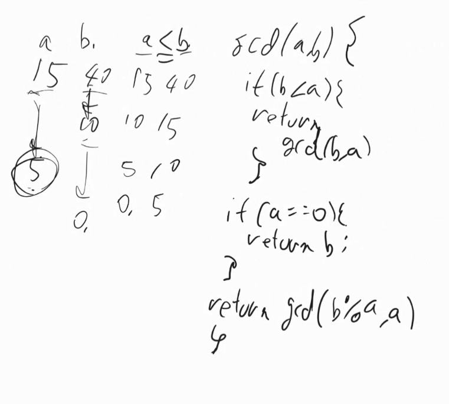
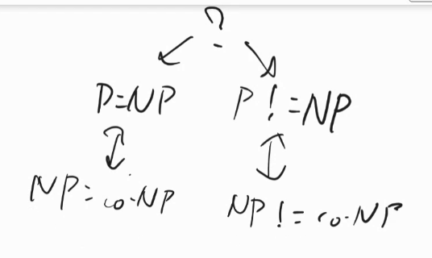

# Brute-Force（総当たり）アプローチ
- 選択ソート
    - 一番小さいのを選択、を繰り返す
- 巡回セールスマン問題
    - 
- ナップザック問題
    - 各素材を入れる入れないの2通り
    - 容量が4以下か調べて、一番高いやつ
    - 

- エンジニア二人で、１０K儲かるやつと、三人で18K儲かるやつと、どの案件を会社としてやるべきか、とか
    - 
- 巡回セールスマンは、セールスマンや、トラックの輸送ルートとか考える時に使う

# Decrease and conquer
- 挿入ソート
    - 左に置いた整理済みのものに、ひとつずつ入れてくので、一個ずつ減ってく
    - 
- トポロジカルソート
    - 待ちタスクがないやつから順番に見てくことで、全部実行できる順番を見つける
    - 待たなきゃいけないタスク数を減らしながら、次に進んでいく
    - 
- ユークリッドの互除法
    - gcd greatest common devisor, 最大公約数を求める
    - 

# Devide and conquer
- クイックソート
    - pivotより小さいグループと大きいグループに分けて、それぞれのグループでクイックソートをまたする
- マージソート
    - ソート済みの要素1のものにまで分解して、合体していく。合体するときは、小さいものから順番に取っていく。

- strassenのアルゴリズム
    - 
    - 普通はO(n^3)
    - 掛け算がn＾３なのであまりやりたくない。(足し算や引き算は大変じゃない)
    - サイズ8倍になったら、普通計算量も8倍なのに、7倍で済んで嬉しい。
    - 

- 足し算は1クロック、掛け算は数クロック、割り算は50クロックくらい
- 同じ計算が１０億回も呼ばれるようなスパコンの行列計算とかのプログラムとかだと、クロック数気にしながらプログラムしたりするが、それ以外の場合は無駄なので気にしなくて良い

- ハミング重み（ハミングおもみ、英: Hamming weight）とは、シンボル列中の 0 以外のシンボルの個数である。典型的には、ビット列中の1の個数として使われる。

# Greedy アルゴリズム
- 目に見えてる中で一番美味しそうなケーキをとる
- ダイクストラ(要復習)
    - 
- クラスカル(要復習)
- ナップザック
    - 最適にはならないが,全部調べるのは大変なので、こういうやり方ができる
    - 

- 世の中効率的な正解が見つかる問題ばかりではないから、一旦強欲法でやってみよう、みたいなことはよくある。どこから営業行ったらいいかわからんからとりあえず大きいところから、とか。

- NP(効率的に答えを求める方法はないと思われている)

# transform and conquer
- 問題を変換してあげて、楽に解こう
- ソートって問題をヒープ使ったpushとpop-minのn回ずつの操作に変換して、nlognで解けて嬉しい
    -  

- 最小公倍数(LCM)
    - 
    - 最大公約数求める問題に変換できた。(要復習)

- linerar programming
    - こういう問題
    - 

- Dynamic programming
    - ワーシャル法
        - 
        - あらかじめ決められたものを計算するのではなく、これを計算するには、これとこれが計算できてれば良くて、さらにそれには、、、と言った感じで他の計算しなきゃいけないものに依存するものを動的計画法と言う

    - ベルマンフォード法
        - 下記の例は無限ループで、答えが存在しない
        -  

# space time tradeoff
- スキップリスト(各駅、快速、急行)
    - addやfindがlogn
    - 
    - 
    - addの時、乱数出して、1/4より小さかったら特急が止まるように、1/2より小さかったら快速が止まるようにする
    - 確率的なバイナリサーチ(何個辿らなきゃいけないかの数は確率的になる)
    - 1/2の各区立で止まってたのを1/3とかにすると、メモリは小さくなるが、計算量は大きくなる
        - 
- Bloom filter
    - sstable(sorted string)
    - 三つの異なるハッシュ関数にかけて、その結果のマスを1にしておく。入ってるか確かめたい要素CのBFを計算して、入ってるかもしれないなら、SStableを見にいく
    - Cのキーがありますかを知りたい。H1(D), H2(D), H3(D)それぞれBFの中で1か見て、全部1だったら入ってるかもだからデータの方見にいく
    - 入ってる可能性があるか、可能性0かどうかを判定できる
    - 
    - 
    - AとかBのキーにバリューがある
    - SStableはハッシュテーブルというかハッシュの構造になってない、SSDとかのイメージ。メモリに乗せてハッシュテーブルにできてれば、findは早いけど、SSDはハッシュの構造になってないから、そんな簡単に探せない。だからBloom filterで一旦このSSDに入ってる可能性があるのかチェックして、その後バイナリサーチする(ソートはされてるので、バイナリサーチはできる)
    - 

- Realな値より小さくなる値が出るなら、ヒューリスティック関数はなんでも良い
    - 

- back tracking 
    - うさぎ足跡
    -  

# iterative inprovment
- 少しずつ改善する
- フォルファーガス
    - 

- シンプレクス
    - OKな範囲から適当に点とって、隣点も取って大きかったらそっちを採用する
    - 
    - OK範囲は凸になって、内部には答えはない。かつ、この方向に行けばスコアが高くなる、という方向がある

#KA core

# formal recursion alaysis

階乗は計算量O(N)

quick sort, merge sort

## amortized
配列オブジェクト(dynamic array)の追加が平均してO(1)になる話
コピーが発生するときは、全部コピーするので要素数に比例する計算(O(N))が発生。
2^x個までデータ入れるには、２＾x-1(≒２＾x)回のコピーが必要
1個あたりで平均すると1になる。
 

##
P:polinominal time 多項式時間
Exp:2^n とか

YesであることのcheckをPでできる問題をNP。NoのチェックはCo-NP
NPはNon diterministic polinominal

Yesになる証拠は、A,B,Cそれぞれ当てはめてYesになる例を1組見つければ良いが、Noの方は全部のパターン検討しないといけない

