# 例示的な学習成果:
CS コア:
この単元の各形式的オートマトンについて:
a. 定義を説明し、この単元の他のオートマトンとの特徴を比較する。
b. 例を用いて、オートマトンが入力に対してどのように動作するかを段階的に説明し、関連する入力を受理するかどうかを含める。
c. オートマトンが受理できる入力と受理できない入力の例を説明する。
問題が与えられたとき、その問題に対処する適切なオートマトンを開発する。
自然言語で表現された正規言語に対して、適切な正規表現を開発する。
タイプ3受容器としての正規表現と、プログラミング言語で使用されるタイプ2受容器としての正規表現の違いを説明する。
この単元の各形式的モデルについて:
a. 定義を説明し、この単元の他のモデルとの特徴を比較する。
b. その言語/文法が受理できる入力と受理できない入力の例を説明する。
万能チューリングマシンとその動作を説明する。
同僚や管理者に対して、無限ループを含む他のすべてのプログラムをチェックするプログラムを提供することが不可能であることを説明する。停止問題、それがアルゴリズム的解決策を持たない理由、および実世界のアルゴリズム的計算にとってのその重要性の説明を含める。
古典的な計算不可能問題の例を説明する。
チャーチ・チューリングのテーゼとアルゴリズム的計算にとってのその重要性を説明する。
(ループ)不変式をアルゴリズムの正当性の証明にどのように使用できるかを説明する。


KA コア:
この単元の各形式的オートマトンについて、その決定論的および非決定論的能力を説明する(比較/対比する)。
ポンピングレンマまたは代替手段を適用して、有限状態オートマトンとプッシュダウンオートマトンの限界を証明する。
算術化と対角線論法を適用して、チューリングマシンの停止問題が決定不能であることを証明する。
既知の決定不能言語が与えられたとき、マッピング還元または計算履歴を適用して、別の言語が決定不能であることを証明する。
DFA、NFA、正規表現の間、およびPDAとCFGの間など、言語の同等に強力な表記法の間で変換を行う。
ライスの定理とその重要性を説明する。
古典的な既知の計算不可能問題をそれに還元することによって、問題が計算不可能であることの証明例を説明する。
原始再帰関数と一般再帰関数(ゼロ、後続、選択、原始再帰、合成、ミュー)、その重要性、およびチューリングマシンでの実装を説明する。
ラムダ計算で計算がどのように実行されるかを説明する(例:アルファ変換とベータ簡約)。


#　20.valid parenthesのarai60のノート参照

# 1. Formal automata
a. Finite State
b. Pushdown
c. Linear Bounded
d. Turing Machine

# 2. Formal languages, grammars and Chomsky Hierarchy
(See also: FPL-Translation, FPL-Syntax)
a. Regular (Type-3)
i. Regular Expressions
b. Context-Free (Type-2)
c. Context-Sensitive (Type-1)
d. Recursively Enumerable (Type-0)


# 3. Relations among formal automata, languages, and grammars


# 4. Decidability, (un)computability, and halting
ref: http://iso.2022.jp/math/tosuu-2017-12/resume.pdf

Decidability: 決定可能性
- ある「決定問題」が「決定可能」かどうか。

「決定問題」→与えられた入力に対し、YesまたはNoで答える計算問題
「決定不能問題」→決定問題のうち、それを解くアルゴリズムが存在しないもの


例:素数判定問題
inputの数字nは素数か否か（Yes, No）
→これは解ける。
n = 1 なら No，n = 2 なら Yes，n > 2 のときは 2, 3, . . . , n − 1 で順番に割ってみて，ひとつで
も割り切れるものがあれば No，そうでないときは Yes と答えればよい．

定義 1.4 (決定問題の決定可能性). f : Σ∗ → {Yes, No} を決定問題とする．f を計算するアルゴリズム
(algorithm) が存在するとき，f は決定可能 (decidable) であるといい，そうでないとき決定不能 (undecidable)
であるという．


https://www.youtube.com/shorts/4E7-6x14BNg
https://www.youtube.com/watch?v=gJQTFhkhwPA
https://www.youtube.com/watch?v=-ZS_zFg4w5k


# 5. The Church-Turing thesis
- Church-Turingの定理は、計算可能性理論における基本的な概念で、効果的に計算可能な関数とチューリングマシンで計算可能な関数が等価であるという主張です
Church-Turingの定理の主な主張は以下の通りです：
任意の効果的に計算可能な関数は、チューリングマシンで計算可能である。
逆に、チューリングマシンで計算可能な関数は、効果的に計算可能である


# 6. Algorithmic correctness a. Invariants (e.g., in iteration, recursion, tree search)
アルゴリズムの正当性と不変条件について説明します。

## アルゴリズムの正当性

アルゴリズムの正当性とは、そのアルゴリズムが常に正しい結果を生成し、期待通りに動作することを意味します。

**正当性の種類**:

1. **部分的正当性**: アルゴリズムが正しい入力を受け取り、終了した場合に正しい出力を生成すること[1].

2. **全体的正当性**: アルゴリズムが正しい入力を受け取り、必ず終了し、かつ常に正しい出力を生成すること[1][2].

全体的正当性を証明するには、通常2つのステップが必要です：

1. アルゴリズムが停止することの証明
2. アルゴリズムの部分的正当性の証明[3]

## 不変条件

不変条件は、アルゴリズムの実行中に常に真となる性質や条件です。これは反復、再帰、木探索などの様々な文脈で使用されます。

**不変条件の重要性**:

1. アルゴリズムの正当性を証明する強力なツール
2. アルゴリズムの理解と設計を助ける
3. バグの発見と修正に役立つ

**ループ不変条件の証明手順**:

1. 不変条件の定義
2. 初期化: ループ開始前に不変条件が成立することを示す
3. 維持: 各反復で不変条件が維持されることを示す
4. 終了: ループ終了時に不変条件が目的の結果を保証することを示す[4]

**例: 配列の最大値を見つけるアルゴリズム**

```python
def find_max(arr):
    if not arr:
        return None
    max_val = arr[0]
    for i in range(1, len(arr)):
        if arr[i] > max_val:
            max_val = arr[i]
    return max_val
```

このアルゴリズムの不変条件は「max_valは、インデックス0からiまでの要素の最大値である」となります。

アルゴリズムの正当性と不変条件は、プログラムが正しく動作することを保証する上で非常に重要な概念です。これらを理解し適切に使用することで、より信頼性の高いソフトウェアを開発することができます。

Citations:
[1] https://www.educative.io/answers/what-is-the-correctness-of-an-algorithm
[2] https://en.wikipedia.org/wiki/Correctness_(computer_science)
[3] https://users.pja.edu.pl/~msyd/wyka-eng/correctness1.pdf
[4] https://course.ccs.neu.edu/cs5002f18-seattle/lects/cs5002_lect11_fall18_notes.pdf
[5] https://www.khanacademy.org/computing/ap-computer-science-principles/algorithms-101/evaluating-algorithms/a/verifying-an-algorithm
[6] https://www.youtube.com/watch?v=xAGTpVDCFfo
[7] https://plato.stanford.edu/entries/church-turing/
[8] https://cacm.acm.org/research/the-church-turing-thesis/


# KA
# Deterministic and nondeterministic automata
決定性有限オートマトン(DFA)と非決定性有限オートマトン(NFA)について説明します。

## 決定性有限オートマトン (DFA)

DFAは以下の特徴を持ちます：

1. 各状態と入力記号の組み合わせに対して、次の状態が一意に決まります[1].
2. 空文字列(ε)による遷移は許されません[3].
3. 入力文字列を処理する際、常に一つの経路のみをたどります[3].

## 非決定性有限オートマトン (NFA)

NFAは以下の特徴を持ちます：

1. 各状態と入力記号の組み合わせに対して、複数の次の状態が存在する可能性があります[1][2].
2. 空文字列(ε)による遷移が許されます（ε-NFA）[2].
3. 入力文字列を処理する際、複数の経路を同時に探索できます[1][4].

## DFAとNFAの主な違い

1. **遷移の決定性**: DFAは各入力に対して一意の遷移を持ちますが、NFAは複数の遷移を持つ可能性があります[3].
2. **空文字列遷移**: DFAでは許されませんが、NFAでは許されます[3].
3. **バックトラッキング**: DFAではバックトラッキングが可能ですが、NFAでは常に可能とは限りません[3].
4. **メモリ使用**: NFAはDFAよりも少ないメモリで表現できる場合があります[3].
5. **受理条件**: DFAは最終状態に到達した場合に文字列を受理しますが、NFAは少なくとも1つの可能な遷移が最終状態に到達した場合に受理します[3].

## 等価性

NFAはDFAよりも柔軟ですが、認識できる言語の範囲は同じです。つまり、任意のNFAに対して、同じ言語を認識する等価なDFAが存在します[2]. この変換は部分集合構成法を用いて行うことができます。

## 応用

1. NFAは正規表現のパターンマッチングに使用されます[4].
2. DFAはコンパイラの字句解析器やプロトコル検証などに使用されます.
3. NFAはより直感的なモデル化が可能で、設計が容易な場合があります[5].

NFAとDFAは、形式言語理論や計算理論の基礎となる重要な概念であり、様々な応用分野で活用されています。

Citations:
[1] https://people.computing.clemson.edu/~goddard/texts/theoryOfComputation/3a.pdf
[2] https://en.wikipedia.org/wiki/Non-deterministic_finite_automaton
[3] https://www.tutorialspoint.com/automata_theory/non_deterministic_finite_automaton.htm
[4] https://www.javatpoint.com/non-deterministic-finite-automata
[5] https://www.youtube.com/watch?v=ehy0jGIYRtE
[6] https://ja.wikipedia.org/wiki/%E9%9D%9E%E6%B1%BA%E5%AE%9A%E6%80%A7%E6%9C%89%E9%99%90%E3%82%AA%E3%83%BC%E3%83%88%E3%83%9E%E3%83%88%E3%83%B3
[7] https://plato.stanford.edu/entries/church-turing/
[8] https://cacm.acm.org/research/the-church-turing-thesis/


# 8. Pumping Lemma proofs
ポンピング補題（Pumping Lemma）の証明について説明します。ポンピング補題は、有限状態オートマトン/正規言語と、プッシュダウンオートマトン/文脈自由言語の限界を示すために使用される重要な定理です。


決定可能性、算術化、対角線論法について説明します。

## 9. Decidability 決定可能性

決定可能性とは、ある問題に対して、常に正しい答えを導き出せるアルゴリズムが存在するかどうかを指す概念です。

**決定可能な問題の例**:
- 命題論理の充足可能性
- 整数の素数判定
- 正規言語の等価性判定

**決定不能な問題の例**:
- チューリング機械の停止問題
- ヒルベルトの第10問題（ディオファントス方程式の可解性）
- 文脈自由文法の等価性判定

## 算術化

算術化（Arithmetization）は、19世紀後半に行われた数学の基礎づけに関する研究プログラムです。主な目的は以下の通りです：

1. 解析学から幾何学的直観を排除すること
2. 実数体を自然数から構成すること
3. 極限、連続性、微分可能性などの概念を厳密に定義すること

**主な成果**:
- デデキントによる実数の構成（デデキント切断）
- カントールによる実数の構成（コーシー列）
- ワイエルシュトラスによるε-δ論法の確立

算術化の結果、数学の基礎がより厳密になり、現代の数学の発展につながりました。

## 対角線論法

対角線論法（Diagonalization）は、ゲオルク・カントールが考案した証明手法で、主に集合論や計算理論で使用されます。

**主な応用**:
1. 実数の非可算性の証明
2. 停止問題の決定不能性の証明
3. ゲーデルの不完全性定理の証明

**対角線論法の基本的なアイデア**:
1. ある集合の要素を無限の表として並べる
2. その表の対角線に注目し、新しい要素を構成する
3. 構成した新しい要素が元の集合に含まれないことを示す

**例: 実数の非可算性の証明**
1. 0と1の無限小数表現で実数を表す
2. すべての実数を表に並べると仮定する
3. 対角線の数字を変更して新しい実数を作る
4. この新しい実数は元の表に含まれていないことを示す
5. よって、すべての実数を列挙することは不可能であり、実数は非可算である

対角線論法は、無限集合の性質を調べたり、計算不可能な問題の存在を示したりするのに非常に強力なツールです。

これらの概念は、計算理論や数学基礎論において重要な役割を果たしており、現代のコンピュータサイエンスの理論的基盤の一部を形成しています。

Citations:
[1] https://encyclopediaofmath.org/wiki/Arithmetization_of_analysis
[2] https://en.wikipedia.org/wiki/Arithmetization_of_analysis
[3] https://course.ccs.neu.edu/cs5002f18-seattle/lects/cs5002_lect11_fall18_notes.pdf
[4] https://users.pja.edu.pl/~msyd/wyka-eng/correctness1.pdf
[5] https://www.merriam-webster.com/dictionary/arithmetization
[6] https://www.youtube.com/watch?v=x2J5kaf6gjg
[7] https://en.wikipedia.org/wiki/Pumping_lemma_for_regular_languages
[8] https://plato.stanford.edu/entries/church-turing/


# 10.Reducibility and reductions
還元可能性(Reducibility)と還元(Reduction)について説明します。

## 還元可能性(Reducibility)

還元可能性とは、ある問題を別の問題に変換できることを示す概念です。問題Aが問題Bに還元可能であるとは、問題Bを解くアルゴリズムを使って問題Aを効率的に解けることを意味します。

主な特徴:
1. 問題の相対的な難しさを比較するのに使用されます。
2. 計算理論や計算複雑性理論で重要な役割を果たします。
3. A ≤ B と表記され、「AはBより簡単ではない」ことを示します。

## 還元(Reduction)

還元とは、ある問題を別の問題に変換するアルゴリズムのことです。

主な種類:
1. マッピング還元（多対一還元）
2. チューリング還元
3. 多項式時間還元（Karp還元）

### マッピング還元

定義: 言語L1がL2にマッピング還元可能であるとは、すべてのwに対して、w ∈ L1 ⇔ f(w) ∈ L2 を満たす計算可能な関数fが存在することです。

特徴:
- 比較的単純で理解しやすい
- 多くの複雑性クラスがマッピング還元の下で閉じています

### チューリング還元

定義: 問題AがBにチューリング還元可能であるとは、Bを解くオラクルを使用してAを解くアルゴリズムが存在することです。

特徴:
- より一般的な還元の概念
- 問題間のより微妙な関係を捉えることができます

### 多項式時間還元

定義: 問題AがBに多項式時間還元可能であるとは、多項式時間で計算可能な関数fが存在し、すべてのxに対してx ∈ A ⇔ f(x) ∈ B が成り立つことです。

特徴:
- 計算複雑性理論で最も一般的に使用される
- NP完全性の証明に広く使用されます

## 還元の応用

1. 問題の難しさの証明: ある問題が難しいことを示すために、既知の難しい問題からの還元を使用します。

2. アルゴリズム設計: 新しい問題を解くために、既知の問題のソリューションを利用します。

3. 決定不能性の証明: ある問題が決定不能であることを示すために、既知の決定不能問題からの還元を使用します。

4. 複雑性クラスの関係の探求: 異なる複雑性クラス間の関係を調べるのに役立ちます。

還元可能性と還元は、計算理論と複雑性理論の基本的な概念であり、問題の難しさを比較し、アルゴリズムを設計し、決定不能性を証明するための強力なツールです。

Citations:
[1] https://wiki.soimort.org/comp/reducibility/
[2] https://en.wikipedia.org/wiki/Reduction_(computability_theory)
[3] https://home.csulb.edu/~tebert/teaching/spring22/528/reduce/reduce.pdf
[4] https://www.dsm.fordham.edu/~agw/theory-comp/handouts/ch05.pdf
[5] https://en.wikipedia.org/wiki/Reduction_(complexity)
[6] https://ai.dmi.unibas.ch/_files/teaching/fs21/theo/slides/theory-c04.pdf
[7] https://www.youtube.com/watch?v=U4yGQp5aCTM
[8] https://plato.stanford.edu/entries/church-turing/


# 11. Time complexity based on Turing Machine


# 知っておくべきこと
- チョムスキー階層のType0,2,3の内のどれなのか判断できるように(1はあまりでない)
- このプログラムが止まるのかどうかを判断できる便利なプログラムは、Type0の普段使うプログラミング言語のプログラムでは存在しない(チューリングマシン)


決定性:入力文字に対して、どの状態に遷移するか一意に決定される

全ての非決定性は決定性に書き換えられる

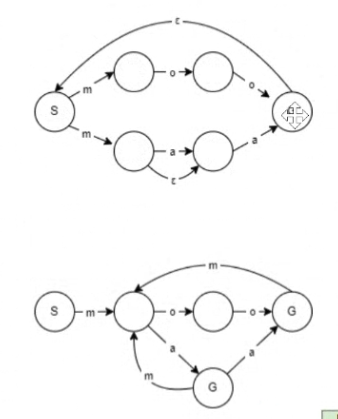
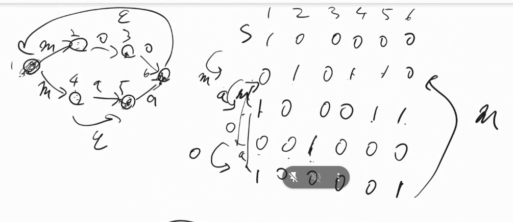

書き換え方。
1~6で、そのとき存在する可能性があるマス全てに1のフラグを立てて、そこからでてる矢印で動いたらどうなるかを次の行へ。
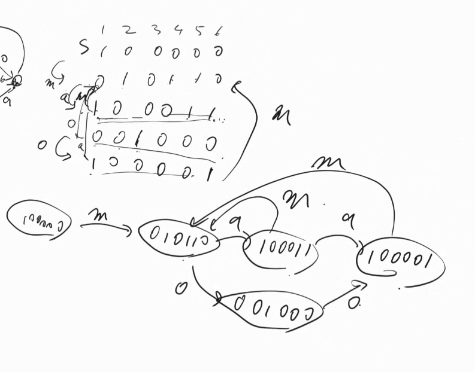

6のbitが立ってるところがゴールマス
どれか一つがゴールマスに立っていたらゴール
6に立ってるときは可能性としてのもう一人の僕は1にいるかもしれないが、一人でもゴールに立ってるならゴール
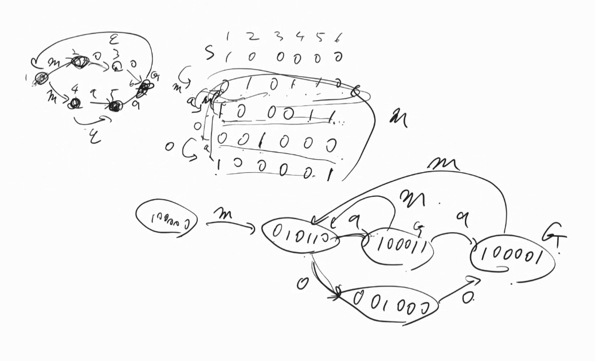


決定性オートマトンは、6マス中どこに存在する可能性があるかを管理するので、マス(パターン)の数が2^nになりうる可能性があり、メモリたくさん使って大変。(その点、非決定性の方がメモリはお得)


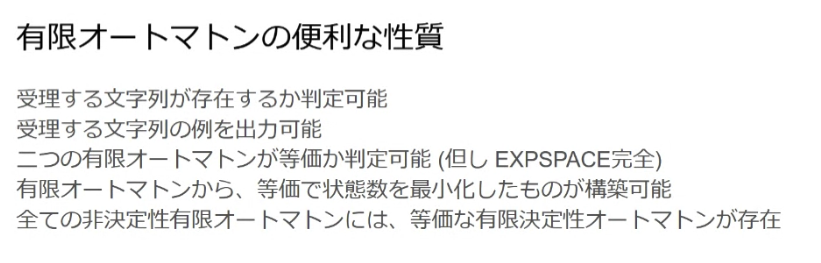
→決定性オートマトンに変換して、等価か確認
expspace完全
メモリが2^n必要になるので、とても時間がかかる
→それぞれのメモリを触るだけでも2^nの時間がかかる


中央の線に立つと、あとn文字b読めばゴールだなとなるが、それは無限パターンあるので、有限オートマトンで表せない
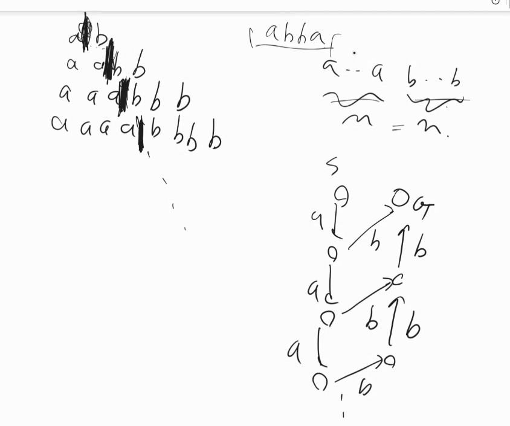
回文も真ん中に立つと、無限パターンあることがわかる


→これをジャッジできるように改善したのがプッシュダウンオートマトン
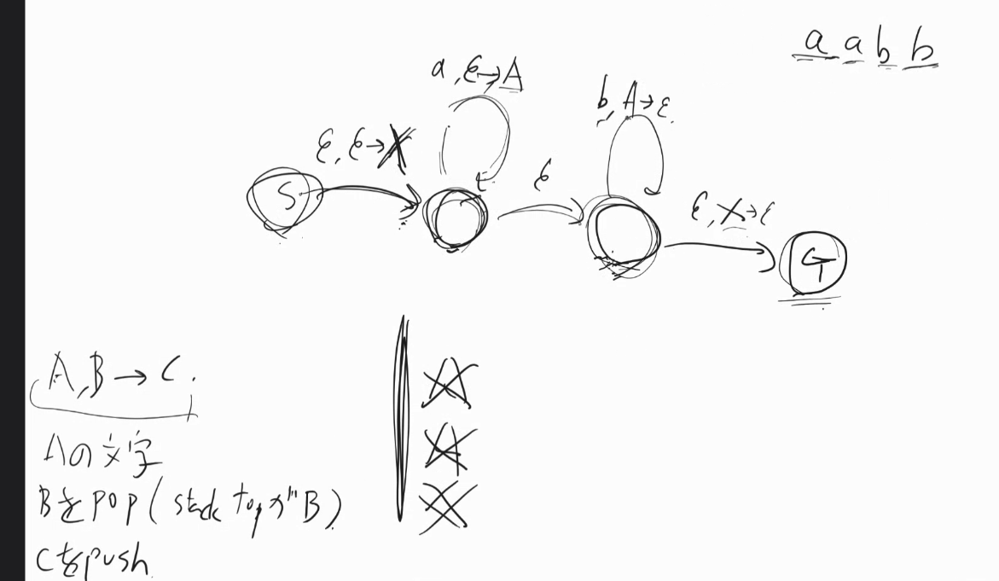
最初と最後にXがあるのは、ゴールしたときスタックが空になってるのを確認したいから

有限オートマトン作ろうとしてみて、マスが無限に必要そうになったら、プッシュダウンオートマトン作ってみようとする


stackの代わりに、無限の長さのメモリにしたのがチューリングマシン
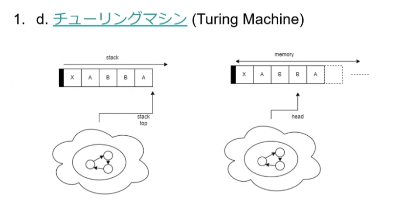
ちなみに、2つstackがあるプッシュダウンは、チューリングマシンと表現力が同じ。stack同士を横に繋げて、popしたときに、左から右に移せば、実質メモリを一個左に移したのと同じ。

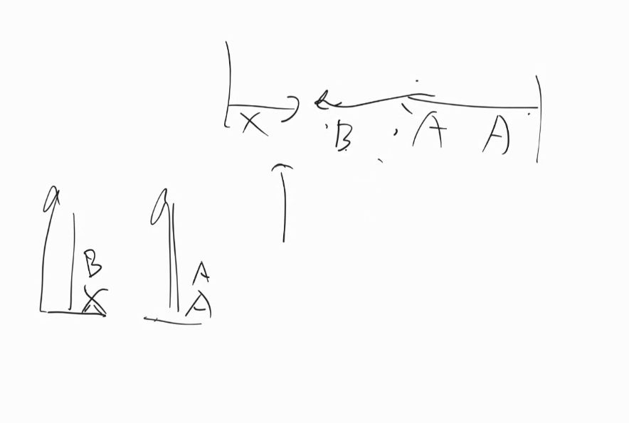


チューリング完全＝チューリングマシンでできること

直感的にはloopとifがかければチューリング完全
https://zenn.dev/cybozu_ept/articles/github-actions-is-turing-complete
https://note.com/kind_aster978/n/nfd883d0c5411


## 正規文法
大文字は書き換え可能＝非終端文字
マスが大文字
左上のマスがAみたいなイメージ
mで動いた後にAのマス。さらにその後AはoBになるので、右隣のマスがB.
右正規で書くか、左正規で書くかで混ぜるのはNG。

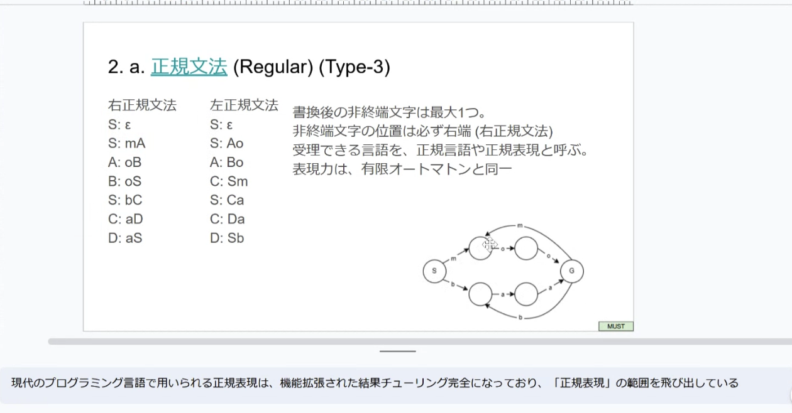


## 文脈自由文法
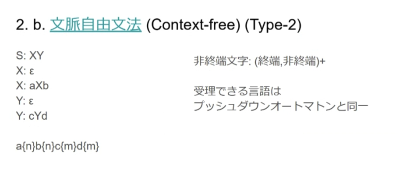
SをXYに変換しなきゃいけないとき、一旦Yをstackしておいて、Xの世界を通って、その後stack見てYもやらなきゃな、というイメージ。


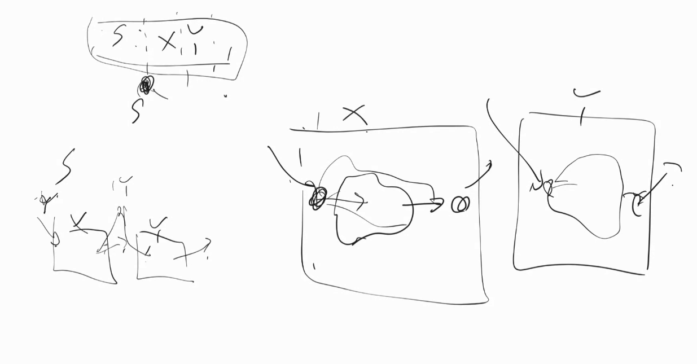

X:aXbは
Xが終わったら、
次はどこから実行しなきゃいけないかな、をスタックに入れる
再帰の関数から戻ってきた時に何をするかをスタックに積んでいる


## 文脈依存文法

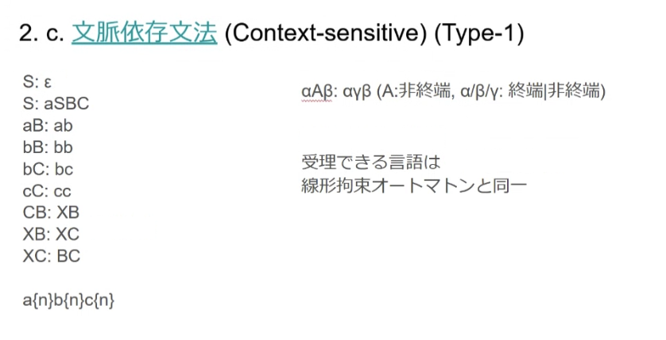
αとβという修飾子(文脈)が前後についてくる。
αとβはキープしたまま、中身のAだけ変換しなきゃいけない。
上記のような感じの、文脈が存在するとみなせるようなルールしかないやつのことを文脈依存文法と呼んでる。(一個下のなんでもありのやつと対比して。)
あまり出てこない。

## 無制限文法
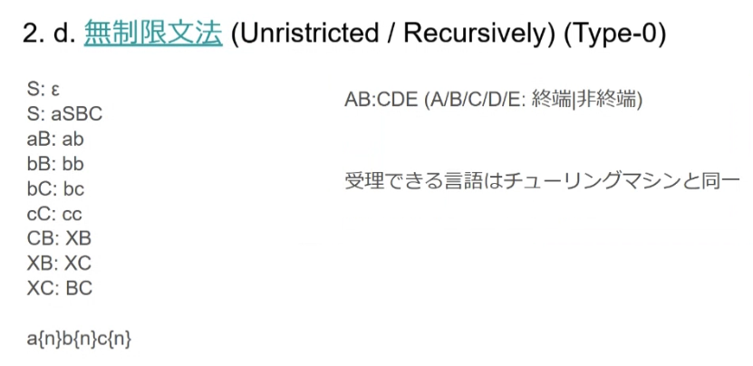
前後の文脈もキープせず、自由に変換して良い。

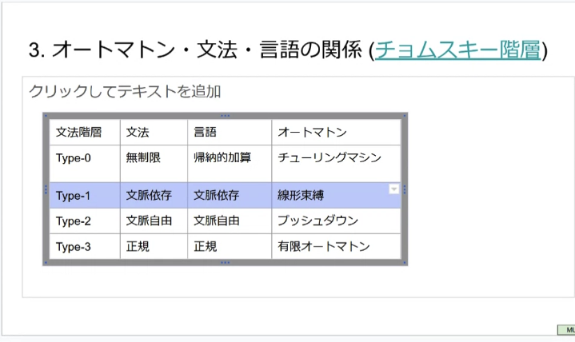


# 全てのプログラムが止まるかどうかを無条件に判定するプログラムはない、という証明
止まるかどうか判定できるGodプログラムMがあると仮定すると、矛盾が生じる。
F(x)が止まるか無限ループになるかを判定するのがM
H(F)の定義はM(F,F)が止まるかどうかで、止まるなら無限に、無限ループなら止まる、というもの。
こういう証明方法を対角線論法と呼ぶ。

チューリングマシンならなんでもできるってわけじゃないんだよという例


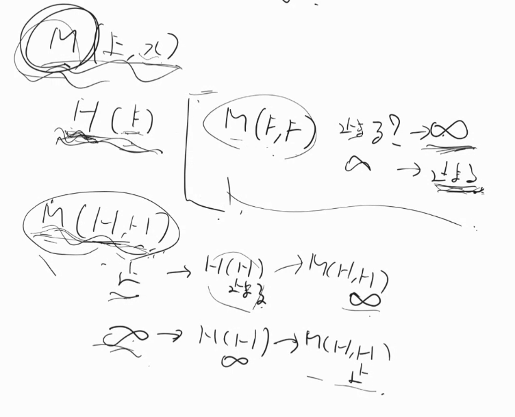

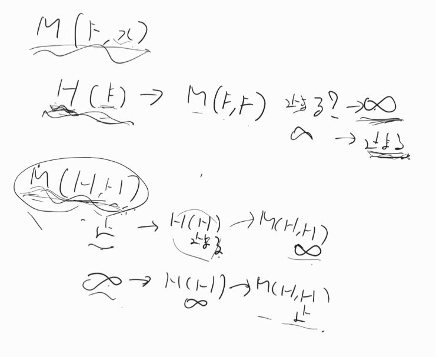


プログラミング言語の文法は文脈自由文法にしておきたいが、チューリング完全になってしまうとコンパイラが無限に終わらないことがありうる。
文脈自由文法なら、スタックだから、スタックを全部消費すれば終わるが、チューリング完全だと、いろんな可能性を試しながらヘッド動かし続けてぐるぐる回り続けてしまう可能性がある。


# チューリングマシンよりもっと賢い何かを作れば、もっとできること増えるのでは説は、いろんな人が頑張ったが思いつけなかっった
- ラムダ計算、というものを考えた人もいたが、チューリングマシンと計算できることが一緒だと後から証明された
- pythonのラムダ関数はここから
- ミューみたいなものを考えた人もいたが、これもチューリングマシンと同じだった
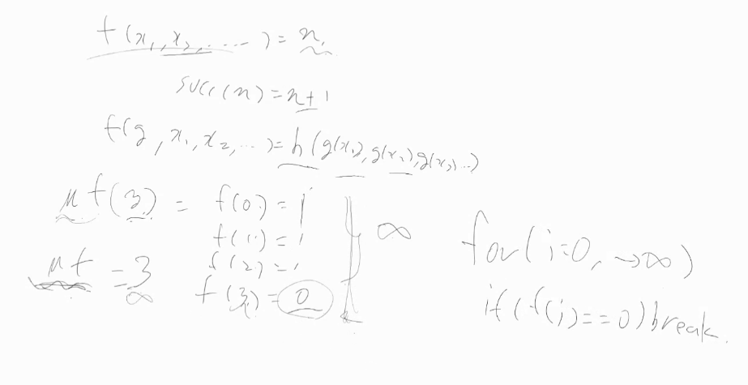

- チューリングマシンができることを計算可能と呼ぼうぜ、というのがchurch turing テーゼ

## Algorithmic correctness
選択ソートは、常に、ソート済みのやつは未ソートのものたちより小さい。
数学的帰納法で証明できる。
普遍条件:invariantsに注目して、アルゴリズムの正しさを証明する(研究者が)。
- エンジニア的には、デバッグする時とかに意識すると、楽になる。


## Pumping Lemma proofs
鳩の巣原理みたいなもので、各言語階層の境界などを示したりする
https://ja.wikipedia.org/wiki/%E6%96%87%E8%84%88%E8%87%AA%E7%94%B1%E8%A8%80%E8%AA%9E%E3%81%AE%E5%8F%8D%E5%BE%A9%E8%A3%9C%E9%A1%8C


EBNF で書くとBison


## チューリング完全
チューリングマシンで実行できることと同じものができる能力のこと
チューリングマシンで実行できるプログラムを何か一つでも実行できなかったらそれは、チューリング完全ではない。


来週
オペレーティングシステム
1-3章　p85まで
https://www.ohmsha.co.jp/book/9784274229152/


parenseが

文脈自由文法の自由はグルテンフリー、アルコールフリーのフリーでないよ、という意味。


## leetcodeでわからなかったやつ解説
アスタリスクが　while trueに対応
if elseはEBNFの　| に対応。


