オペレーティングシステム
1-3章　p85まで
https://www.ohmsha.co.jp/book/9784274229152/

# 1章

1. OS の役割にはどのようなものがあるか説明せよ．
下記のような管理機能を個々のアプリケーションプログラムの代わりに行う。

- 管理機能
    - メモリ管理
        - 複数のプログラムを同時にメモリ上に載せ、並行して動かすときに、どのメモリのどの部分が未使用で、どの部分がどのプログラムに利用されているかを管理する
    - プロセス管理
        - 複数のプロセスの状態を管理し、並列or並行して実行する
        - プロセス:実行中のプログラム
    - ファイル管理
        - 補助記憶装置(ストレージ)のどこにどのようにして保存し、どのようにプログラムからファイルの読み書きを行うかの仕組み
    - 入出力制御
        - キーボードやプリンタなどの入出力装置は、製品ごとに制御の方法が違うため、個々のプログラムが対応するのではなく、OSで対応する。

- 抽象化
    - 例: ハードウェアの抽象化
        - 補助記憶装置からデータを読み込む場合、その中のどこからデータを読み込むのか細かく指定する必要がある。指定方法も製品によって異なる。個々のプログラムがあらゆる製品に対応するのは面倒。OSはファイルという仕組みをアプリケーションに提供している。アプリケーションはファイル名の指定だけで、データにアクセスできる。

リアルタイムOSはCPU資源の分配をしっかり考えてスケジューリングする。
カーラジオ流してたからブレーキに回すCPU足りませんでした、みたいなことがないようにしている。
1秒のうち、500ms動かしたいですと宣言してから動かす。
他に600ms使いたいプログラムが動いてたら、もうそれは動かさない。
プログラム書く方がその時間以内に終わるようなプログラムを責任持って書く。
(普通のPCは色んなタスクがあるとCPUがそれぞれに割り当てられあるので、遅くなる)

スパコン
「500台くらい欲しいXXms」をキューシステムに投げると、良い感じにジョブスケジューラが割り振ってくれる。
個人が勝手にログインしてプログラム動かす、とかは基本できない。

コンピュータは2年に一回は計算ミスしても良い、というクオリティで出荷されている。700台動かすと、毎日。
途中経過を保存しといて、途中でクラッシュしたら別のマシンで途中から計算する。
ロケットとかだと放射線拾って、計算ミスとかがあるので、３つ同じコンピュータ用意して多数決をしている。
パリティビットというエラーコレクション付きのメモリはある。32ビットの情報に対して、4ビットのおまけをつけておいて、復元できるようにしておく。ただしこれはメモリの話なので、メモリ以外でミスがあったらどうするのかはまだ未解決。

2. マルチプログラミングについて説明せよ．  
マルチプログラミングシステムでは、複数のプログラムを同時にメモリ上に置くことができ、プロセッサはそれらのプログラム間で切り替えて使用される。このような処理形態を並行処理ともいう(concuurrent processing)

3. 以下のシステムについて簡単に説明せよ．  
(a) OS/360  
       システム/360シリーズコンピュータが共通して利用していたOS
       それまで使われていたハードウェアのシミュレータとエミュレータを提供することで互換性の問題を解決した。

(b) MS-DOS 
　　1981年にIBMが発売したPC(IBM-PC)用のOS.
　　シングルユーザーシングルタスクのOSで、階層化ディレクトリをサポートした。
　　当時のPC用のOSとして圧倒的なシェアを獲得した。

(c) UNIX  
　　UNIX は， 1969年にベル研究所の Kenneth L. Thompson と Dennis M. Ritchie  が DEC の PDP-7用に開発したマルチユーザ・マルチタスク用の OS。
    Berkleyで改良されたバージョンのBSD UNIX(Berkeley software distributioin)が広く普及した。
    1980年代半ばになると、各社より様々なUNIXが発売されるようになったので、POSIXというプロジェクトを始め、共通する昨日の呼び出し方法や、OSの標準的なインターフェースなどを定義した。
    LinusによってUNIXと互換性のあるLinuxカーネルが開発された。
    Linuxカーネルは、UNIX上のアプリケーションプログラムとして開発された膨大なオープンソースプログラムを含めたディストリビューションパッケージとして配布されるようになり、手軽にUNIX環境を定に入れることができるようになった。

4. シミュレータとエミュレータの相違を述べよ．  
        両者とも、1代のコンピュータをあたかも別のコンピュータであるかのように使用することを可能にする技術。
        シミュレータは主にソフトウェアによって構成され、安価に実現可能。
        エミュレータはマイクロプログラム(あるいは機械語)レベルの対応を必要とするが、元のプログラムを高速に実行できる。

5. ハードウェア， OS， アプリケーションプログラムの関係について， コンピュータシステムにおける階層構造にもとづいて説明せよ． 
        アプリケーションプログラムの層にあるプログラムが、ハードウぜあの層にあるメモリやCPUを扱うために、個々のハード毎の違いなどを吸収し、抽象化したインタフェースをOSは提供している。

# 第2章

1. DRAM と SRAM の特性の違いを述べよ．  
DRAM(DynamicRaM)
コンデンサに蓄えられた電荷によってビットを記憶する。
殿下の放電によって内容が失われることを防ぐために、定期的に電化を再チャージする必要があり、これをリフレッシュと呼ぶ。
SRAM(Static Ram)
トランジスタを用いたフリップフロップ回路によってビットを記憶する。
リフレッシュ不要。
動作が高速で消費電力も少ないが、ビットあたりの回路の面積がDRAMより大きく、高価。
メインメモリはDRAMで構成し、SRAMは高速性が重要なキャッシュメモリなどで使用。

2. 自分が使っている PC で使われているプロセッサの名称，動作周波数， コアの数，  キャッシュメモリの階層数とそれぞれの容量，物理メモリの容量を調べてみよ．  

3. スタックは， 関数から自分自身を呼び出す再帰呼出しの実現に役立っている． このことについて説明せよ．  

4. メインメモリのアクセス時間が 50 ナノ秒， キャッシュメモリのアクセス時間が  10 ナノ秒のシステムがある． ここで， キャッシュメモリのヒット率が 95%のとき，  平均アクセス時間を求めよ． 

メモ
命令セットアーキテクチャ（ISA：instruction set architecture）
- プロセッサの機種によって解釈できる機械語は異なる。プロセッサが解釈できる機械語命令や、しようできるレジスタなど、プログラムから見たときのプロセッサの仕様を包括的にISAと呼ぶ。同一のISAに基づくプロセッサなら、別の製品でも、機械語レベル(バイナリレベル)で互換性がある。一般的なwindowsPCでは、x86という32ビットのISAか、64ビットのx86_64アーキテクチャが使われている。スマホや最近のmacは、armv7やarmv8が使われている。

オペランド、オペコード
- オペコードが加算とかの操作で、オペランドは操作対象

マルチコアプロセッサ
- プロセッサが機械語命令を順実行していく流れをハードウェアスレッドと呼ぶ
- 現代のプロセッサは内部に複数のプロセッサコアがあるので、複数のハードウェアスレッドを同時に(並列に)実行できる
- こういうプロセッサをマルチコアプロセッサという

どういう種類の命令があるか知っておくと良い
全部の命令を残らず知る必要はない
この命令がないと遅くなる、
CPUが仮想メモリというものをサポートしてるから速い
ソフトウェアで仮想メモリを
特権とか割り込みがあるからこういうことができる、というのを知っておきたい
自分が使ってるマシンの機械語が読めると

回路と命令セットを合わせてライセンスするビジネスをarmとかはしている。

EEPROMは書き込めるけど、ユーザーが書き込むというよりは、バグがあったときにパッチとかで書き換えるイメージ

メモリ階層の話はとても重要なので、しっかり理解してほしい
Jeff Dean Numberをざっくり知っておこう
https://gist.github.com/jboner/2841832
設計する上で知っておいた方が良い。
TimsortはnlogNだけど、キャッシュヒットでやるからマージソートより速い
Deanの数値は1 ns = 10^-9 secondsなのでクロック数が1GHzのCPUだと仮定するとnsをクロック数に置き換えて考えれる
PCは3Ghzとか4GHzが多い

デバイスドライバは、ハードウェアメーカーが自分で作る。
not Linuxチーム。

ブーストクロックは最高速度だけど、すっとそれでは動かせない
内部の温度測ってて、暑くなったらクロック数落とす

経済的な制約で綺麗な三角形になっている
くびれ的なものがあったら、いらないじゃんと言って弾かれる
SSDはメモリより遅いけど、安いから良いかとして使うわけで、メモリの方が安かったらメモリだけ使うよね
ノートに書いておく、みたいな階層入れても良いけど、それって効率悪すぎてピラミッドに入れない
食物連鎖ピラミッドも同じ

磁気テープはバックアップによく使われる
カセットひとつで40TB
ランダムアクセスできないが、連続して再生するには速くできる
書くけどほとんど読むことはない、というデータに使われる
安い
データセンターで使うとかで100個とか買うともっと安くなる

容量が小さい

NICはネットのケーブルさすところ
WIFIの時はwireless NIC

--------

# 第3章

1. 条件変数の wait では， mutex のアンロック， 待機キューへの追加， スレッドのブ  ロックを不可分に行う． これが不可分に行われないとどのような不都合が生じるか．  

2. 簡単な C言語のプログラムを用意し， コンパイラが出力するアセンブリ言語のプロ  グラムを眺めてみよ．  なお， 通常， コンパイルドライバは中間生成物であるアセンブリ言語のプログラ  ムは削除してしまうが， オプションなどを指定することでアセンブリ言語のプログ  ラムを出力することができる． 方法はそれぞれの環境で異なるため， 各自で調べて  みること．  

3. 以下の C言語のプログラムをコンパイルして実行したときに表示される 4 つのアド  レスは， それぞれテキスト領域， データ領域， BSS領域， スタック領域のどの領域  に含まれるか※48．  

1 #include <stdio.h>  
2  
3 int global = 10;  
4 int not init;  
5  
6 int main(int argc, char ∗∗argv) {  
7 int local = 20;  
8 printf(" &global=%p\n", &global);  
9 printf("&not_init=%p\n", &not init);  
10 printf(" &main=%p\n", &main);  
11 printf(" &local=%p\n", &local);  
12 return 0;  13}  
............................................... 

安倍広多; 石橋勇人; 佐藤隆士; 松浦敏雄; 松林弘治; 吉田久. 工学基礎シリーズ オペレーティングシステム (p.85). Kindle 版. 

メモ
    コンパイル(高水準言語→アセンブリ言語)
        アセンブリ言語は機械語プログラムをニーモニック(ADDとか)などで表したもの

    アセンブル(アセンブリ言語→機械語プログラム)
        機械語プログラムはオブジェクトファイルとして保存される。
        0番地を仮の先頭として、機械語プログラムやデータを割り付ける。シンボルのアドレスも計算。

    リンク
        オブジェクトファイルを結合→実行ファイルに。
        実際にアドレスを割り付ける

8コア16スレッドだったら、16このプログラムを実行できる
プロセスという単位はここには関係ない

ハードウェア￥
プロセスの中にスレッドが何個か集まってる
プロセスに対して、ユーザーIDとか誰の権限で動かしてるのかとか仮想メモリの状態とか、どのメモリ使ってるのかとかそういうのを管理してる
各スレッドは同じ設定で動いている。

違うプロセスA,Bの中のスレッドa,bはお互いにメモリアクセスとかはできない。お互い権限とかも違う。

ハードウェアから見たら、どんなスレッドなのか知らないけど、その設定で動かしてあげるよ、という感じ。

https://qiita.com/Amby/items/66073b2df242c3bd6558
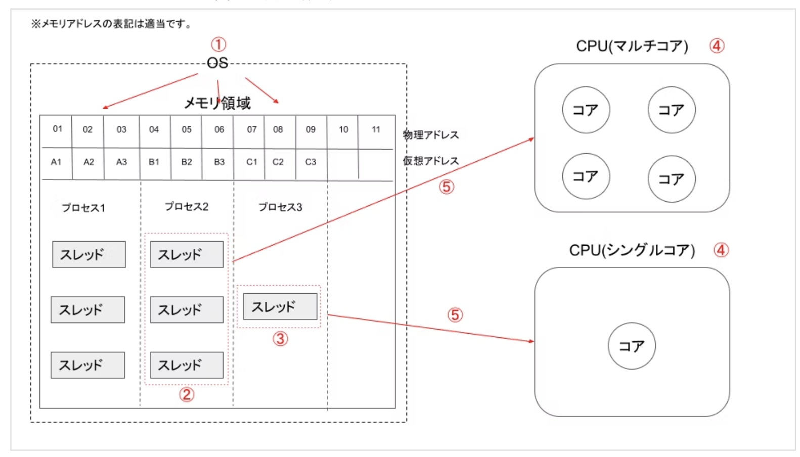

スレッドとプロセスはCPUから見たときの設定が違う、くらい
プログラムは動かしてなくてもプログラム。
プロセスは動いているプログラム
スレッドの中でプログラムが動くイメージ

スレッドの生成、ってのはスレッド一覧に登録するイメージ
スケジューラがその一覧からいい感じに選んでCPUに投げる
いつでも動かせるタスクとして詰んでおく、みたいなイメージ

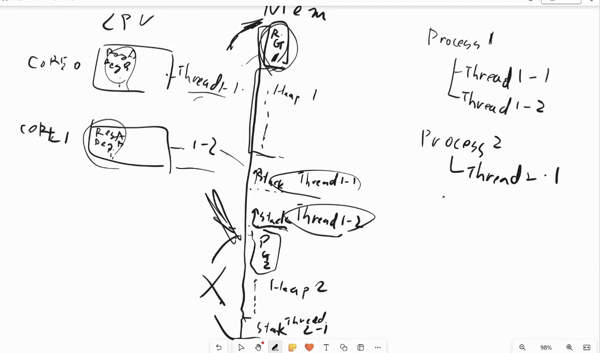
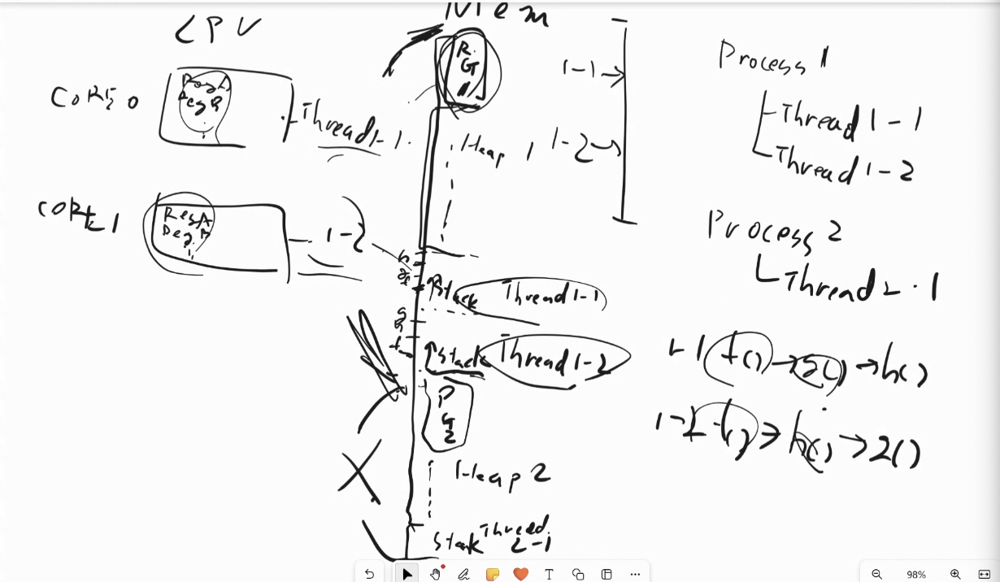
stackは関数の呼び出しの今の状況だから、スレッド毎にバラバラに持っておく必要がある
f（）→ g（）→　h() の流れの今どこなのかの状況
heapはわざわざ分けなくても良いか、ぐらいの気持ち
分ける作戦を取ることもある
NUMAだとCPUごとにどこからとると早いとかあるから、ヒープを分けたりする
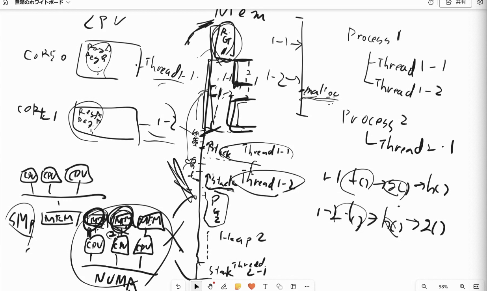

別のスレッドが立ち上がるっていうのは、どういうケースなのか
    スレッドを複数立ち上げたい時は、明示的にそういう関数を書いたときだけ
    そういうコード書かない限りは普通はスレッドは常に一本
    asyncで別のスレッドを作ってawaitでそのスレッドが終わるのを待ってる感じ
    非同期に実行できる単位であればスレッドを作る必要はない
    そいうプログラムを書けば、一つのスレッドの中で、タスクをキューとかに詰んでおいて一個ずつ処理をする
    スレッドを分けない限りは一個ずつやるしかない。

スレッドの状態はどう判断しているのか
    普通にしてたらブロックにはならない
    システムコールを呼び出して、それが、ファイル読むとか、ネットワークから受け取ったデータを取るとか、そういうのだった時に、ハードディスク動かそうとしてるからちょっと待ってねって時とか、キーボードからcontrol cとか来たときに、スレッドの状態がブロックになる。
    何かを待っている間、ブロックの状態になる。
    4ms毎に次のどのスレッド実行しようかなって考える時に対象に入らない。
    OS関連のファイル読むのにまだ準備できてない、とかのOS関連でブロックになる。

コンテキストスイッチ
プログラムカウンタは今ここの命令を実行していますという数字を保存している
call fとかがあったら、PCをfの入ってる番号(ここだと7)に変えて、スキップしたものはstackに入れておく。return文が来たときに、stackを見始める。
スタックに、命令単位で保存して、1命令は4msよりだいぶ短い時間で終わるので、ずっと終わらない何か、みたいなのは発生しない。

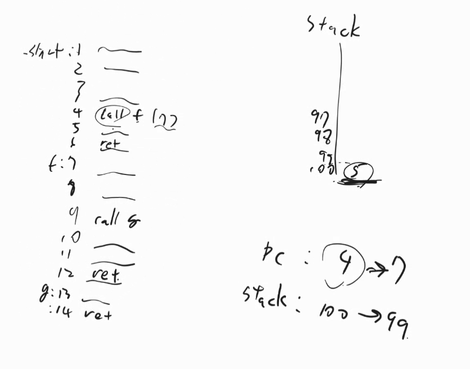
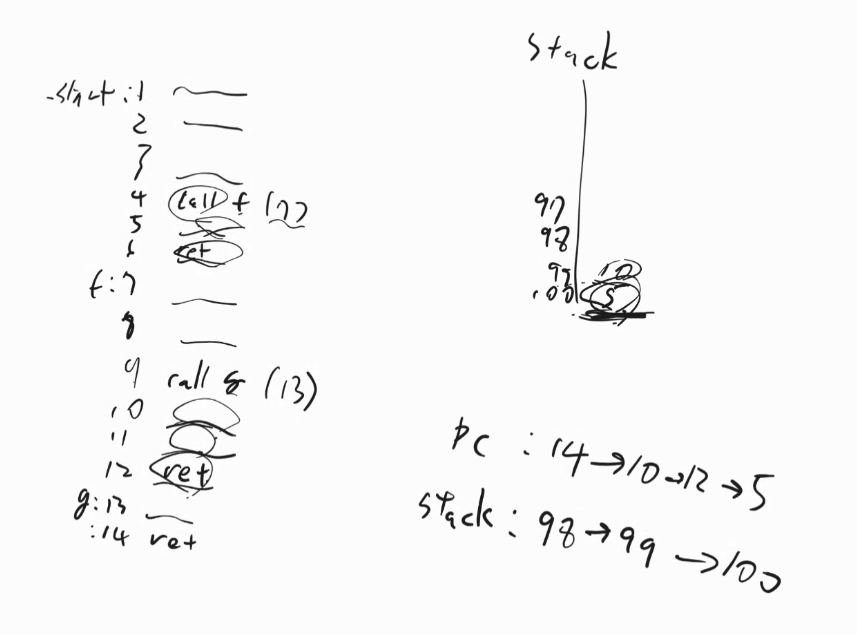

コンテキストスイッチ
プログラムカウンタPCとstackの番号を保存しといて、次同じスレッドに戻った時に、前の場所から始める。
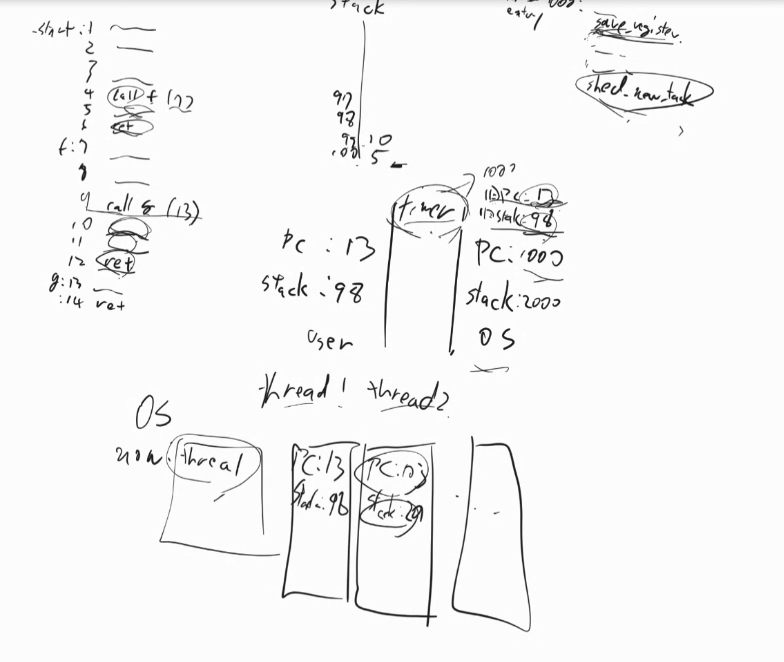

カーネルスレッド、ユーザースレッド
ユーザーが二つスレッド作ってね、ってやっても、ライブラリがいい感じに1このスレッドで上手いことやってくれるかも
gotroutineとかもこれ。
カーネルスレッドはカーネルが認識してるスレッドの数
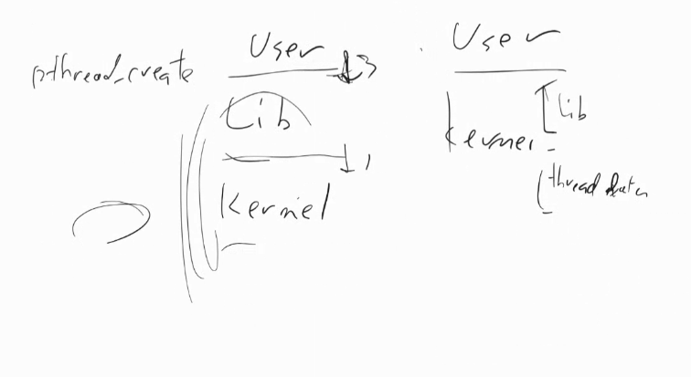

コンテキストによって、カーネルスレッドやユーザースレッドは意味が変わるので注意
カーネル開発者目線だと、ユーザーからの要望で作るのではなく関係なくカーネルがカーネルのためにカーネルが作るスレッドをカーネルスレッドと呼ぶ
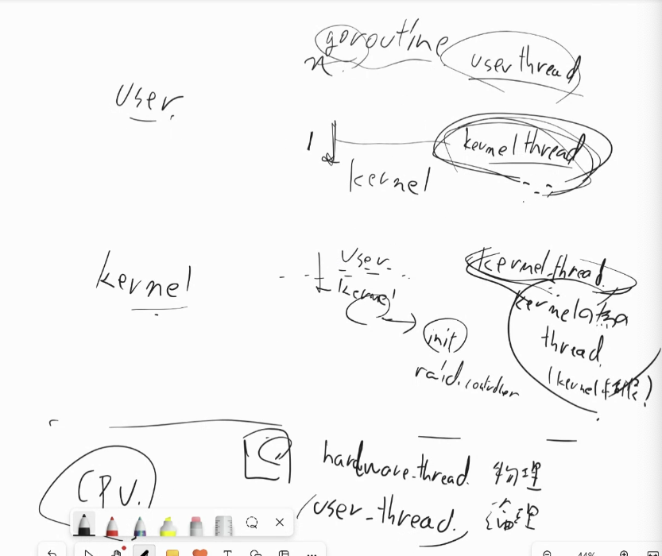

重い処理の時スレッドを使おう
CPUたくさん使う
ファイル読み込む　ハードディスクの円盤が読みたいところまで回るのを待つ
そうすると待ってる間はスレッドがブロックしてしまう(例えば1個しかコアがないなら待ってる間CPUが暇)
ファイルとかの待たされる処理は別スレッドにする
iOSとかのUIスレッド
    ユーザーの処理を受け付けて、何を描画するUIスレッドは、ファイルを読み込んだりネットワークのファイルを読み込んだりはできない
    ちょっと画面スクロールしただけなのに、固まるみたいなことが起きる
    別のスレッドにしておけば、一旦画像読み込めなくても、スクロールしたり、前のページ戻ったりはできる

優先度継承
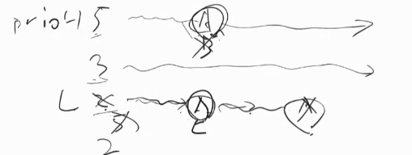

排他制御はとっても難しい
コンパイラは最適化で機械語の実行順を逆にしたりするので、その上で排他制御するのはとても難しい

ロックも難しい
ロックのコツ：ロックをとってから、解除するまでに余計な関係ないことをしない。待ってる人がいるので。

デッドロック
あるスレッドが特定のセマフォから5こ取り出して、終わってから5こ戻そうとしても、3個しか元からなかったら、一生進まなくなる。すでに触ってるものからさらに取ろうとしない。
mutexだったら、誰が持ってるかの情報があるので、自分が持ってるものをさらにに取ろうとしたらスルーできる。
複数ロックを取る必要がある時は、優先順値をもつAB両方必要なら、必ずA→Bでとらないとデッドロックになる
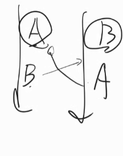

複数ロックを取らなければならないようなプログラムは2個だけのロックで済むように書き直せるはず
Aをとって、その後BCDEをやるというロック→A終わらす→Bとって、CDEをやるタスクのロックを取る。
最大でも二個。2個取るのもあまりやりたくない。
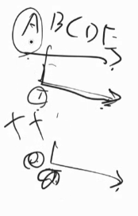

ロックをとったら、一つのファイルの中で全て処理収めるなど、何やってるか見える状態にしておかないと、手がつけられなくなる。

プロセス間通信の手法の選び方
パイプとメッセージキューは似た感じだが、バイト列より、メッセージ間の区切りがわかりやすい。
共有メモリでデータのやり取りするときはOS解さずにできるので一番速いが、Aが書いた後Bが書く、みたいなのを自分でプログラミングしないといけない。ロック使って。パイプとかだったら勝手にやってくれる。
ソケットはネットワーク通信する時(1-3は同じマシンの間だけど、4は他のマシンでもいける)
同じマシン内でもソケットでいけるけど、ネットワーク使うと、通信エラーの可能性がある。(TCPなら届いてるかどうかの確認はできるが、文字化けとかしてるかも?)

復習

https://www.coins.tsukuba.ac.jp/~syspro/2022/lecture4/index.html

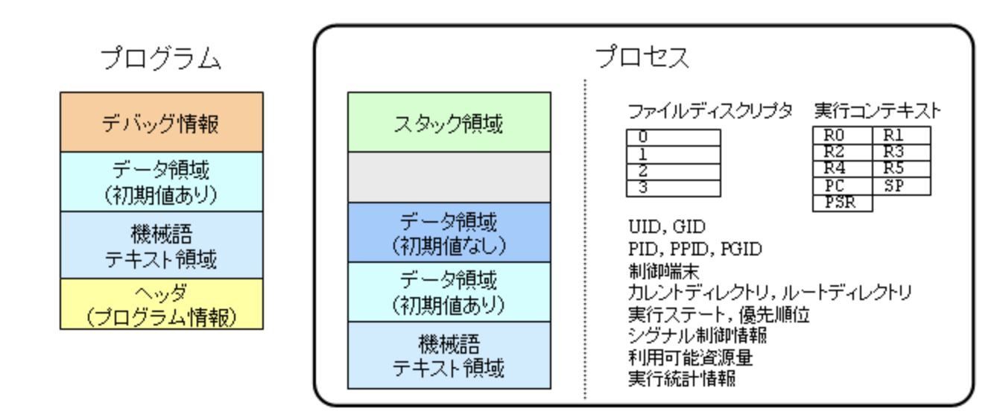

データ領域(初期値なし)とは
>プロセスに入っている実行に必要な情報には，プログラムに含まれている情報もあれば，プログラムに含まれていない情報もある． 初期値が0（初期値なし）のデータ領域はプログラムに含める必要性はなく，そのデータ領域がプロセス中のどこにどれだけの大きさで必要かという情報だけがプログラムに含まれていればよい． しかし，プログラムの実行にはそのデータ領域が必要であるため，プロセスではそのデータ領域が実際に確保されている必要がある．

プロセスの機能
プロセスの重要な機能として資源割り当てと保護がある．

>UNIX におけるプロセスは，プロセッサ時間，メモリ，ファイル，キーボードやディスプレイ，プリンタなどのデバイスといった，処理を行うにあたって必要となる計算資源の割り当て単位である． ユーザがプログラムを起動すると，それはプロセスにより実行される． OS カーネルによりプロセスに対しプロセッサ時間やメモリが割り当てられプロセスの実行が始まる． プロセスは，プログラムに記述された通りにファイルをアクセスし，キーボードやディスプレイなどのデバイスを使用する． ファイルをオープンした時に得るファイルディスクリプタは各プロセス固有のものになる． ファイルのアクセス権はユーザに対して与えられるが，計算資源はプロセスに対して与えられる．基本的には，OSカーネルは，プロセッサ時間やメモリを各プロセスにほぼ平等に割り当てる． ファイルやデバイスは先着順で割り当てる．

>保護
プロセスは，割り当てられた資源が保護される単位でもある． あるプロセスは他のプロセスに割り当てられた資源に対し許可なくアクセスすることはできない． たとえ同じユーザが生成したプロセス間であってもである． 保護の機能により，例えばある暴走したプロセスが他のプロセスの実行内容を破壊するようなことは起こらない

実行ファイルの「テキスト」領域は、機械語テキスト領域で、機械語の命令が書いてある

