工学基礎シリーズ オペレーティングシステム 4章、5章
安倍広多; 石橋勇人; 佐藤隆士; 松浦敏雄; 松林弘治; 吉田久. 

四章　~p122(30p)　18:00
5章　~150 (28p) 19:00

# 第4章

Q.
p.87
>単一区画方式ではユーザプログラムは常に同じアドレスに配置される． このため，機械語プログラムで直接アドレスを指定してサブルーチン呼出しやデータ参照を行っても差し支えない

とあるが、ユーザプログラムとは例えば、chromeとかzoomみたいなユーザが普通に使うプログラムを指していますか？

>常に同じアドレスに配置される
これは、実行が終わっても、メモリは解放しない(orする必要がない)、ということ？
その場合、補助記憶装置はいらない？（全部メモリに載っているなら、いらない？）
昔の話で、アプリケーション立ち上がったら、消して、次のアプリ立ち上げよう、という頃の話。
ファイルの読み書きとかするから、補助記憶装置がいらない、という話にはならない。

>プロセスが必要なメモリサイズがあらかじめわかっている必要がある． 
chrome立ち上げたいです、というプロセスが来た時、そのプロセスはどうやって自分に必要なメモリを推定して自己申告？するのか
    　chromeを書いた人が設定するか、使う人が設定する。「このプログラムは300MBくらいメモリ使います」という感じ。
タブたくさん開いて、思ったよりメモリが必要そうになって区画の広さより大きくなったらどうするのか→デマンドページング?

P88
ベースレジスタの使い方は下記であっているか?
chromeに90番から100番のメモリ区画が割り当てられました
プロセス「chromeの3つめのメモリにアクセスしたいです」
ベースレジスタ「3に90を足して93を見なさい」

p92
>このため， 実際のシステムではバディシステムは一定サイズ以下のメモリ割当てにの み使用し， 大きいサイズのメモリ割当てには別のアルゴリズムを使うといった方  法が採られる． 
なぜこれで問題が解決するのか?

１.大きくなると、無駄になる幅が大きくなる
256kb +1 なら無駄255だけど、2G+1だと、2Gも無駄になってしまう。

2.大きい時はリンクトリストでやっても要素数がそんなに多くないから、連結リストのデメリットである一個ずつ見るの大変、が起きにくいので、バディみたいな変なことせずナイーブに連結リストでやる。4Gしかない中で、1Gくださいって言われたらバデぃシステムにしてもあんまり嬉しくない
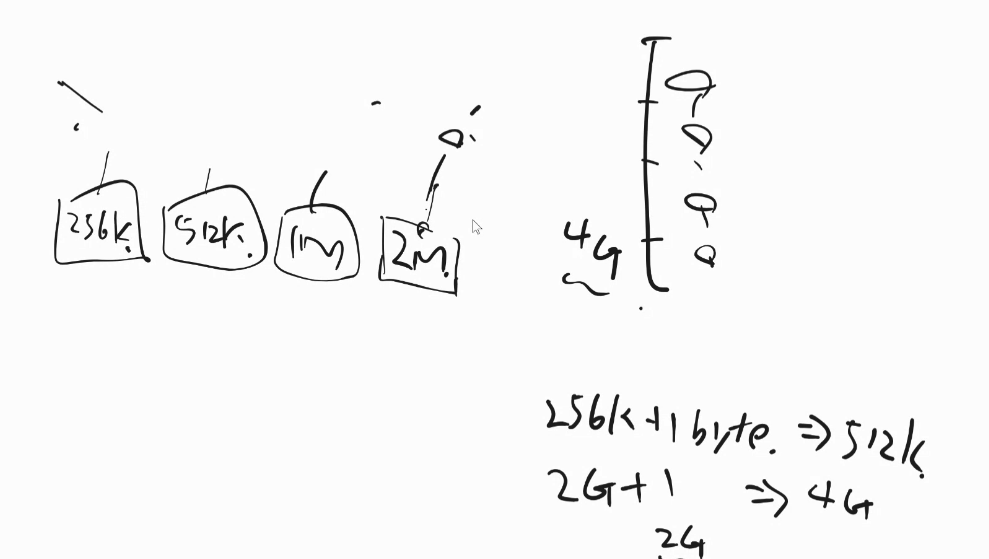

p93
仮想記憶の利点
>（ほかのプロセスに割り当てたメモリに影響されずに） 各プロセスに対して  連続したアドレス空間を提供できる． 
今まででたアルゴリズムだと、仮想記憶を使わない場合発生するのは「連続したメモリの区画が渡される」の「区画が足りず渡されない」のどちらかであって、「非連続の区画がいくつか渡される」というのはなさそうだが、認識あっているか?

新しいライブラリ読み込みたいから、またちょうだい、とやるとぐちゃぐちゃになる

(もし今までは非連続が渡される可能性があった場合、)仮想上で連続していると何が嬉しいのか?
10のスペースが2個空いてた時に、20のスペース欲しい!に答えられる。
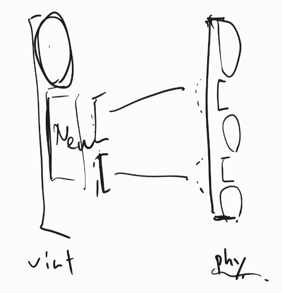

>各プロセスのアドレス空間を分離することで互いに隔離し， システムの安定性を高めることができる． 
ここでいう安定性が崩れるというのはどういうシチュエーション？間違えて隣のアドレスにアクセスしてしまうとか？仮想記憶使わないとなぜそれが発生する？
→他のプロセスのメモリいじれない　極端な話OSを触っちゃいましたみたいなことが起きてしまうかも。(OSが書かれてるメモリに上書きしてしまう、とか)仮想メモリにすれば、もう別空間にあってさわれない。
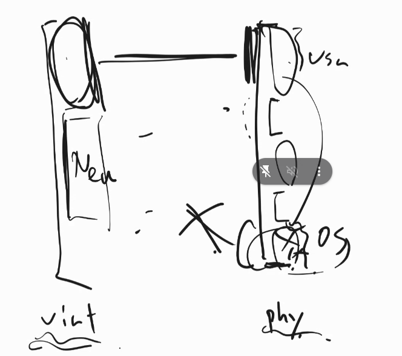

L1とかで扱ってるのは4KBより一小さいから(32Byte)とかだから、4KBとかでバラバラに物理的になってても、もっと小さい単位でL1キャッシュで扱えるから、そんなに困らない。

p95
>セグメント番号とセグメント内のオフセットを指定することで行う． つまり， セグメント方式では仮想アドレスは 2次元となる． 

ページ方式も結局ページ番号とページ内オフセットの二つなんだから二次元なのでは？(セグメントは二次元だから廃れたとあるが)
セグメントは4KB単位になってないので、断片化が激しくなる。別々のを組み合わせて一つにしたりが難しい

p97
XDビットは何に使うのか
- 予想しないものを実行させないためにある
- スタック領域
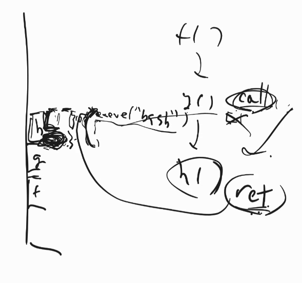

p100
>多段ページテーブルでは，実際に使用する仮想アドレスの範囲に対応するページテーブルのみを用意すればよいため，
なぜ?
仕組みがよくわかってないかも
→使うメモリが判明してから、それに該当するL1,2,3,4テーブルを作る.このメモリに関係ない場所のL2,3はまだ作らなくて済む。また別のメモリの場所が必要になったら、そこに関連するテーブルだけ都度作れば良い。

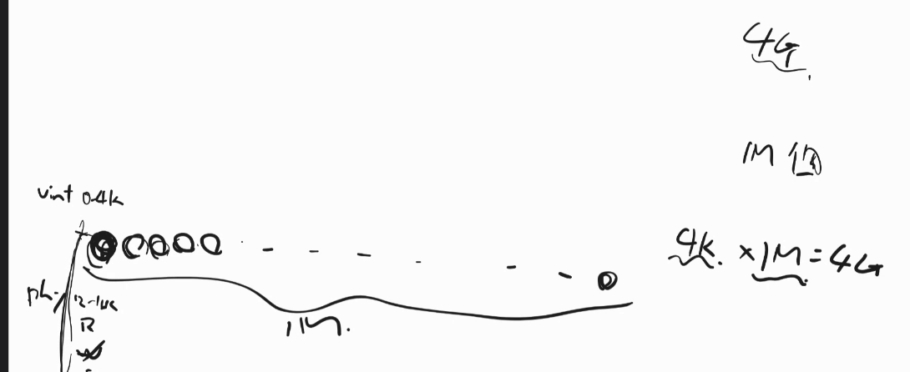
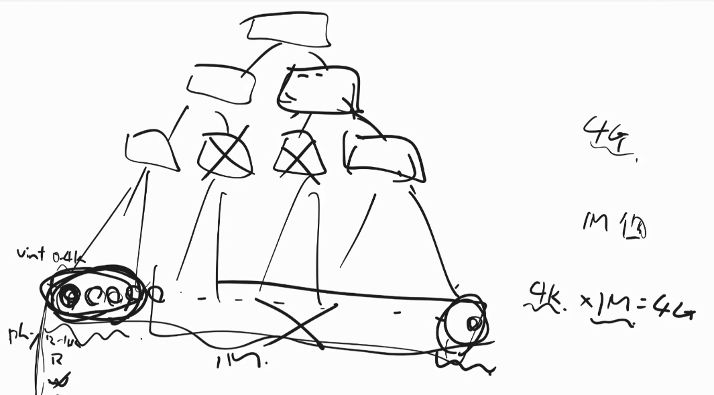

p102
仮想アドレスの 0番地を含むページは通常，読み書き禁止に設定する． これに  よって， ヌルポインタ （null pointer） ※12を使ってメモリを参照するバグ （ヌルポ インタ参照） を検知し， プロセスを強制終了させることができる． 

なぜこれで検知できるのか。

0は無効なアドレスというルールでC言語は作られている。
- 0じゃなくてもなんでもよかったが
- プリンターとかでも動く
- どういうメモリ空間かわからない。うっかり0X2134は使わないようにしましょうとか言って、使ってたら困る。
- CPUの世界では、0はFlaseで0以外の数字はTrueという扱いをする
- C言語の世界ではpointerがnullだったらfalseと判定する(こういうことができるので、一個使わないと決めてるメモリがあると嬉しい。0じゃなくてもよかった。)

0に間違って書いちゃうくらいなら、死んでくれた方が嬉しい。

p111
実行時に未来のページ参照情報を必要とするため （このため千里眼アルゴリズムとも呼ばれる）， 現実的には実装不可能
ある程度未来わかるのでは？

先週、スケジューラが各スレッドの一覧の中から、どれを選ぶかのアルゴリズムをいくつかやった。
アルゴリズムが決まっていて、キューの状態もわかるなら、次の何ターンかはどのスレッドが選ばれるかわかるから、未来のページ参照情報もわかるかと思ったが、わからない？
スレッドA→B→Cという順番でプロセッサに渡されるなら、Aが見るα、Bが見るβ、Cが見るγの順にページ参照をする説。
OSはプログラムが何するかわからない。やんちゃな子供みたいな感じで思ってる。
乱数を引いて、でた番号のメモリにアクセスするプログラムとかだったら、それが実行されて

p112
>典型的な例は， 物理メモリに 入り切らないほど巨大な配列を 1 回， あるいは複数回，先頭から末尾まで走査す  る場合

p108
コピーオンライト
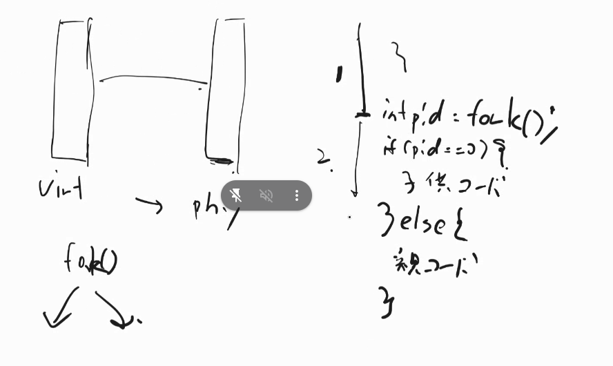

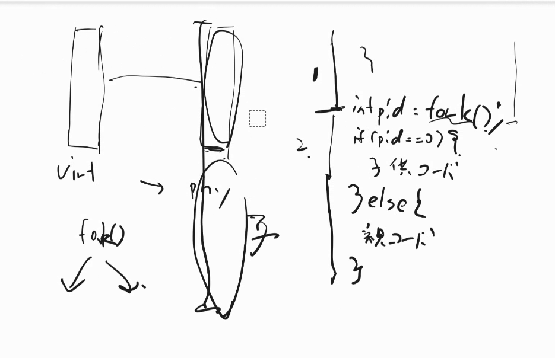

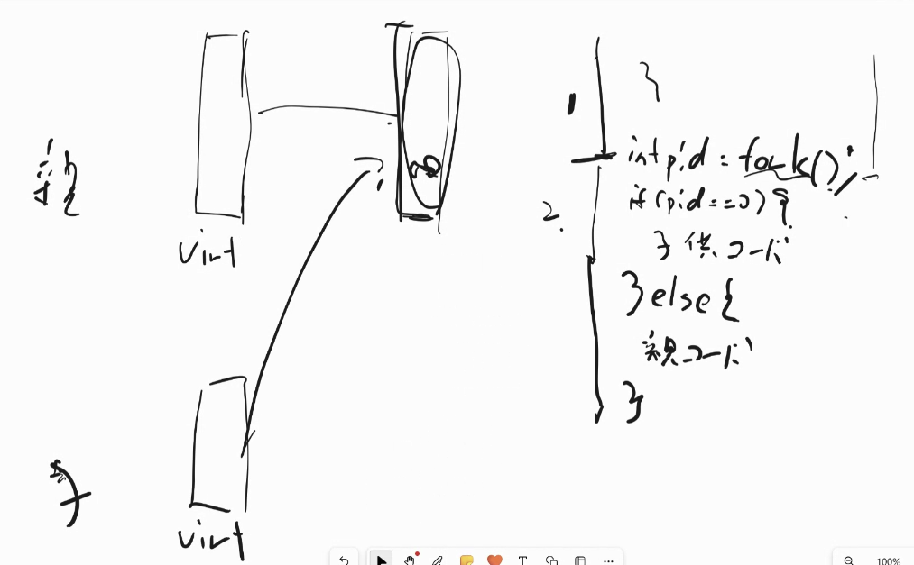
コピーは大変だから、同じものを指すだけにする。
Read onlyにする
子供が書き込んだ瞬間に割り込みハンドラが入って、懲罰房へOSが何したのか確認。
forkしたときにWを外しただけで、本当は書き込んで良いんだよ
下だけコピーする
親が下に書き込もうとした時も、懲罰房行って、OSが確認して、一人しか使ってないから良いよ
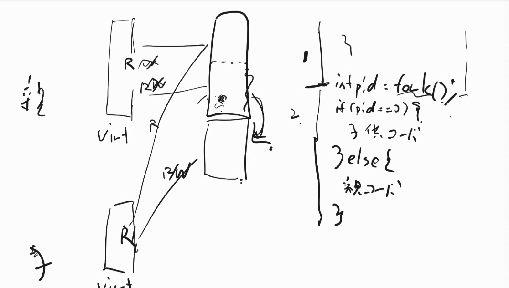

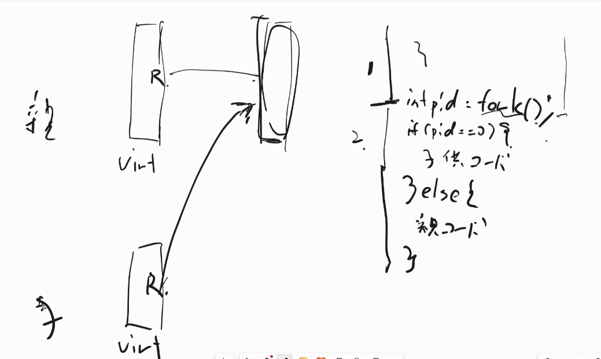

読まれることしかない領域は、2倍にしなくて良いからお得
4KBが1マス

P115
ライブラリとは
他のプログラムから呼び出すために作られたプログラム
libc
soファイル

実行プログラム(a.out)とかとライブラリを結合すると、printfとかを呼べる
putsを各ファイルにくっつけちゃうのが製的リンク
別のとこに置いとくのは動的リンク
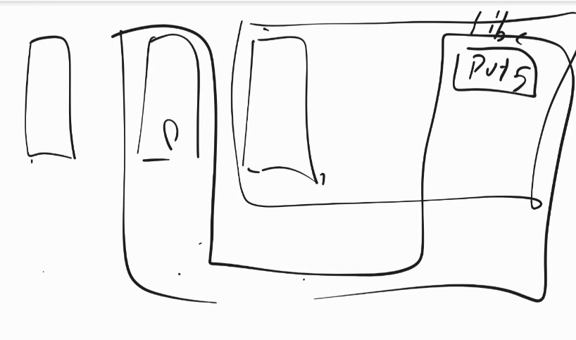
putsがどこに置かれるかでjump先が変わる
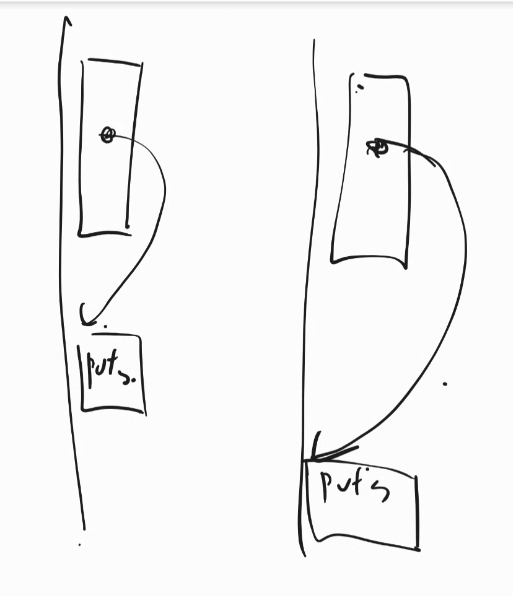
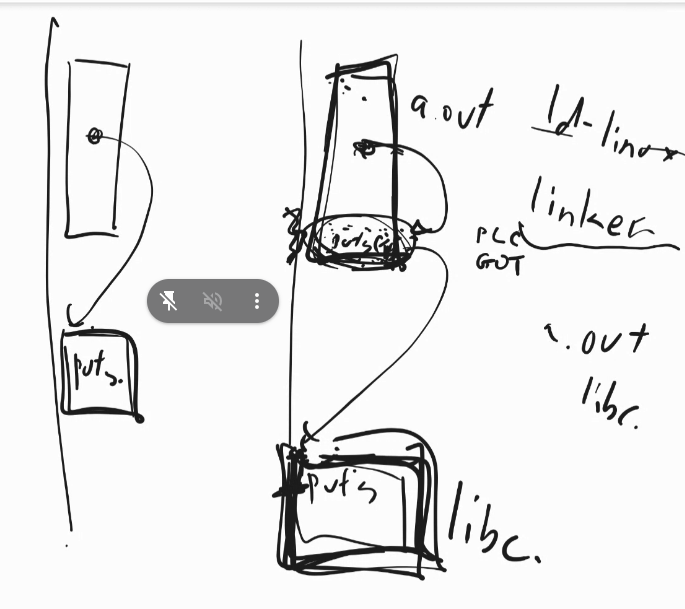
linkerの仕事
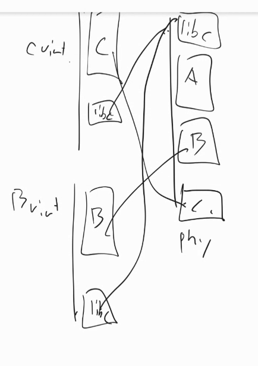
メモリ節約できた。

p118
位置独立コード
→これがライブラリをシェアする方の方式の名前

ファイルシステムのキャッシュ
closeした時に、dirty bitになってるとこだけ、ハードディスクに書き込む。
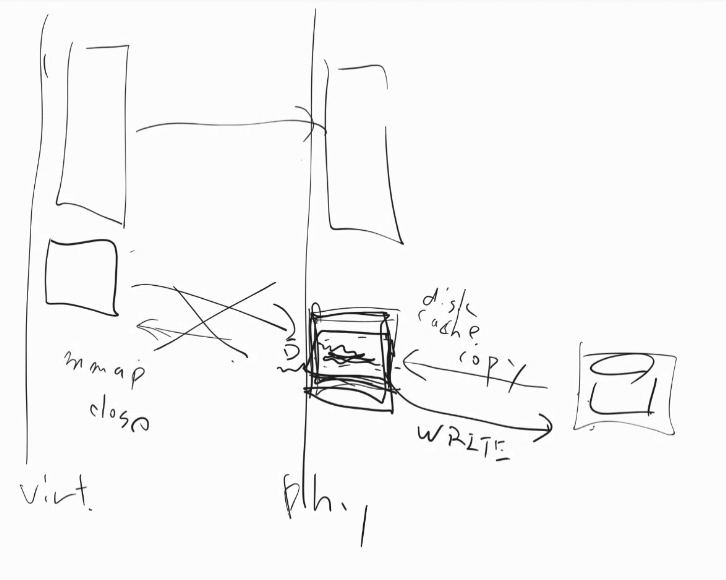

closeはしよう
openしてこの後すぐプログラムが終了してOSが処理してくれるからいいや→あとからこの処理真似しよう、とかした人がプログラムの前半とかでやると、メモリが使われっぱなしになる。

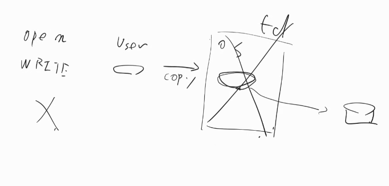
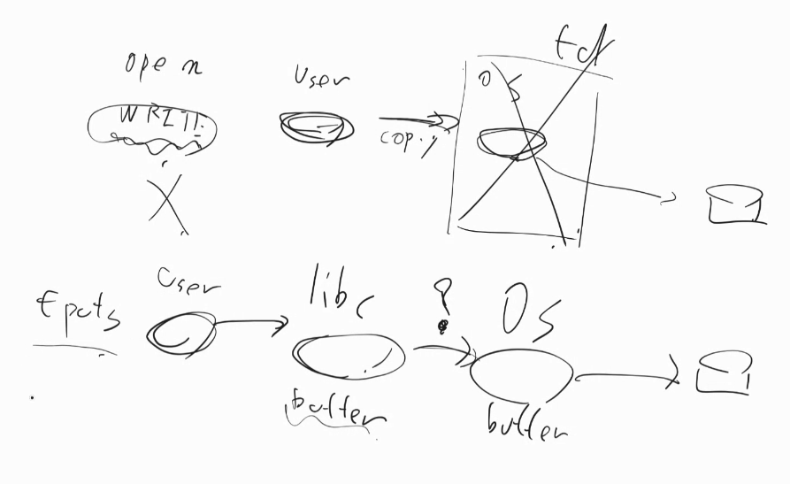
OSまでデータが渡ってなかったら、消える。
close呼ばなくても面倒見てくれるのは、OSの中の領域だけfile discriptaとかに入ってるときだけ。
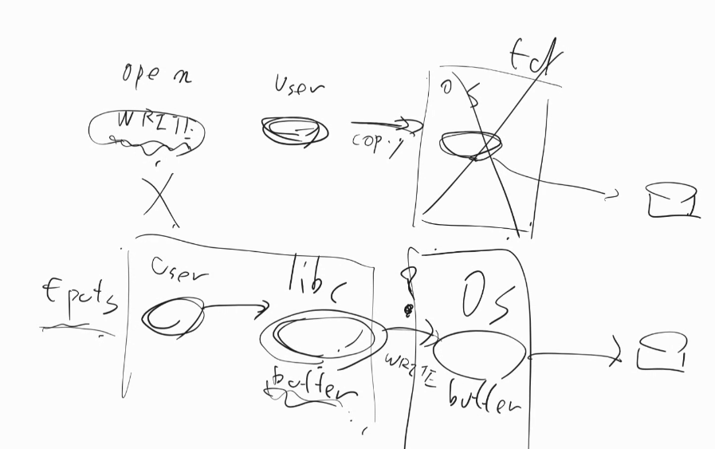

1. 次のページ参照ストリングを与えたときの， OPT， LRU， クロックアルゴリズムに  よるページフォールト回数を求めよ． ただし， 物理ページの数は 3 とする．  
(1) 0, 1, 2, 1, 2, 0, 4, 1, 2, 3, 2  
(2) 0, 1, 2, 3, 0, 1, 2, 3, 0, 1, 2  

2. 内部断片化と外部断片化の違いを説明せよ．  

3. x64 プロセッサを使用しているシステムで， プロセスに 64 GB の仮想アドレス空間  を割り 当てる場合，各レベルのページテーブルはいくつずつ必要か （ページサイズ  は 4 KB で計算せよ）． 

サブルーチン呼び出し
>「サブルーチン呼び出し」（C言語の関数呼び出しやJavaのメソッド呼び出しのように，別の場所に書いた部分プログラムを実行し，終わったら呼び出し地点に戻ること）は，スタックを使って実現されている場合が多い。
http://www.info.kochi-tech.ac.jp/y-takata/pl2/part1/stack.html

固定区画
    - 単一区画
        - 区画が一つしかない。このユーザプログラムはいつもここね、と場所が決まってるので、直接アドレスをしてデータ参照をできる。
    - 多重区画
        - 大きさ10 , 20 , 50の区画を用意しておく
        - プロセス「7」くらい欲しいです。
        - じゃあ10の使ってね
        - 10-7 = 3 の未使用が出る　内部断片化 (区画の内部が断片に)

可変区画
    - 需要が発生するたびに、ちょうど必要そうなくらいの広さのメモリを広場から確保して、渡す(使用中とする)
    - 使用中と使用中の間に、使われてない未使用領域が出る　外部断片化（区画の外部が断片に）
        - メモリコンパクション
            - 使用中区画を全て左にギューっと詰める。
                - コピーが大量に発生するので時間かかって、その間プロセス停止
                - 引越し先アドレス変換をベースレジスタにやってもらう必要あり

スワッピング
    - マルチタスクする時、待ち状態が長いプロセスの使ってるメモリを、一旦補助記憶装置に退避させて空ける
        - スワップアウト:退避すること
        - スワップイン:戻すこと
        - スワップ領域:これに使う領域

シーケンシャルフィットアルゴリズム
    - メモリのあき区画を、双方向連結リストとして管理して、探しやすくする
    - 大きさmのメモリが欲しくなったら、空き区画順番に見て、m以上のが見つかるまで探す
    - 見つかったサイズsのあき区画のうち、mだけ使って残りは空き区画にする
        - ベストフィット：全部見て、あまりが最も小さくなる区画を使う
        - ワーストフィット:あまりが大きくなる区画使う(ベストの方がいい感じになることが多い)

バディシステム
    - 2^nのサイズのいろんな大きさのメモリ区画を用意して、ギリギリ入るやつを使う。ちょうどいいのがなかったら区画を半分に割って使う。
    - 分割してできた二つの区画を互いにバディと呼び、バディ同士は両方が解放されたらマージする。（これは再帰的に発生して、どんどん大きくなれる）

仮想記憶(virtual memory)
    - プロセスごとに専用の独立したアドレス空間を割り当てる
    - プロセスがメモリにアクセスする時は、仮想アドレスを物理アドレスに変換して、物理メモリにアクセスする
    - MMU(memory management unit)と呼ばれるハードウェア(inプロセッサ)が変換してくれる

仮想アドレスへのマッピング
    - ページング方式
        - ページという単位(4kb)で管理
    - セグメント方式
        - プログラムを構成する論理的な単位(プログラムやデータなど)にセグメントと呼ばれる可変長のメモリ領域を割り当てる
        - セグメントには一意なセグメント番号が振られる
        - アクセス時は、セグメント番号と、セグメント内のオフセットを指定し、二次元でアクセス

ページテーブル
    - 仮想アドレスから物理アドレスに変換するためのデータ構造
    - ページ番号でインデックスする配列

ページテーブルエントリ
    - ページテーブル(配列)の要素
    - ページテーブルエントリはビットごとに意味を持つ
    - 重要なビット
        - 物理ページ番号の他に、R/Wビット(読み書き許可されてるか示すビット)などがある

ページテーブルベースレジスタ
 - MMU には， 使用するページテーブルの物理アドレスを保持するレジスタ （ペー ジテーブルベースレジスタ） があり， 異なるページテーブルを指すように変更す ることでプロセッサが使用する仮想アドレス空間を切りかえることができる． 

ページフォールト
- 仮想メモリ上のページにアクセスしようとしたら、そのペ０時が物理メモリ上になかった場合に発生する割り込み
- メモリが小さいとこれがよく発生してpcが重くなる

第五章