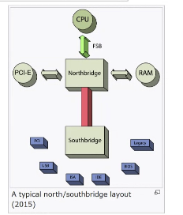
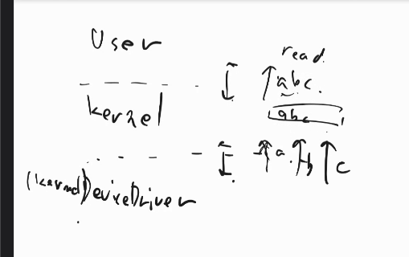
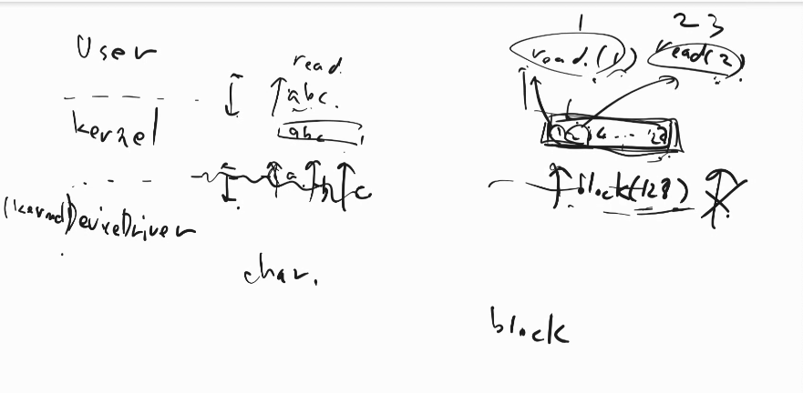
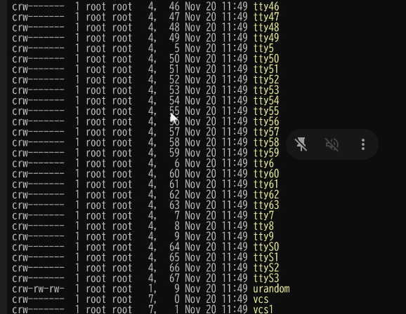
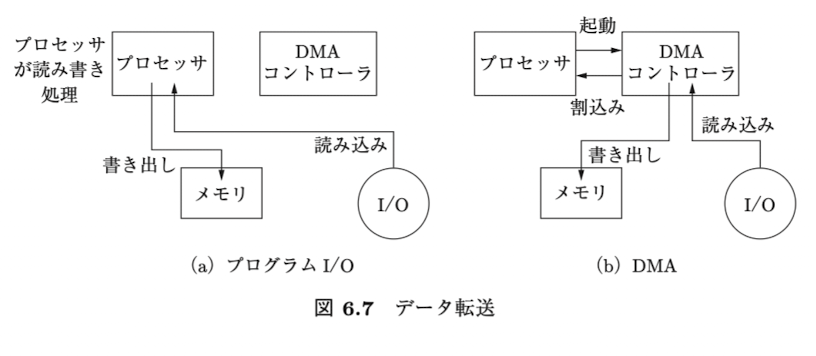
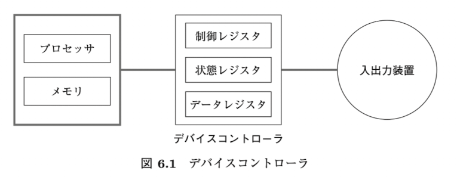

工学基礎シリーズ オペレーティングシステム 6章、7章

# 6章
p151~169

Q
p.154
>処理速度が遅い入出力装置からの割込みの処理
ここでいう遅いというのは、前ページの「入出力完了に応じた処理」をプロセッサが処理すると時間がかかる、という意味？
データレジスタにデータを入れるのに時間がかかるのは(ハードディスクの回転待ちとかで)イメージがつくが、それが終わった後の処理なのにまだ時間かかるの？
→デバイスドライバがアホで、一度に全部もらわずに、ちょっとデータレジスタに載せて、読んで、またレジスタに載せて、みたいな作り方したら時間かかるよという話。

割り込みハンドラはあまりやらないようにlinuxはしてる、割り込んでキューに入れておいて、実際にやるのは後にするとか。

p156
>これを使って  コンピュータ全体の処理が遅くならないようにする．→OK
どうやって？

マザーボード
ノースブリッジ、サウスブリッジ
サウスブリッジにつけてるものが低いヘルツ10MBPsとかで、上の方は何ギガHzとかで、直接繋げると非効率なので、間にクッション的なものが欲しい。

最近は色々高性能になって、全部上の世界でやるようになっている。

バッファリング
    - スピーカーとかマイクとかで使われる
    - 電磁石の強さをどれにするかの情報が受け渡される
    - 決まった長さのバッファを右から左に読んで、終わったらまた最初から読む
    - 前半の0.5を読んでる間に、後半0.5を書き換える(2つのバッファが直線に並んでる)
    - マイクは逆。書き込む。後半書き込んでいる間に、前半読み込んでもらう。

>入出力レジスタ→OK
→これは、p152で言うところの、デバイスコントローラの持つ３つのレジスタ全てを指しているか、あるいは、データレジスタだけ？
制御レジスタとデータレジスタを合わせたもの。主には制御レジスタだと思ってOK。

p158　OK
>3.データ転送
ここでの転送は、前ページのポートマップトIOをベースにしている？
(メモリマップトIOなら、読み込み元も書き出し先も同じ物理メモリだから、わざわざDMAなどの複雑なことをしない？それともやはりプロセッサ資源節約のために、DMAを使う？)
使う場合、普通のデータのコピーなどはDMA使わないのに、IOが関わるデータの時だけDMAを使うのは？

あなた向けですよ、
配列のコピーとかもDMA使うときはある
1kbとかならCPUでいいジャンだけど、100MBとかだと賢いのは使うかも
DMAへのリクエスト投げるのはカーネルしかできないから、ユーザーのプログラムはお願いできない。
デバイスドライバはカーネル権限で動く

p159
> プロセッサは入出力装置が(データレジスタから？)バッファにデータを書き込んでいる間，別の処理をすることができる．
→これはそうかもしれないが、元々はバッファに書き込むための時間が発生せず、いきなりデバイスコントローラ内のデータレジスタを読みに行っていたのだから、そっちの方が早いのでは？

カセットテープの何バイト目を読みたい
デバイスは巻いておいて、デバイスの中のメモリ(バッファ)に書いて、用意できたよ、と(DMAが)CPUのメモリに送る
デバイスはDMA経由で、物理メモリからデバイスのメモリに書き込んだりする

バッファはデバイス上のメモリにするときもあれば、物理メモリ上に用意するときもある。

RDMAという、俺のマシンから相手のマシンのメモリに送る、みたいなテクニックもある
4GBメモリのマシン4代で16GBのメモリかのように扱う

p160
>OS は個々の入出力用にブロックを保持するた  め， 入出力で待たされることがないようバッファを確保するのが一般的

なぜ、個々に入出力ブロックを保持すると、入出力で待たされるのか

 デバイスとOSとのデータのやり取りの単位をブロックという単位にしましょう、という話

一回目は待たされるけど、二回目以降はblockの中に入ってるからそこから取ればいいよね

メジャーバージョンがどのデバイスドライぶが担当するか決まり、マイナーバージョンがどう処理するかがきまる。
デバイスドライブ書きときに、俺4番だからよろしく、みたいなのをOSに宣言するようにする

1,3がnullデバイスの番号なので、他に同じ操作ができるものをmknodってコマンドでスペシャルデバイスとして作れる（おすすめしないけど）

p162
>物理的にトラックあたりのセクタ数を一定値に固定するかわりに， ディスクのシリンダをゾーン （zone） と呼ばれるグルー  プに分けて内側から外側のゾーンに向けてトラックあたりのセクタ数を増加させ  ることができる． 

よくわからない。
5
フロッピーからある時の話
このロタっくはセクタ何個あってって計算するのめんどくさい
先頭から1000番目ってことは、このシリンダのこのセクタって計算(変換)するのはハードディスクがやってね。(これがLBA)
OSから見たら、一直線に記憶場所が並んでいるように扱える。細かいことはハードディスクに任せた。

上位層デバイスドライバは、マイク共通用とかハードディスク共通用とかそういう感じ。
ドライバの登録はinsmodというコマンドで、やる
lsmodで今入ってるモジュールが見れる
カーネルモジュールの中の人つがデバイスドライバ
カーネルモジュールはカーネルで動くもの

ポートマップとIOは今ほとんど使われていない。今はメモリマップとがメイン。
- 昔はメモリが小さかったら、全部使えるようにメモリアドレス空間とは別に用意したかった

頻繁にディスクから読み出したいときはSSD.
webサーバーとかはそういうことしないので、HDDで良い。

p167
バッファキャッシュとメモリマップトファイルの違い
仮想メモリに紐付けたらメモリマップトファイルで、紐付けなかったらバッファキャッシュだけど、ほとんど同じ。
メモリマップトにしなくてもキャッシュには乗ってるよ、くらいの話。

1. デバイスコントローラの 3 つのレジスタについて説明せよ．
    制御レジスタ
        プロセッサが入出力装置に対する要求を書き込む
    状態レジスタ
        入出力装置の状態が書かれている
    データレジスタ
        入出力の対象となるデータが書かれている

2. OS が入出力の完了を知る方法を説明せよ． 
    ポーリング
        一定の時間間隔でOSが入出力装置の状態を確認
    割り込み
        入出力装置のデバイスコントローラが、イベント発生の際に、プロセッサに対して割り込み信号を送る。

3. プロセッサの入出力レジスタへのアクセス方法を説明せよ．
    ポートマップトIO
        - 入出力専用のプロセッサ命令を使用して、入出力レジスタにアクセスする。メモリのアドレス空間と分離された入出力空間アドレスを持っていることになる。
    メモリマップトIO
        - メモリのアドレス空間上にメモリと入出力機器を共存させる。入出力命令は使わず、メモリの読み書きのための機械語命令を入出力にも使用する。つまりプロセッサの物理アドレス空間に、入出力制御のための領域も用意する。

    
4. 入出力装置とメモリ間のデータ転送のうち DMA のしくみについて説明せよ． 
    DMAコントローラというハードウェアを使用してデータ転送を行う。
    プロセッサは、DMAコントローラに転送対象データの開始アドレスとデータ量を指定するまでを行う。
    
5. デバイスドライバの役割を説明せよ．
    OSによる一般的な操作を現実の入出力総理の操作を置き換える。(ソフトウェア)
6. 図6.11 （164 ページ） に示す各ディスクスケジューリングにおけるヘッドの総移動  量を求めよ． 
    pass

ページフォールト(復習)
仮想アドレス空間のブロックであるページ(4kbのやつ)にアクセスしようとした時に、まだ物理ページが割り当てられていないと、ページフォールトが発生して、しばらく使わなそうなページの内容をスワップ領域に書き出し、このページを空き物理ページとして利用する。

デバイスファイル
    - OSにファイルとして認識させる、入出力インターフェース
    - 一般のファイルのように、READとWRITEができる
    - キャラクタデバイスとブロックデバイスの二種類がある

デバイスコントローラ
    -  デバイスコントローラは、コンピュータと周辺機器（デバイス）の間のデータ通信を制御するハードウェアコンポーネント.
    - ハードウェアデバイスとオペレーティングシステムまたはアプリケーションプログラムの間のブリッジとして動作するハードウェアコンポーネント

シリンダ
    - (ヘッド群が移動することなく読める、すなわちディスク面数だけある)トラックの組
    - トラック
        - 同心円.複数のセクタを置くことができる。
    - (シリンダ番号、ヘッド番号、セクタ番号)の3つの組みCHSで、個々のセクタを特定可能

HDDの仕組み
https://www.youtube.com/watch?v=wtdnatmVdIg&t=282s

OSは隣接する複数のセクタをひとまとまりとしたブロック単位でアクセスする。
- p127 ファイルその操作において、OSが補助記憶装置を読み書きするときはブロックを単位として行う。すなわち、ブロックはOSから見た転送の最小単位。

データブロック
- 補助記憶装置のデータの転送の最小探知であるブロックの内、ファイル本体を格納するブロックのことを、索引ブロックと対比してこう呼ぶ。(p139)

ポーリングと割り込みはハイブリッドで使われてる
- 1秒間に60万個のパケットが届く
- 60万回1秒間に割り込みかけると、CPU他のことできなくなってしまう
- そんなに届いてないときは割り込みにして、忙しいときはポーリング

# 7章
p170~198

Q
p178
>返り値pos は，実際に設定された入出力ポインタの， ファイルの先頭からの位置である． 
 - posを使ってreadやwriteをする関数が別にある？

lseekはカーソルを動かす。readはカーソルの位置から読み込む。
openしたときは、ファイルの場所にカーソルがある。

p178  p50にfork/execの説明あり
>また， exec系のシステムコール※9は， プログラム中でほかのプログラムを実行  するために用いられる．  例えば， execl は， 自分自身のプロセスを引数の file で指定したプログラムで置  き換える． 

(子プロセスは fork システムコールを  呼び出した直後の状態から実行が始まる． この時点では， 子プロセスは親プロセ  スと同じプログラムを実行しているが， その後，子プロセス側で exec システム  コールを実行することで， 実行中のプログラムをシステムコールの引数で指定し  た実行ファイルに入れかえる． )

なぜ、fork/execなどという一見複雑なことを？(以前伺ったような気がするのですが、、)
別にcreate processとかでもよい。windowsは違うし。伝統がこれだというだけ
最近はcloneとかいうforkの進化版もある(いらないものはコピーはしないとか)
二つ作るなら、コピーオンライトの時は読むだけの時は物理メモリを節約できたりして、お得だったりする。

>ミスに備えて， fork した後の子プロセスで exec系のシステムコールを実行することが多い． 
どういうミス？
forkした子プロセスがexecしたコマンドが失敗して帰ってきた時に、それのエラーコードに従って、対処変えたい。
親プロセスが子プロセスの終了コード見て判断したいよね、という話。

p179
>プロセス間通信
ファイルはないのにファイルディスクリプタを使って、あたかもファイルに書き込み/読み込みしてるかのようにプロセス同士が情報を受け渡している？

p180
>こ のとき， wait の返り値として子プロセスの PID が返されるので， 複数の子プロセ  スを生成した場合でも， どの子プロセスが終了したかを識別することができる． 

p184
>図7.5の仕組み
iノードのサイズは決まってるので、大きいファイルの格納場所を全て指すには、三重とかを使わないといけない。だけど、頭から三重にすると、読み込むのに何ステップもかかる。ファイルの先頭くらいは見れるようにしたいよねってことで、先頭の方は間接ブロック使わずにしまってる。

p186
>システム全体のオープンファイルテーブルが常駐していることで， プロセスご  とのオープンファイルテーブル （非常駐） は， アクティブ i–ノードテーブルのエン  トリへのポインタではなく， （システムの） オープンファイルテーブルのエントリ  へのポインタで各ファイルにアクセスできるようになっている． 

システムのは、誰かが開いている一覧
プロセスのは俺が開いている一覧
だから別途もつ
持たなきゃいけない情報は一緒。だから情報はシステムの方で持っといて、プロセスの方は、システムのこれって指さしてるだけ。

p191
>いくつかのプロセスのメモリイメージのすべてがスワップアウトされてしまい， メモリ容量の不足が解消された  ときにスワップイン （swap in， 必要なメモリを割り付け， メモリセグメントを読  み出す） されるという問題

これの何が問題なのか
コレに比べデマンドページングなら、メモリの一部だけスワップになる
メモリが200メガ、110メガのプロセスが二つ
2つ目のを読み込んだタイミングで、元いたやつの20マガだけを追い出せば良い(全部追い出す必要ないよね)

標準エラー出力をファイルに入れる方法
    - ls  hoge 2> aaa
    - パイプで入るのは標準出力だけ
    - 0が標準入力、1が標準出力、2がエラー出力

&
    バックグラウンド実行

2>&1
    - 2を1に繋ぎこむ

シェルスクリプト大きいもの作って運用しようとすると酷い目に遭うのでやめよう。
自分の手元でちょっと使うくらいならいいけど。

1. pipe システムコールを用いて双方向通信を行いたいときには， どのようなプログラ  ムを書けばよいか． 概略を示せ．  
2. パイプラインによって複数のコマンドが連結されている場合に， シェルは内部でど  のように処理しているか， シェル自身のプログラムの概略を予想せよ．  
3. 図7.4 において， 1 ブロックが 1 KB のとき， 保存可能なファイルの最大容量はいく  らになるか．  
4. 例えば， /etc/passwd ファイルを参照するとき， ファイルシステムはディレクトリ  や i–ノードをどのようにたどって， 最終的に目的のファイルを見つけるか説明せよ．  
5. FreeBSD や Linux など， 身近にある Unix系OS のソースを調べて， i–ノードがど  のような情報を含んでいるかを確かめよ．  
6. FreeBSD や Linux など， 身近にある Unix系OS のソースを調べて， プロセステー  ブルがどのような情報を含んでいるかを確かめよ． 

Unix系OSのファイル入出力
- 既存のファイルを読み書きするには、先にopenシステムコールでファイルを開く必要がある
- fd = open(name, flag)
- nameはファイルのパス名。flagは「読む」「書く」「新規作成」などのファイルに対するアクセス方法

ファイル記述子(ファイルディスクリプタ)
- UNIX系OSでファイルを開く時に使うopenシステムコールの返り値
- 以後の読み書きなどの操作でファイルを識別するために用いられる小さな整数値
- fd = open(name, flag)

iノード
- それぞれ1つのファイル実態に対応するデータ構造。ファイルの長さなどの属性情報の他に、データブロックへのポインタも保持している。

プセセステーブルエントリ
    - プロセステーブル
        - プロセスの状態
        - スワップアウトされている時にも必要
    - ユーザ構造体
        - スワップアウトされた時には必要ない情報

セキュリティの話
sudoはsetidビットがついていて、所有者がrootなので、rootとして何でもできる

マウントしたディスクにroot権限のbashがあったら何でもできちゃう？
setuidを無視しろって設定をして、usbとかをマウントする

悪いことしたい人
自分のパソコンでroot権限でsetuidビットをつけたbashを作ってusbに入れておく
会社のpcにそのUSBを指し、sudoでそのbash立ち上げると、root権限で実行できることになり、何でもできちゃう。(会社pcのrootと自分のpcのrootを区別できない)
対策として、マウントするときにはsetuidビットが自動で無効化されるような設定をしておく。

LD_PRELOAD
- 既存の関数をオーバーライドまたはフックすることが可能
- suを実行しても、動的リンカーがsuはsetuidビットついてるよね、じゃあやらないね
- setuidビットがついてるものに対してはLD_PRELOADができない

物理的なアクセスがあったら何でもできる
- HDD引き抜いて悪い人のpcでroot権限でみれば見れちゃう
- 平文ではおかずに、暗号化して書き込もう

動かしてるlinuxは本物なのか
- 誰かが悪いもの入れた偽物じゃないのか
- コンピュータが起動したときにBIOSを鍵で見て、証明されてる鍵と検証して、マイクロソフトが作ったものです、みたいなことを確認する。これをいろんなファイルで次々やる。認証曲と通信するか、公開鍵一覧をあらかじめインストールしておく。(それが置き換えられてたら困るが。)
- windowsはデバイスドライバインストールするときに、証明できるものなのかチェックする。
- マイクロソフトがやられていたら終わり。誰を信頼するか。
- セキュリティチェーン　Aが大丈夫ならBが大丈夫ならm、、、、　どこかダメならダメ

来週は8,9章
