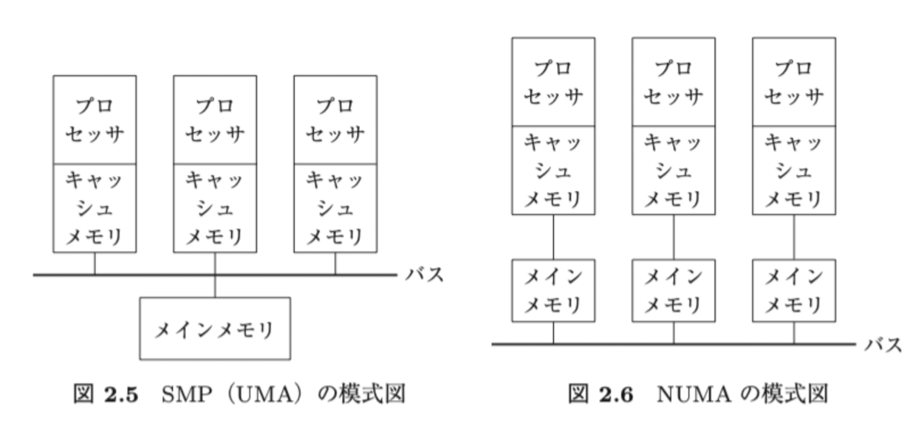

工学基礎シリーズ オペレーティングシステム 8,9章

# 8章
p199~220

Q

p208
>Windows のカーネルでは対称型マルチプロセッシングおよび， NUMA  を実現している

対称型マルチプロセッシングとNUMAは定義的にどちらか一つしかできなさそうだが、両方やっているとはどういうことか
どちらの形式だったとしてもwindowsは動きますよ、という話。

p32,33
なぜ対称型マルチプロセッシングは、バスを共有する必要があるのか。
そこがボトルネックになるのであれば、プロセッサ一つにつきバスを一つ用意すれば良さそうだがそうしないのはなぜか。
→同じメモリに複数のプロセッサが読み書きしようとしたら、結局順番待ちが発生する。メインメモリにプロセッサひとつにつきひとつバスを引いたら、メインメモリの中で順番整理する必要がある。

最初はプロセッサひとつにメモリひとつ、プロセッサ増やした。(対象型マルチプロセッシング)メモリアクセスで渋滞するからNUMAにしよう。(遠いメモリのアクセスは遅いけど、近いのしかどうせ使わないしそこ速いからいいよね)

p215
LPCによる3つのメッセージ受け渡し方法が、よくわからない

HDD消えない問題

1. Windows の特長を 5 つ以上あげ， その内容を説明せよ．
- 可搬性 （portability， ポータビリティ），
    - 様々なアーキテクチャのハードウェア上で動作することを目指して設計されている。
    - 階層構造を採用して実現している
    - HAL(Hardware abstraction layer)ととカーネルより上位の層を独立したモジュールとして分離
    - 可搬性の高いC言語でOS自体が記述されている点も要因になっている

- 互換性
    - 古いバージョンのwindowsやMS-DOSとの互換性を確保し続けている
    - Unix系などの他のOSとの相互運用も保たれるようにしている

- 信頼性
    - 内部の機能不全や外部からの不正操作に対して頑健
    - OSを、不正なアプリケーションプログラムのアクセスから保護したい
    - アプリケーションプログラムがカーネルモードで動作するOSにアクセスできないようにしている
        - カーネルモード(OSのカーネルが動作する環境)
        - ユーザーモード(アプリケーションプログラム(AP)が動作する環境)
    - APとカーネルのやり取りが必要なときには、windowsAPIを使用して通信する
    - APもそれぞれモジュールに分割し、三塚らのメモリ空間にのみアクセスでき、それ以外のメモリ空間に対してはアクセスできなくしている。
    - つまり， Windows ではモジュール化によって 1 つのアプリケーションプログラ  ムに対する不正なアクセスがほかのアプリケーションプログラムに影響を及ぼす  ことがないようにしている．
    - さらに， カーネルモードで動作する OS もモジュー  ル化し， かつ， それらを層状に積み重ねる階層構造とすることによって， システ  ムの各部分を分離させ， 信頼性を向上させている． 

- 拡張性
    - 柔軟なネットワーク機能を実装し、様々なネットワーク環境への統合が容易に行えるように設計されている
    - モジュール分割しているので、カーネルモード/ユーザモードのどちらにおいても新機能の追加が可能

- 性能の確保
    - バージョウンアップを重ねて、処理速度や応答性などの性能を確保

2. Windows において， クライアントとサーバは LPC機能を使用して通信を行うが，  この LPC はメッセージの受渡し方法の違いによって 3種類に分類できる．それぞれについて説明せよ．  

1.ポートメッセージキューを用いる

3. Windows PC でパフォーマンスモニタを使用して， スレッドスケジューリングの状態変化を観察せよ．  

4. 上の 3. と同じく， Windows PC でパフォーマンスモニタを使用して， 割込みと DPC  処理の様子を観察せよ． 

- セグメンテーションフォールト
    - プログラムがアクセス禁止のメモリ領域にアクセスした際のエラー
    - 存在しない無効なアドレスへのアクセス、リードオンリー領域への書き込み試行など

- ページフォールト
    - プロセスがアクセスしようとしたメモリ領域（ページ）が物理メモリ上に存在せず、ストレージに退避されている場合に発生する割り込み

- windowsのカーネルでは、対象型マルチプロセッシングおよびNUMAを実現している
    - p32に詳細あり
    - 対象型マルチプロセッシング(SMP)
        - symmetrical multiprocessing
        - 全てのプロセッサ(プロセッサコア)が同じ種類で構成され、メインメモリを共有する方式。構造上、全てのプロセッサのメモリへのアクセス速度は等しくなる。    
        
    - non uniform memory access (p32)
        - プロセッサごとにローカルメモリを有し、リモートメモリ(他のプロセッサあるいはプロセッサグループのローカルメモリ)よりも、ローカルメモリの方が高速にアクセスできる方式
        - SMPでは、全てのプロセッサでメモリバスを共有するため、プロセッサ数が増えるとメモリへのアクセスがボトルネックになるが、NUMAはこれを解決し、現在主流になっている。
    

- FAT
    - file allocation tableというファイルシステム
    - データとは別に連結リストを補助記憶装置の中に持って、データがどこにあるかの情報を保存

- 32bitと64bitのOSの違い
    - https://abm.asukabook.com/jp/expert/64or32.html
    - CPUのデータバスの幅が32bitか64bitか。
    - データバス
        CPUと主記憶装置（メモリ）や他の周辺機器との間でデータを転送するための伝送路
    - 大量の情報が入ってきても渋滞しないので速い
    - 

仮想メモリが出てきた時のwindowsの対応()
- windowsでよく動かされてるソフトtop500が仮想メモリを入れても動くように
- シムシティは0番目のアドレスを見るバグがあったが、そのバージョンのシムシティの起動時に把握して対応するようにしている
昔のwindowsにあったバグは仕様ってことにして、新しいwindowsでも同じようになるように、ちゃんとテストしてる

linuxとwindowsの違い
linuxは大きな一枚岩。カーネル空間は任意のメモリを読める。どっか一箇所壊れると他にも影響出る。他への影響を考えるのが大変なので、改修する時大変。windowsははっきり分かれている。その分同じことするのに何個も分かれてるもの使わなきゃいけなくて遅くなりがち。

CPUが3Ghzだったとしても、いつも3Ghzで動くわけではない
- 消費電力を抑えるために、車の1速2速みたいな感じで切り替えてる。
- 負荷が少ない時は、ゆっくり動かしてる
- こういうポリシーで速度変えよう、というのをlinuxが管理

# 9章
p221~235

Q
p.227
コンテナの特徴の最初の２つは、なぜコンテナだと軽量だったり、計算機資源が少なくて済むのか

ハイパーバイザ型だと、ハイパーバイザの隣に別のOSを立ち上げてるイメージ。　→別々のOSを立ち上げてる
コンテナ型だと、OSはひとつで、その中で名前空間とかを分けている　→OSの環境まるまる用意しなくて良い

結局コンテナだと何が嬉しいのか
- このメモリしか見れなくて、このファイルしか見れないよね見たいな制限をかけられるので、再現性やセキュリティ的に嬉しい
- メモリ大量に食うプログラムがいたとして、コンテナに閉じ込めておけば、それが死ぬだけで、他のプログラムがメモリ足りない、見たいなことはない
- パッケージとかライブラリの色々バージョンアップしちゃうと、再現性的に困るから、固めておきたい、って感じでもよくコンテナは使われる。

メモリとかを制限してくれるのはカーネルの機能

1. 仮想化によってサーバを集約し， 物理ハードウェアの台数を減らすことの得失につ  いて述べよ．
    - ハードウェアの利用効率向上

2. CP/CMS のように， シングルユーザの OS を複数実行してマルチユーザ化すること  と， マルチユーザの OS を 1 つ実行することの得失について考察せよ．  

3. 昨今のサーバや PC向けのプロセッサでは， 仮想化のためのハードウェア支援機構が  実装されていることが一般的である． 具体的にどのようなものがあるか調べてみよ．  

4. 同様に， 入出力制御装置 （ネットワークや補助記憶装置のコントローラ） における  仮想化支援にはどのようなものがあるか調べてみよ．  

5. 自分の PC で使用できるハイパーバイザについて調べ， 可能であれば Linux などを  ゲスト OS としてインストール， 実行してみよ．  

6. 自分の PC にコンテナ環境をインストールし， コンテナを作成して実行してみよ． 

トラップ
- プロセッサのトラップは、コンピュータシステムにおける例外処理の一種
- 実行中の命令で異常が発生したことを知らせる同期割り込み
- 発生原因
    - 未定義命令の実行試行
    - ゼロ除算
    - etc

バイナリ変換も対応できないケースもある
- プログラムを初めて実行するときに解析して、大丈夫かなを見るが、プログラムの実行中にやっちゃマズイ命令を生成するようなプログラムだと対応できない
    -  JITとかが典型的な例。OSから見た時はユーザープログラムが何をしているかは仮定できない。
- 間にエミュレータを入れて、なんでも動かせるよん、と歌ってるシステムもあるが、それはその分かなり遅い

ハイパーバイザの隣に別のOSを立ち上げてる　→別々のOSを立ち上げてる

OSはひとつで、その中で名前空間とかを分けている
OSの環境まるまる用意しなくて良い

次回

図解入門TCP/IP
chapter1,2