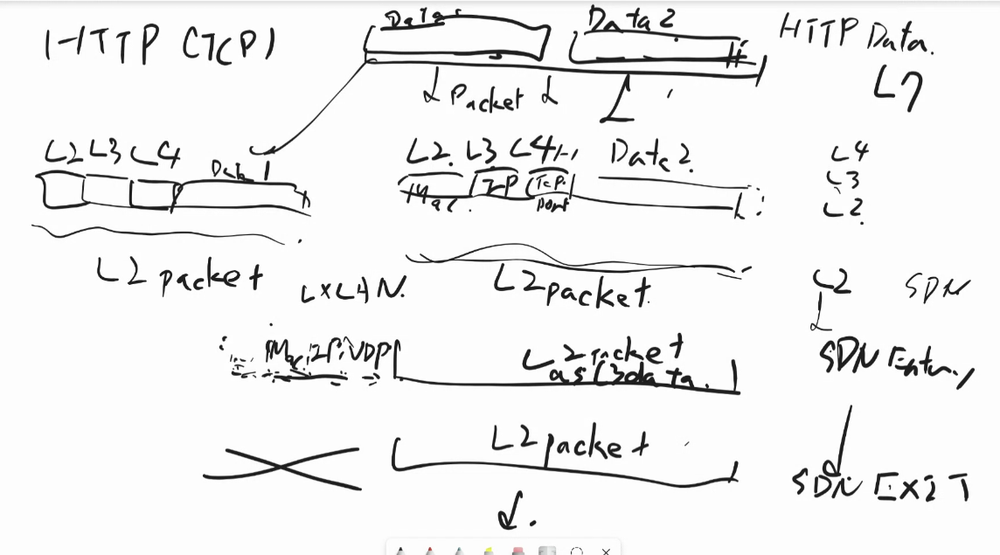

図解入門TCP/IP 第一版
chapter1,2

HW
どうやって電圧の差とかで0/1を送っているのか調べる

# Chapter1
p3~46

Q.
p24,25
なぜブリッジが作られたのか。間に橋をかけずとも、そのまま繋げばいいのでは？(スイッチはあったら配線が楽になりそう)
「>物理層の信頼性を確保」と関係がある？

054 
そのため〜

p59

なんで光は送受信で2本だが電気は良いのか
これと半二重雨、全二重(p63)の関連は?
    光は早いから、二重にしないと勿体無いということ？

反射がなければ1本でもいけるかも
前に

道線で電圧だと、向こうから来たのかどうかわからんくなる。から2本に分ける
昔は1本で無理やりやってたけど、空気の読み合い必要でだるいので、分けた
複数人が書き込みするとトラックが衝突する

p67
周波数帯域が重なるとは
チャンネルを変えてみましょうってそんな軽いノリでできるものなの？

無線ルーターがチャンネルを変える機能を持ってる。最近のは勝手にやってくれる。

p73
ボンディングとMIMOの違い
    ボンディング：別々の周波数をまとめて太い道として違う
    MIMP:一つの周波数を2本のアンテナで両方使い、受信側もアンテナ2本にして、データ2倍のスループット
        - 受信側は、どっちの送信アンテナから来たデータかなって頑張って考えて判別する必要がある
        - 

75
Blouetoothはなんでそんな頻繁に切り替えるのか
→ぶつかった時にすぐ切り替えられるように

- 電波のことが色々書いてあるサイト
    - https://techweb.rohm.co.jp/product/wireless/wireless-communication/37/

- ブロードバンド
    - ブロードバンドとは、高速かつ大容量のデータ通信が可能なインターネット接続サービスの総称です。
    - 一般的には、512Kbps以上の速度を持つ接続サービスがブロードバンドと定義されています
    - 日本では1996年からブロードバンドサービスが提供され始め、その後急速に普及しました。従来のナローバンド（狭い帯域）のインターネット接続から移行することで、多くの家庭や企業が高速インターネット環境を手に入れることができました

JPnic
 AS番号を管理してる団体(世界的に管理してる団体があって、日本ではこの団体がやってね、ということになってる)
 AS同士で契約してつながるかどうかを決めてる
 力関係でどっちが金払うかとか
 それを小売りしてるのがISP
 Internet Exchange

回線交換方式
    - 電話回線で使われてた
    - 喋ってない間も使ってるので勿体無い
    - NGNに置き換わった

公衆電話でインターネット
    - ISDN:電話かけるみたいな感じでインターネット
    - 音声をデジタル信号に変換

p12のプロトコルは知っておこう

p17のプロトコルも何やってるのかわかっておこう

p18
- L2だとヘッダだけでなくトレーラーにがついてるのは?
    - ハードウェアに近いところの処理なので、チェックサムがトレーラーについてる。データが壊れてないかチェックするもの。電波の状態の間に1が0になっちゃったりしてないかを確認。

- パッケージマネージャーはチェックサムや署名の検証をしてくれてる
    - これは改ざんされてないよねの、確認。

- インターネットからのものを全部チェックサム見たりはしない
    - 中身が悪いものだったりしたら、チェックサムも偽装されてるかも

- AさんはBさんからもらった鍵が正しいものかどうかを、なんらかの別のネットワークで確かめないといけない
    - 信頼されてる鍵のリストを公開してる人がいるので、それで確認する
    - そのリストが正しいのかどうか→みんながあの人のリストを使ってるから、まぁいいか

リピーターは海底ケーブルで使ってる
光ケーブルは盗聴が難しい
リピーターの場所では電気信号になってるので、盗聴できる

電気だと減衰するのに、光ファイバーは大丈夫な理由
- 海で波が遠くに行くと弱くなるような感じ。電気は分子の間を電子が通ってくので統計的に時々変なことが起きる
- 光の方が障害物的なものが少ないので、そういう統計的エラーが少ない

光のケーブルは、ゆったりとしか曲げられない
    - パスタみたいなイメージ。何センチあたり何度までしか曲げられない

5Ghzは屋内でしか使っちゃダメ
- 飛行機が５GHz使ってる
- 飛行機のデータを引いちゃうと、30分くらいルーターが黙るようになってる
- 飛行機から、5Ghzだまれ、みたいな電波を出してる
- ワンルームとかだと窓から入ることも。カーテン閉めるとかでも改善する。
- だから公衆Wifiは2.4が多い。3chしか同時に使えないから、自宅の隣にできると辛い。

来週は3と4.

p40
    SDN
    ソフトウェアでどれとどれが繋がってるかを管理する
    AWS借りた時に、これとこれを繋げるみたいに設定した時に裏側で人がケーブル差し替えてるのではない
    物理的には全て繋がっているが、使っていいケーブルと使っちゃダメなものをソフトウェアで管理してる感じ

p54
    なぜネジネジなのか
    - まっすぐ並行な2本があると、1本に流した電流が磁場操作してもう片方を同じような状態にしてしまう。
    - まっすぐだとアンテナ化してしまう(電磁波を拾ってしまう)

    なぜ2本？
        - 2本の電圧の差を見てる
        - 2本が同じ影響を受けると、同じ方向のノイズを受けてたら、2本の差分を取ってる分には影響を受けない

p72 ショートガードインターバル
    - 
    - データの先頭はここだよ、車の先頭はここだよ、と事前に決めた形にしておくことで、車の波を復元した後に、どこから読み始めたらいいのかわかる。
    - 
    - 
    - http://www.radio3.ee.uec.ac.jp/ronbun/FORN_No_340_Karasawa_All_Rights_Reserved.pdf

- https://www.logitec.co.jp/products/network/450wlan/450lan_purple.html

プロトコルで決まっていること
 - 物理的な仕様
 - 送信相手の特定
 - .. 

- 1.物理層
    - ケーブルやコネクタの形状など物理的なしようについて定義されている。光を電気信号にしたり、電波にしたりする。
    - NIC(Network )
        - コンピューターをネットワークに接続するための部品(昔は差し込むタイプのカードだった)
    - (リピーター)
        - 電気は減衰するから100mごとに復活させる機械.最近は光だからいらない。
    - (リピーターハブ)
        - 受け取ったパケット(ビット)のコピーをそのままいくつかのポートに分岐させて送る。L2スイッチに置き換えられた。
    - メディアコンバーター
        - 電気を減衰しにくい光に変換して最後にまた電気に戻してpcに渡したいので、これで変換する
    - アクセスポイント
        - パケットを電場に変調する。無線と有線の架け橋。

- 2.データリンク層
    - 物理そうの信頼性を担保し、同じネットワークにいる端末と接続できるようにする。
    - MACアドレス(フレームのヘッダーに入ってる)の情報を元にフレーム転送を行う。
    - ブリッジ/L2スイッチ内のMACアドレステーブルで、ブリッジ/L2スイッチのどのポートに、どのmacアドレスの機器が繋がってるか管理
    - ブリッジ/L2スイッチ(の機能)
        - pc1のポートとpc2のポートを繋ぐ橋
        - ブリッジは1対１だが、L2の方はたくさんの端末を接続できる
        - 

- 3.ネットワーク層
    - ネットワークとネットワークを繋ぐ階層。
    - IPアドレス(パケットのヘッダーにある)を元にパケット転送をする。
    - ルーティングテーブル
        -  詳細はp163~
    - ルーター(の機能)
        - NAT(Network Address Translation)
            - IPアドレス書き換え
        - IPsec VPN
            - 仮想的な専用線(トンネル)をインターネット上に作成
        - PPPoE(point to point protocol over Ethernet)
            - NTTのフレッツ網と接続
    - L3スイッチ(の機能)
        - ルーター　＋ L2スイッチ

# Chapter2
p47~ 75

19: