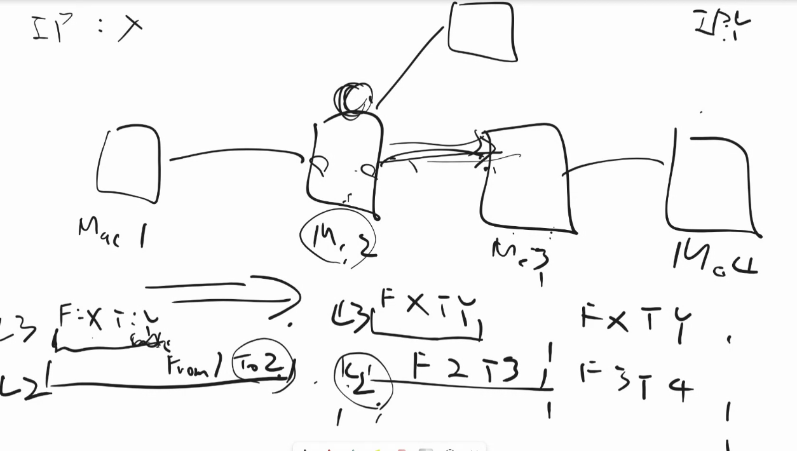

3,4章

# 3章
p77~130

p117
③どうやって自分に対するARPフレームだと判断するのか
各PCは自分のIPとmacアドレスを知っていて、ARPリクエストで、このIPの人いますか、と聞いたら、私です！と回答
おせっかいで他の人が答えるようにすると、大量のpcからあいつあいつ！と回答が来て大変なので、自分で答えさせるようにする。

124 grafはCHAP

p140
サブネットマスクとCIDRの仕組み

p163 
IPルーティングの仕組み

p173
ベクター(出力インターフェース)とは？
ベクターはルーター的にみたら、右か左か、みたいなイメージ。
右方向に行ったらあと３歩で着くらしい、みたいなことを元にルートを判断する。

ペイロードの中身がプリアンブルと同じになってて、途中が最初
先頭のプリアンブルがちゃんと読めていれば、同じパターンが途中に来ても、これはペイロードのものだなってわかる。タイプの中にパケットサイズが書かれるので、どこまでペイロードかわかる。
もし、途中のものをプリアンブルだと思ってしまっても、チェックサムが合わなくて、捨てられるので問題ない。

送る側と受け取る側で周波数が違うとクロックがずれて、ちょうど0と1の間をサンプリングしちゃうかも
→通信速度を1Gbpsとか決めておくことで、ずれないようにする
機械なので、1Gbpsで作ろうと思ってたけど、1.001Gbpsとかになっちゃう可能性もある。だけど、プリアンブルとして01を64個並べておけば、多少ズレてても、気づけるでしょ、ということで64こも並べてる。

macアドレス被り
iphoneとかはmacアドレスを定期的にランダム化して、プライバシーを強化してる。
このmacアドレス朝8時に大体ここ通ってるな、を防ぐ。(駅のwifiとかで拾っちゃう。)
macアドレスが被って困るのはLANの中だけでの話。だからARPすれば大丈夫。

IPアドレスに届けたい。LANにいなかったらLAN内の町の郵便局であるゲートウェイに送る。

緑のところで、MACアドレスかブロードキャスト用のアドレスが入ってたら、受け取る。受け取って中のオレンジの部分のIPを見て、自分用かどうか判断。
オレンジの後に緑で包むために、ARPで誰？ってやって、いなかったら、郵便局へ。

一つのmacアドレスに複数のIP割り振りはOKだが、逆はだめ。

pp135
フラグメンテーション
上のレイヤでやると早くなるのは？
TCPの長いのをIPの短いのに分割。
上のレイヤーの方が、届いてなかったらこれだけ送り返してね、みたいな複雑なことをできる。なので、なるべく上の方で分割したい。

p135
DontFragmentビット
いったんこのビット立てて、おっきい荷物送ってみる。L2データリンク層は分解したいけど、このフラグがついていたら無理なので捨てる。上の層の送りたかった人は、受取証明書が来ないので、「ダメだったかぁ、もう少し小さくしてもう一度送ろう」とやる。￥
ICMPというエラーのプロトコルで、親切に、捨てたよ~っておしえてくれるルーターもいる。

どの桁数までをネットワークとするのか、の表し方が、2通りある
- 255.255.255.0みたいに、4つの数字で表すやり方
- 196.196.196.0/24 みたいに、24ビット目までネットワークだよって表すやり方。
コンピュータが500台だと/24だと256までなので無理
そういうときは端末を表す桁を多めに取りたい。そうすると、ネットワークの方を表す桁が減るが、これはあくまで内部のIPなので、グローバルに判別したりはしないので、そんなに桁数なくても困らない。

上の表でクラス分けしているが、クラスAの中で、1個だけこれはプライベートに使いましょうね、クラスBの中で...という感じで決めといてる↓
グローバルのアドレスは、上記を使わないようにしてる。
プライベートIPはあくまで同じネットワークの内部で使う。macアドレスみたいなノリだが、それのL3レイヤーバージョン。

ipv6
フラグメントされない。黙って捨てられる。

IP:とりあえず隣に送ったぜ、あとは知らん。
TCP:いくつめまで届いたよ。これ届いてない方対応しなきゃ。

ぐるぐる回ることがある
全体把握して最適ルート考えているのではなく、書くルーターが右に送るか左に送るか、くらいのことを独自に考えてるので。

大阪から東京に行ってる間に、変更があると、

IPSecは拠点間でよくやる
HTTP以外のこともするかもしれない。ファイルのコピーとか。だから色々できるIPのレイヤで暗号化を考える(HTTPのレイヤで考えるのではなく)
何を暗号化したいのかによって、どこでどこまで暗号化するのか
どのIPに送ってるかまで隠したいのか、など。

# 4章
