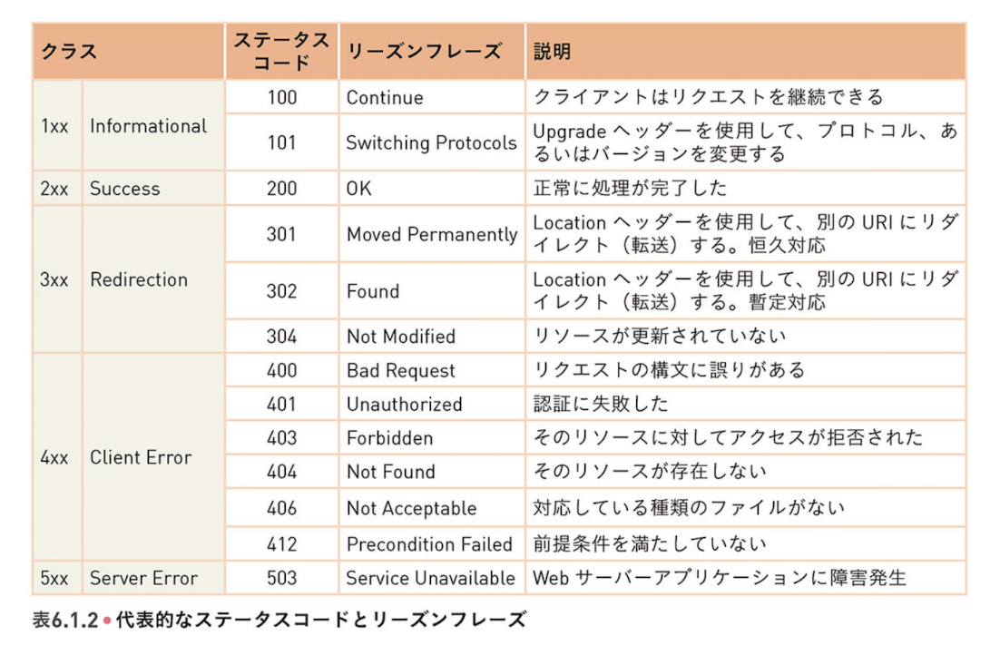

229~400

19:15
270

19:30
315

--------

チェックサムの、1の補数表現に関して
- https://www.mew.org/~kazu/doc/bsdmag/cksum.html#:~:text=%E3%83%81%E3%82%A7%E3%83%83%E3%82%AF%E3%82%B5%E3%83%A0%E3%81%AF%E3%80%81%E3%80%8C%E5%AF%BE%E8%B1%A1%E3%81%A8,1%20%E3%81%AE%E8%A3%9C%E6%95%B0%E3%80%8D%E3%81%A8%E8%A8%80%E3%81%86%E3%80%82

ファイアウォールは物理的な端末なのか
- 普通のpc
- いいやつはソフトウェア使わずにハードウェア的に処理してくれるものもある

p242
シーケンス番号がバイトごとなのは？(なぜペイロードごとではない)

→ウインドウサイズが変わったりするから。どれだけパケット詰め込むかが話しながら変わっていく。
パケットの長さは可変。1番目に100バイト入れて、2番目に100バイト入れて、とかができる。そうすると、1と2が届いてない間に3がどこのデータからなのかわからないと、不便なので。
例えば3番目のパケットだけ届いて、201バイト目からのデータだけある場合、1~200バイトをまとめて1パケットで送って~とかもできる。
パケットの数にあまり意味はない。

TCPの終了フェーズ
TIME-WAIT
- 最後はふんわり終わるしかないので、たぶん届いただろ。一応返事ないかしばらく待っとくか、の時間。
- 時間を短くしたりする
- 短すぎると、もし届かなかったときに、向こうはLAST-ACK状態が続いてタイムアウトしたりエラー終了したりするのを待つしかない。

p263
Tail Loss Probe
最後の方かどうかの判断はどうやってやるのか
今まで送った実績から、これくらいの時間かかるな、を把握して、それの2倍経っても届いてなかったら、もう一度送ってみる。もう直ぐ最後だから、

p251
SYN/ACK来てから、ACK返さずにデータ返し始めちゃダメなのか。
SYN/ACKのあと、サーバーからデータを送りたい時もある。
それだとACKが帰ってきてないと、送っていいのかな、という気持ちになる。

p250
なぜランダムな数を使うのか。毎回0から始めないのは？
毎回0からだったら、捏造パケットで攻撃しやすい
ウインドウの幅の中に入ると受け取っちゃうけど、ウインドウ幅は対して広くないから、ランダムな数字にしておけば、そうそう受け取ることはない。

syn flood
- IPのパケットは捏造し放題
    - Aさんがこういうことを言ってたんだ、と言ってたんだ、という内容を送れる
    - ソースポートも変えられるが、そこに返事が行っちゃう
    - TCPの初めのSYNパケットは、受け取ったサーバーとしては、SYN/ACKを返すと同時に、通信始まるだろうからメモリ用意しよう。SYN/ACKで返したシーケンス番号覚えたりとか。
    - 大量に捏造したものを送ると、ポート番号を使い潰してしまったりする
    - サーバーのリソース確保をSYN/ACKへの返事としてACKが来てから
    - お返事ACKから復元できるように・SYN/ACKの情報をちょっと加工したりする。

なりすまし
- AとBがTCPで話してる。次は100番で送るとわかったら、Cさんが、Aからのだよって100番で送ったら、勘違いしてしまう。→暗号化しよう。
- 中国のグレートファイアウォール
    - 中国から出る時の境目でチェックして、FWが送信元に対してTCPのリセットを送る

- アメリカのやってること
    - クオンタムインサート
    - ISPの回線に機器を差し込んでる
    - 捏造データをねじ込んでる
    - httpで何かDLしてそうだぞ、と察知したときに、リダイレクトを返してマルウェアをダウンロードさせたりして、いろんなPCをハッキングしてる。とスノーデンの報告書に書いてあった。（あの国のあの国会議員はこのIPだからやってやろう、みたいな。）

- →IPは信頼できない。
- 全て暗号化しよう。HTTPは使うな。

p297
キャッシュコントロールヘッダー
- リアルタイム株価とかの時は、キャッシュつかわないで~とここに入れる。

p277
パイプラインの並列できない話とiphoneのsafariで動画とか画像とかは並列に持ってきてる話の違い
→パイプラインは一つのコネクションの中で並列にできないって話で、iphoneの話は、コネクション自体が複数あるという話。

HTTP1.1の頃のチャット機能
サーバープッシュがないのでどうやってたのか。
- 5秒に一回読み込む
- ロングポーリング
    - リクエスト受けるけど、答えを返さずにずっと保留しておいて、誰かがチャット書いたら返す。返したらまたリクエストもらっとく。

OPTIONSというメソッドがある。
p288のステータスコードは覚えておこう

refererヘッダー
- r二つが正しいが、こちらが仕様として広まった
- 必ずいつも手に入るわけではない(HTTPSのページからHTTPに遷移した時とか落ちたりする。他にもあるので調べて注意して使う。)

User-Agent
- アプリ内ブラウザ(Lineとか)とかだと、俺はこのアプリだよって主張するアプリとかもある。

cookie シンク
- ドメインAのuser-idとドメインBのuser-idがお互いに両方わかるようにするテクニック
- iphoneとかはsafariにそういう個人情報が渡らないような機能を最近入れたりした
- サードパーティクッキーは本当に使えるのか検討しよう

p321
>ハッシュ値も改ざんすれば良いのでは？

別の方法でハッシュは手に入れよう
ハッシュ値だけ郵便で送る、とか

何も信用できないと信用できない
トラストアンカー　トラストチェーン
これが正しいとすると、これが正しい、とする
セコムとかの認証局のハッシュIDはwindowsが配ってる
認証局が正しいことがわかる
認証局があのサーバーの公開鍵がこれですよっていうんで信じる
暗号解除できることでDLしたものを信じる

信用できない認証局とかもあある、chromeもこの認証局は無視する、とかもある
マイナンバー

トラストチェーンにいる人が誰も裏ぎらない前提

テレグラム使う時は、お互いに画面を見せる
鍵のパターンを画面に表示して、これだよねって確認する(ハッシュを別に送ろうねってのと同じ)
AとBで話す
Aしか解けない暗号で、Bが暗号化して送ってる。Bしか暗号化しかできなくて、Aしか
鍵これだよね、っていうのは確実にしておく必要亜ある
間にCさんが入って自分の鍵を渡す。と中間者攻撃ができる。man in the middle

レッツエンクリプト
- 誰でも無料で鍵を登録できる
- トラディショナルなものは会社の登記簿とかを確認してたので、証明書発行手数料が何十万円とかかかってた
- ドメインの持ち主であることは保証される。ドメインがハッキングされてたり、ドメイン持ってる人が誰なのかとかまではカバーしてない。

webサーバーからDBサーバーへのアクセスは暗号化するのか
- 一般的には閉じたネットワークにすることで対応
- データセンターに誰か来て、ケーブルに何かつけたりしたら盗聴されるけど、大丈夫か→そこも気にするなら暗号に
- データセンターとデータセンターの間の通信とかは暗号化した方が良い

暗号やる時のベストプラクティス
- 暗号詳しい人に話を聞きましょう
- A.送るデータの先頭にランダムなデータ入れる
    - 同じ文章送ってもランダムに見える
- B.さらに日付のタイムスタンプ入れる
    - 30秒以上前だから無視していいかな、みたいなリピート攻撃影響軽減
- AとBをくっつけたものをハッシュ化して、そのハッシュ値も最後につける。
- 暗号化して、サーバーしか読めないようにする
    - まだ安全とは限らない
        - リピート攻撃(解読はされないけど、受け取れちゃうものが何度も送られてくる)
  
⭐️公開鍵方式の仕組みは知っておこう

SSLの終端どこにするのかは難しい問題
- どこで暗号化を止めるべきなのか
- リスクを良しとするのか、大事なデータだからもっとしっかりやるのか
    - SSLおわらしてからさらに暗号化する、とか

CDN
IPアドレス見ると、どのASなのかわかって、そうするとどこのキャッシュサーバーから返すのが良いのかわかる

⭐️DNSのlookupの仕組みは知っておこう

メール系のプロトコルはそこまで知らなくても良さそう

SMTP
- これもリレーで動くことが前提
    - 東京郵便局→大阪郵便局→
    - 途中で悪いものを混ぜることができる
    - だが、そういうことが起こらないように、受け取った後に送信もとIPをDNSサーバー見に行って確かにfromの人からきてるね、って確認したりする
    - こういうことをして、スパムメール送れないようにしてる

telnetは使わない。sshを使う。sshもパスワードではなく、公開鍵認証で使おう。
sshのサーバーは22番がデフォルトだが、そのままだと大量のアクセストライが来るので、変えた方が良い
新しいIPアドレス見つけると、全てのポート(高々6万)に対して既知の
- UDPのXX番、YY番、ZZ番にこの順番でダミーパケットを送った時だけ22番に転送する、というテクニックがあったりする
- varlogに大量のfail loginとかが残ってうざい。

p377
一瞬で時刻データが返るならいいけど、ケーブル通ってる時間はある程度あるはずで、それがどれくらいの長さかわからないと時刻同期できないのでは？
→YES
    リクエスト送って、帰ってくるまでかかった時間の半分くらいは時刻ズレあるのかなって考える
    何回かリクエスト送って平均取ったり。

ツリー構造になってるのは、一台のサーバーに世界中のサーバーがアクセスしたら忙しくて困るから。

⭐️6-6、７はそこまで知らなくても良さそう

宿題
echoサーバーを作ろう
送ったデータがそのまま返ってくる。
linuxのシステムコールを使ってC言語でシステムコールを呼んで。
エラーが起きたときには必ず処理して。
余力があれば、複数スレッドで大量のリクエストにも対応したりサーバーを適切に終了。クライアントとの接続が終了してからサーバーをシャットダウン。
合図を受け取ったサーバーは、これ以上リクエストを受け付けなくする。でも、まだ対応中のものは対応してレスポンスを送る。graeful shutdown.
IPv6対応。
サーバーとクライアントを両方作る。
ipv4とipv6は使うコールが違うので気を付ける。

man2コマンドを使うとシステムコールの説明が見れる。
インターネットだけ見るのではなく、マニュアルを読もう

宿題：Echo サーバーを作る
制約：
1．Linux のシステムコールを使う（言語は C ）
2．エラーハンドリングは必ず
3．できればやってみる（大量のリクエスト処理、適切に終了、IPv6対応）

