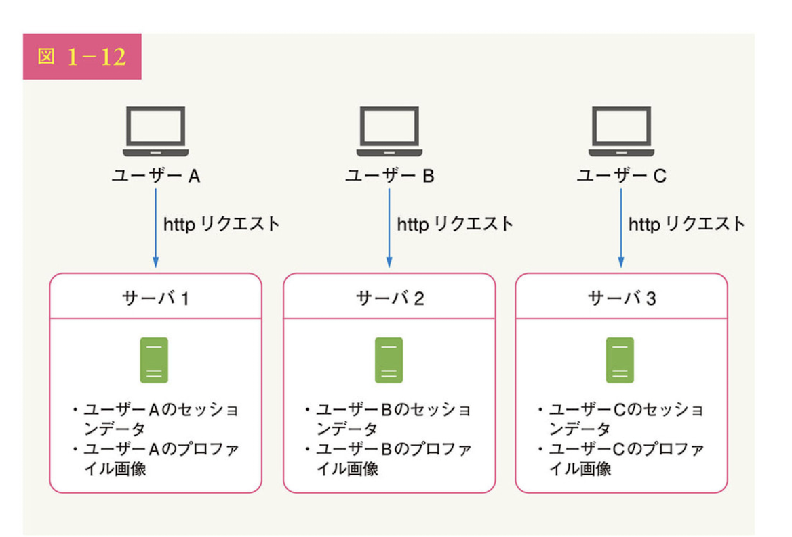
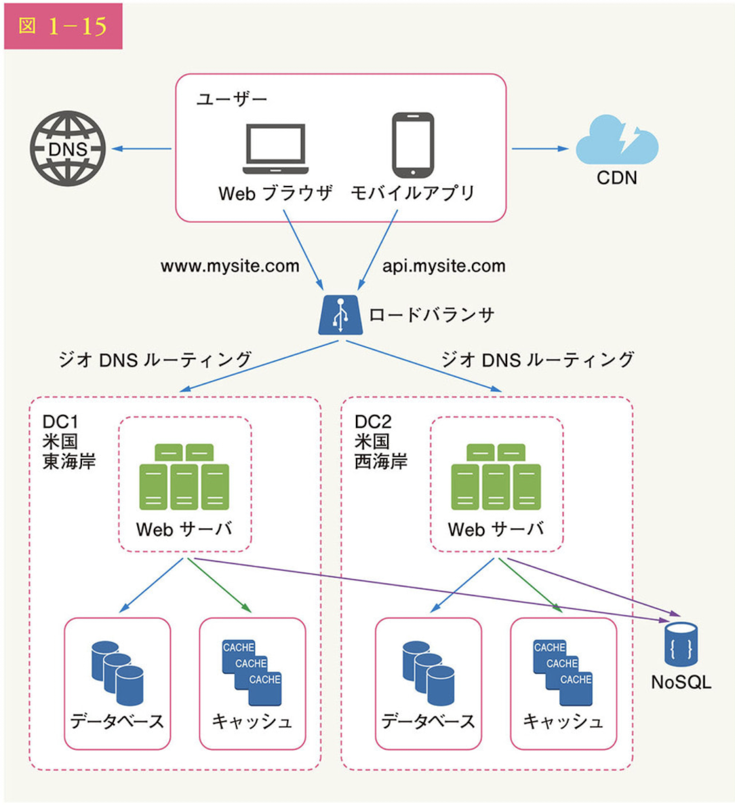

システム設計の面接試験　１〜5章

~ p103

# 1章 11:45

ロードバランサ　p15
    ロードバランサがなく、直接webサーバに接続すると、下記の問題が起きる
        webサーバーがオフラインになったら、webサイトにアクセスできなくなる
            → ??　
        多くのユーザーがアクセスしてwebサーバーの負荷制限に達すると、レスポンスが遅くなるか、接続に失敗する
            →適度に振り分けてくれる

Q.p15
    webサーバーがオフラインになったら、webサイトにアクセスできなくなる問題をロードバランサで解決、とあるが、これはロードバランサがオフラインになったら一緒では？
    ロードバランサーの方が落ちる確率が低いということ？それはなぜ？

Q.p18 データ復旧スクリプトとはどんなもので、どこにある？

Q.p20
キャッシュの中身
keyがSQLで、valueが結果のテーブルになっているdictをキャッシュは持っている？それとももう少し賢い何か？
(つまり全く同一のSQL呼び出しがあった時だけ、キャッシュヒットする？)

p22(解決)
キャッシュの消去ポリシーがあるなら、有効期限ポリシーを設定しうる必要はないように感じたが、なぜ設定するのか。
→データが古くなる可能性があるから。キャッシュにいつまでも残していると、DBはもう最新のになってるのに、いつまでも古いキャッシュ上の情報を返してしまう。

Q.p22
なぜ単一のキャッシュサーバーは単一障害点になるのか。
キャッシュサーバーが倒れても、DBに直接アクセスが行くようになるだけだから障害にはならないのでは？

フェイルオーバー:
    片方が壊れたら自動でもう片方に切り替える
    ←→フェイルバック
        : フェイルオーバーの逆。予備を動かしていた状態から元に戻す。

フォールバック
    :何らかの問題が発生した際に「止まるよりは、しょぼい方がマシでしょ？」な考えに基づいて、機能や性能を制限して動かし続けること

- https://wa3.i-3-i.info/diff272back.html

スティッキーセッション
    - スティッキーセッション（sticky session）とは、ロードバランサ(負荷分散装置)の機能の一つで、セッションが続いている間は同じクライアントを同じサーバへ誘導する機能
    - https://e-words.jp/w/%E3%82%B9%E3%83%86%E3%82%A3%E3%83%83%E3%82%AD%E3%83%BC%E3%82%BB%E3%83%83%E3%82%B7%E3%83%A7%E3%83%B3.html
    - 
    - ユーザAはサーバー1にアクセスしないと、ログイン認証できない
    - これはサーバーの追加/削除が困難になる

Q.p29
NoSQLデータストアは、拡張が容易なことから選ばれます。とあるが、ここでいう拡張とは何か？

Q.p31
図1-15, なぜ、NoSQLだけ東海岸でも西海岸でもない謎の場所に置いているのか。それぞれに一つずつ持たないのか。

2013年のstackoverflow.comは月間1000万人のユニークビジターを抱えながら、1つのマスターデータベースしか持っていなかった！！！

Q.p40
    シャードもした上で、さらに4つにシャードしたセットのコピーを作ったりしてスレーブにするのか
    あるいはシャードするときはマスター/スレーブはしないのか

    
Q.p41
    「結合と非正規化」
    シャード間でジョイン操作を行うとは？(シャードはあくまで一つのテーブルが別々のデータベースに振り分けられているのであって、一つのテーブルならjoinはないのでは？)
    データベースの非正規化を行って、単一のテーブルでクエリを実行できるようにする。とは？
    なぜそれが回避策になる？

Q.p77
 「短所」の、あまり厳密でないルックバックウィンドウ、とは？

Q>p87
    ハードウェアとソフトウェアのリミッターとは

p87 Iptables復習

Q.p93 160はどこから？

Q.p98 仮想ノード
    サーバ0の中に複数のwebサーバーを立ち上げるということ？

