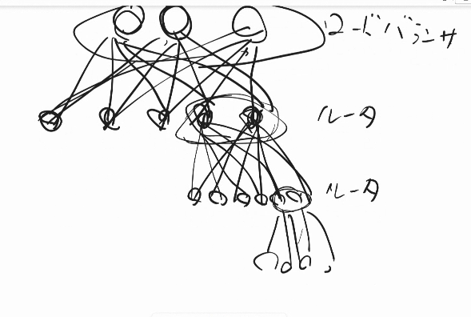
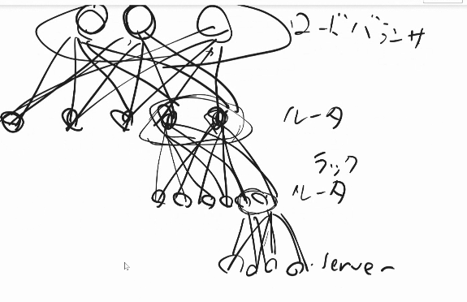
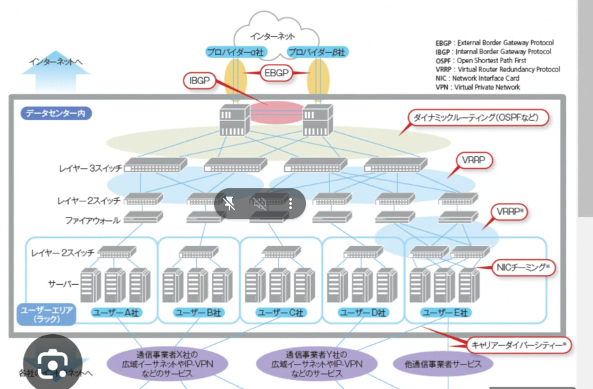
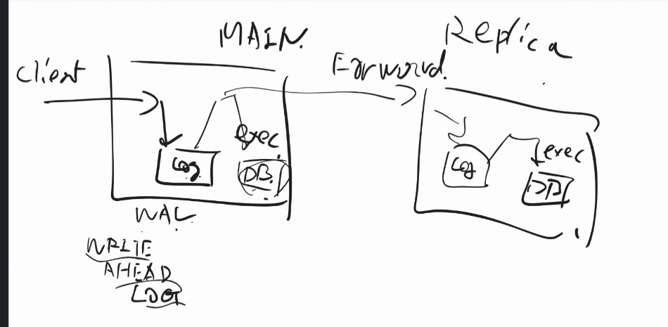
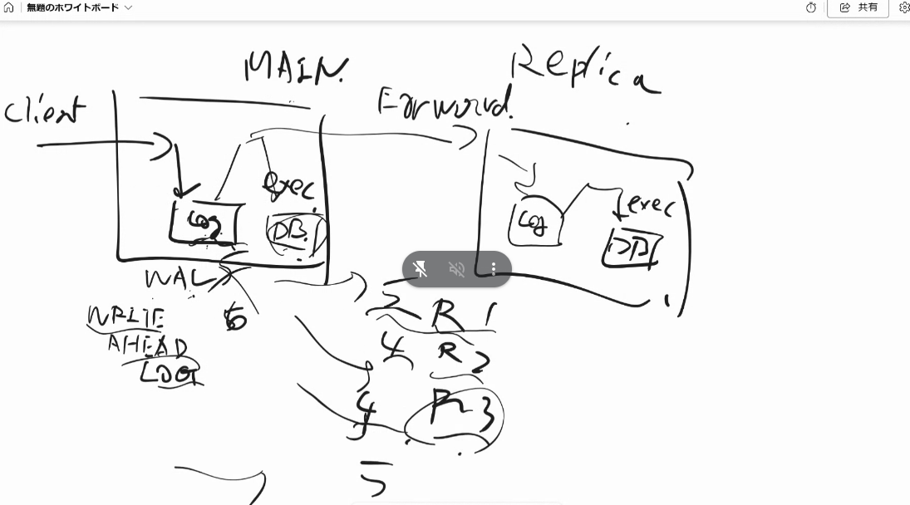
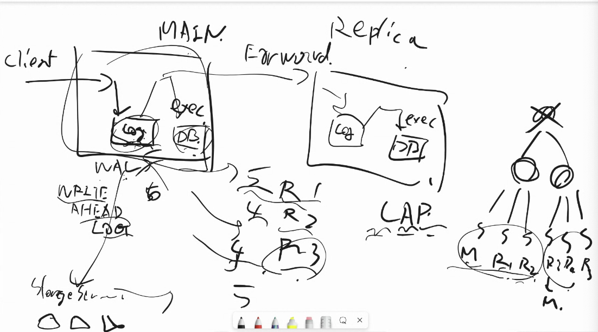
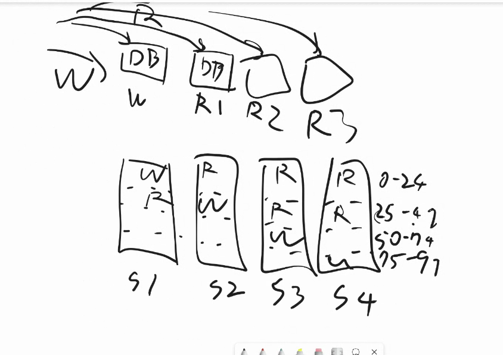
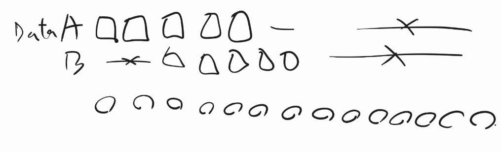
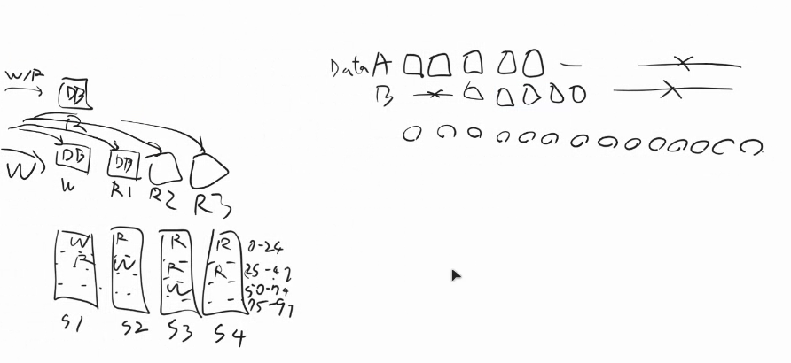
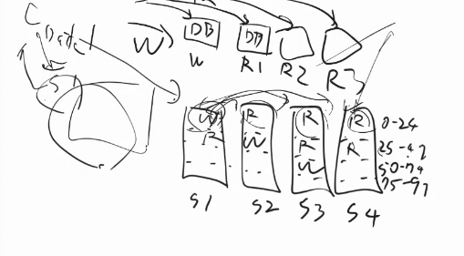

システム設計の面接試験　１〜5章

~ p103

# 1章 11:45

ロードバランサ　p15
    ロードバランサがなく、直接webサーバに接続すると、下記の問題が起きる
        webサーバーがオフラインになったら、webサイトにアクセスできなくなる
            → ??　
        多くのユーザーがアクセスしてwebサーバーの負荷制限に達すると、レスポンスが遅くなるか、接続に失敗する
            →適度に振り分けてくれる

Q.p15(解決)
    webサーバーがオフラインになったら、webサイトにアクセスできなくなる問題をロードバランサで解決、とあるが、これはロードバランサがオフラインになったら一緒では？
    ロードバランサーの方が落ちる確率が低いということ？それはなぜ？

    それはそう。ロードバランサも複数おく。
    SPOFがないように作らないといけない
    
    
    片方が壊れても良いように同じ仕事をするバディ
    

Q.p18 (最後の段落)データ復旧スクリプトとはどんなもので、どこにある？(解決)
    
    途中で停電とかが起きて、都有まで実行ができなかったら困るから、先にログ
    終わったら、logに終わったよと書く。
    途中かもしれないと気づける。
    
    5を送った瞬間に切れちゃったら、最新の状態はどれだろう。レプリカ1は5だと言ってるが、レプリカ2は4だと言ってる。
    CAP定理
        3個のうちの２個までしか満たせないことがわかっている。
    
    ネットワークの分断があってもマスターが一つになるように考えないといけない

NoSQLの方が優れている点
    RDBはjoinとかコミットとか、いろんな便利機能がある
    ただし、それを複数のサーバーでやろうとすると、不都合が起きる
    大量のデータをjoinするとCPUもメモリも足りない
    NoSQLはそういうやると大変なことをそぎ落として、スケールしやすくしてある。
    さらにそれに加え、大規模に数百台で動かすことを前提に、数台壊れても自動でなんとかしてくれたり、データのお裾分け負荷分散とかも自動でやったりしてくれる。
    しかしこれはデメリットにもなりうる。想定してないタイミングで、お裾分けが走って
    5~10台とかで動かすと、イレギュラーの自動対応でCPU負荷が高くなったりして困る。
    1~10番までのデータを持ってるが、データ大きいから10万のデータ君にあげる、みたいなことをする。

Q.p20
キャッシュの中身
keyがSQLで、valueが結果のテーブルになっているdictをキャッシュは持っている？それとももう少し賢い何か？
(つまり全く同一のSQL呼び出しがあった時だけ、キャッシュヒットする？)
→Yes　他のやり方もある

p22(解決)
キャッシュの消去ポリシーがあるなら、有効期限ポリシーを設定しうる必要はないように感じたが、なぜ設定するのか。
→データが古くなる可能性があるから。キャッシュにいつまでも残していると、DBはもう最新のになってるのに、いつまでも古いキャッシュ上の情報を返してしまう。

Q.p22
なぜ単一のキャッシュサーバーは単一障害点になるのか。
キャッシュサーバーが倒れても、DBに直接アクセスが行くようになるだけだから障害にはならないのでは？
→DBサーバーが負荷に耐えられなくなって大体障害になる

フェイルオーバー:
    片方が壊れたら自動でもう片方に切り替える
    ←→フェイルバック
        : フェイルオーバーの逆。予備を動かしていた状態から元に戻す。

フォールバック
    :何らかの問題が発生した際に「止まるよりは、しょぼい方がマシでしょ？」な考えに基づいて、機能や性能を制限して動かし続けること

- https://wa3.i-3-i.info/diff272back.html

スティッキーセッション
    - スティッキーセッション（sticky session）とは、ロードバランサ(負荷分散装置)の機能の一つで、セッションが続いている間は同じクライアントを同じサーバへ誘導する機能
    - https://e-words.jp/w/%E3%82%B9%E3%83%86%E3%82%A3%E3%83%83%E3%82%AD%E3%83%BC%E3%82%BB%E3%83%83%E3%82%B7%E3%83%A7%E3%83%B3.html
    - 
    - ユーザAはサーバー1にアクセスしないと、ログイン認証できない
    - これはサーバーの追加/削除が困難になる

Q.p31
図1-15, なぜ、NoSQLだけ東海岸でも西海岸でもない謎の場所に置いているのか。それぞれに一つずつ持たないのか。

DC1と２両方においてあるどっちの送ってもいいよとか、
ロードバランサも12両方にある。どっちもにリクエスト送ったりするから、図がごちゃつくから書いてない。

障害耐性
    何に耐えられるのかを先に考えておく
    サーバーが1台落ちる→再起動してもディスクが残ってないかも
    Gの時は2台死んでも大丈夫でやってた
    1台たまたま死んで、さらに1台メンテ中でも大丈夫
    データセンターが死んでも大丈夫、とか。東京電力停電とかDCで火事とか
    DC作るAmazonとかはある程度近くにDC複数作って、5KMとか離して光ケーブル敷いて、そこの間はインターネット通さず行けるようにしておく。
    https://www.youtube.com/watch?v=3t6L-FlfeaI

2013年のstackoverflow.comは月間1000万人のユニークビジターを抱えながら、1つのマスターデータベースしか持っていなかった！！！

レコードの番号ごとにこの番号に関してはマスタで、違う番号はスレーブ、とかもできる

全部のデータが1台に乗らない！→DataAを持ってるのは、1000台あるうちの5台だけ。

S1に書き込んだのがS2,3,4に書き込まれる。書き込まれる前にs2とかにリクエストが来たら、どうするのか
    →どこまでconsistencyが欲しいか次第。最新のが欲しいというリクエスト送ったら最新かチェックするとかもできる
    →クライアント側のライブラリがそこら辺を調整する。
        参考：(kumagiさんの記事)https://qiita.com/kumagi/items/3867862c6be65328f89c
RDBSができるのはリードレプリカくらいまで、それ以降のやつはNoSQL

Q.p40
    シャードもした上で、さらに4つにシャードしたセットのコピーを作ったりしてスレーブにするのか
    あるいはシャードするときはマスター/スレーブはしないのか
    どちらの方法を選ぶかはどのように決める？
    データ多くなったらやらざるを得ない
    MySQLを何個か置いて自前シャーディングとかもよくやる　シャーディングだけで済むなら楽
    欠点はどれか一つ落ちたら全部動かないので、壊れる確率4倍
    raid5 復習
        https://note.cman.jp/server/raid/raid5/

    
Q.p41
    「結合と非正規化」
    シャード間でジョイン操作を行うとは？(シャードはあくまで一つのテーブルが別々のデータベースに振り分けられているのであって、一つのテーブルならjoinはないのでは？)
    データベースの非正規化を行って、単一のテーブルでクエリを実行できるようにする。とは？
    なぜそれが回避策になる？

    ジョインする時、いろんなところにバラバラにあるのでコミュニケーションが大変。
    購買テーブルとユーザー情報テーブルをあらかじめくっつけてしまって、そもそもジョインしなくていいようにする。
    デメリット：データの扱いが難しくなる。トランザクションに書いてある住所の情報と、それが最新のとは限らなくなる。
        大阪に住んでる時に大阪の家に送ってもらった購買履歴が、東京に引っ越してから見たら東京の住所に送られていたら辺な感じする。

データセンター内の往復は、電気的で済むので、ディスクのシークより速い
カリフォルニアオランダ間は光が往復するだけで何十msくらいかかるので、それプラスもう少し色々かかる。
ざっくりJeffD　Numberは出ると良い
非現実的なサーバー台数とかじゃないこと確認(測る価値あるのか確認する)　→　ちょっと組んでみて、測ってみる

3章
p53の流れは嫌だ
どのくらいの数字だと思いますか？と聞くと思う
下請けSEではないのだから、
ここら辺が重要だと思うので、それでいいか？
友達人数これくらいだから、これで良いと思うか？みたいな聞き方で、自分から根拠をもって合理的に提案・確認。

半分くらいの時間で設計を終えて、どこを深掘りするかは面接官次第。
時間ギリギリに設計できました、では、その後の深掘りができないのでNG

8割の人にはもっと話して、とアドバイスしてる。
どういう理解をしていて、何をしようとしているのか、わからないところはどこか
曖昧に問題を出すので、わからないところがどこか話してほしい
わかりません！ではなく、こういうケースもあるし、こういうケースもあると思うが、どうしましょうか？が良い
意思決定は、自分の原案出した上で確認する。
関係することを話してください
困っても何かしら話してください
　どこがわかってて、どこがわかってないのかを話す
正解したら100点のゲームではない。なんでその方法なのか説得する必要がある
40分考え続け、最後に正解がスラスラ出るのではダメ

p72
安定した流出レートが必要なユーズケース：リクエスト送りすぎるとメモリ使いすぎて死んじゃうような受けてがいる時、とか

リクエスト受ける側の都合でレートリミッターのアルゴリズムが決まることが多い
急に跳ねると困る。レイテンシ長くなって、クライアントが諦めてリトライしてさらに悪循環

Q.p77
 「短所」の、あまり厳密でないルックバックウィンドウ、とは？

    ばらつきがあるから、制限しなくて良かった時に制限しちゃったりするかもだけど、そんな悪意のあるパターンで来ることもないから、そんな困ったことはほぼ起きないよ、という話。

Q>p87
    ハードウェアとソフトウェアのリミッターとは
    ソフトウェアは未処理のタスクを置いておけるバッファがある
    ハードウェアは遠心分離機が5台しかないからそれ以上来ても無理、みたいな話

p87 Iptables復習

Q.p98 仮想ノード
    サーバ0の中に複数のwebサーバーソフト？を立ち上げるということ？
    →NO
        別にそんな難しいことはしてなくて、ただ番号振って何番から何番まではサーバー０みたいに決めてるだけ
        仮想ノードしないなら、0-50, 51-100という二つに分かれるだけだが、もっと細かく分けるよ、という話

p.101
    ホットスポット
    人気ワードいくつかがまとまってるなら、それを分散させることでよくなるが、
    超人気ワードのキー「バルス」は一つのサーバーに入っているなら、問題は解決しない。
    こういう場合はレプリカ作るしかない。

    
    

