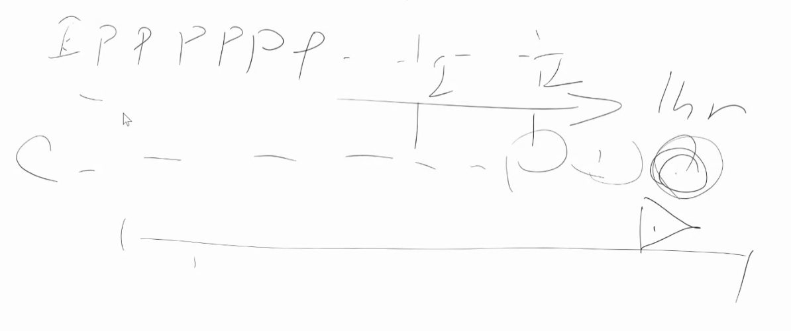

# 11章
auth tokenをリクエストパラメータにつけるのはあまり良くない
ブラウザのキャッシュに載せたくないし、nginxとかロードバランサのログにも残ってしまう
リファラーにも載ってしまう

グラフDB
 点　枝　点　で保存
 Aの妻の仕事は何？みたいな情報とか
 Aの友達、とか

メッセージキュー
    キューから撮ってきて処理して、終わったって宣言が来たら、メッセージキューからタスクが削除される
    処理の方は冪等になるようにしておく
    Exact Once つまり、絶対1回実行されるのを保証するのは難しい

分散ファイルシステムとか自分で建てようとしない
    3台とかで建てても、1台の方が速い(通信コスト)
    1000台とかになって嬉しくなってくる
    全滅しないために分散システムやってるのに、3台だと1台あたり66%にしておかないと、1台壊れた時に1台あたりが100%超えてしまって困る
    HBaseとかZooKeeperとかは自分で運用しようとしないこと。

キャッシュ
    いつ書き込んで、いつまで残しておくのか、は難しい問題
    古いものが残っちゃたり、逆にほぼDBアクセスになってしまったり

# 12章

Q. p.238 最後の行　(12章)
ボトルネックを解消するには〜
    通知を送る人の数を絞る、という話
    友達一覧ページを見てる人だけに送る、とか、今同じグループでオンライン(コネクション繋がってる人)だけに送る、とか。

websocketではなく、HTTP2のkeep aliveでもできるか
    できる

end2end暗号化

    掲示板
        サーバーに生データがあって、サーバから送るときだけ暗号化
            →サーバークラッキングしたら見れる

    e2e暗号化
        AはBの公開鍵で暗号化

        
        公開鍵と秘密鍵をそれぞれ一回かけると、元に戻る
        公開鍵はインターネットに公開する。秘密鍵は自分だけ知ってる

        

        AがBに送っていることを証明できる

        メッセージの内容とともに、そのハッシュ値も送る
        「いちご」というメッセージをAがBに送って、Cが解読して奇跡的に「メロン」と複合されても、メロンのハッシュ値の部分まで一致する確率は非常に低い

        難しいポイント
            Aさんの公開鍵、と言われているものが本当にAさんの公開鍵なのかは難しい
            Aさんの公開鍵である、というのは認証局とかが証明する
            認証局を正しいとすると、認証局がこれがAさんの鍵だと言っているからOKとなる

            テレグラム見たいな暗号通信アプリも、相手の公開鍵を本当にあってると確信して手に入れるには、会って交換したりするしかない。

            デジタルの世界だけでは何かを確かめることはできない。

            要復習:デジタル証明書
                TCP/IPの本　p330

# 13　章
トライ木の計算量がO(p)な理由

    trの場合、2段目まで探す
    1段の計算は、ハッシュマップ使うのでO(1)。2段やったO(2)

    p252の最大長の制限の話は、p=50なら、たかだか50段(定数)見るだけで済むからO(1)だよね、という話
    段数が無限にあったら、一段O(1)だからって、全体は長くなるし、ハッシュ値の計算も時間かかるようになってくる

クエリが人気かどうかだけでなく、検索の結果どれほど適切な結果が返されるかも重要な指標
人気なワードで検索した結果、何も結果が表示されなかったら誰も嬉しくない

みんなtypoするので、typoも含めてサジェストするには、トライだけでは厳しい

オートコンプリート
    ログから日本語最適化されてないことを発見
    これがどのくらい検索されてるかのデータを引っ張ってきて、トライを作成
    ABテスト
    これくらいは新卒が3ヶ月で1人で

専用線

カリフォルニアまでデータを送るのにかかるコスト
    巻いた光ケーブルを船に乗せて、日本からアメリカまで行く
    数十億円くらいかかる
    しかし引いちゃった後に、1MB転送するににかかる金額はほぼ0円
    光ケーブルは基本的にスカスカなので、いろんな会社読んで相見積もりして、ほぼ0円になる
    p267の図14-2からはさらに98%引きくらいにできる
    CDNカンファレンスの資料とか見ると、どのくらいトラフィック使うと、どのくらい割引に
    表に見えてる価格と限界の原価には乖離がある

p277
fileというコンテナの話と、中に入れる動画や音声をどう変換するかの話は別々

動画は連続しているので、効率よく圧縮できる。
前の画像と同じ部分は、そのまま流用的なことをする
前の画像の何pxシフトしたところと大体同じで、差分はこれです、みたいな感じ

前の画像に依存して圧縮することになる。最初のフレームをK(key)I frameと呼ぶ(そうじゃない奴はP frame progeessive frame)

シークバーがあると、途中から見るとき、最初から全部読み込まないといけなくなる
だから途中にKey Frameを差し込む
シーンの切り替わりは、差分が大きいので、Progressive Frame作ってもデータ量が多くなるので、そこを狙ってI Frame差し込んでく

似たような部分を速く(うまく)見つけられるアルゴリズムがあると、速く圧縮できる
最近はNNですごく速くできるようになってる

HLS
    ライブ配信の仕組み
    Http Live Streaming
    長さ10秒の細切れファイルを、CDNにおく。どれみてね、っていう指標を.m3u8に書く
    
    10秒のファイルを2個保存して配置してるってことは、リアルから20秒遅れてることになる
    たくさん分割すると、i frameがその度に発生するので、細かくしすぎたくはない。
    パラメタ調整を上手いことやる。
    配信側は2秒の動画を2個CDNにおいて、を2個.m3u8に書いて、クライアントは4秒ごとに.m3u8見に行って、そこに書いてあるファイルをCDNにとりにいく。これで4秒ラグの配信。
    スパちゃもらってから、「ありがとー」まで4秒だと苦しい。

    数秒のラグが許せないのでUDPで自前で書いてるナナミュージックとかツイキャスというサービスももある
    AさんとBさんがそれぞれの楽器を弾いて、Cさんがそれを見てる、みたいなことをしてる

# 15 章

次回↓

https://www.mext.go.jp/a_menu/shotou/zyouhou/detail/1416756.htm