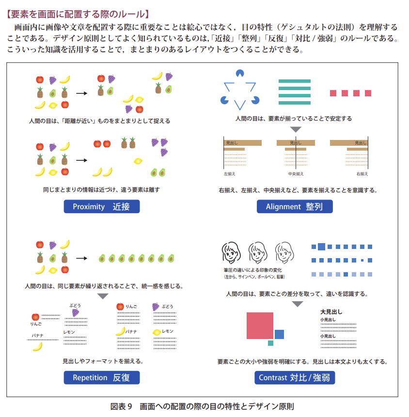
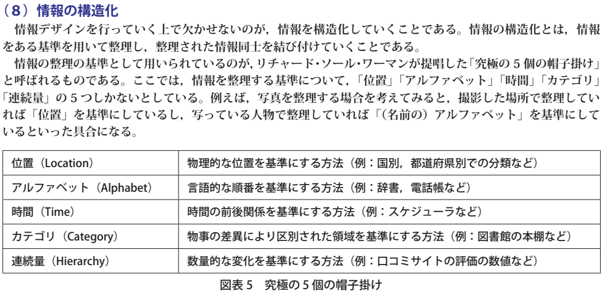
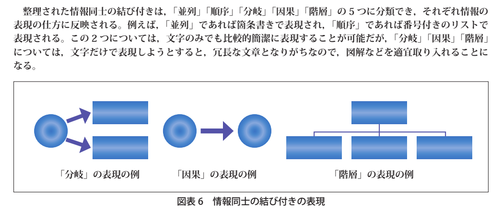
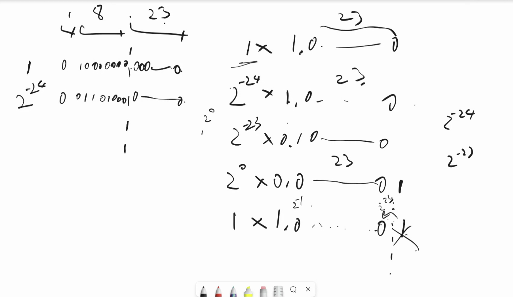
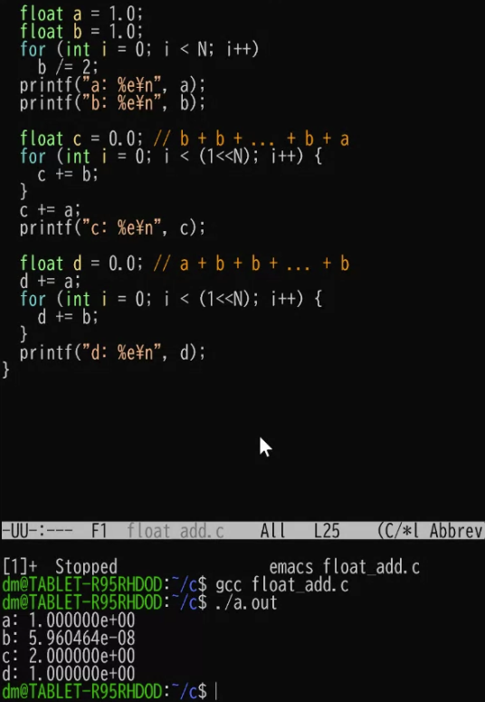
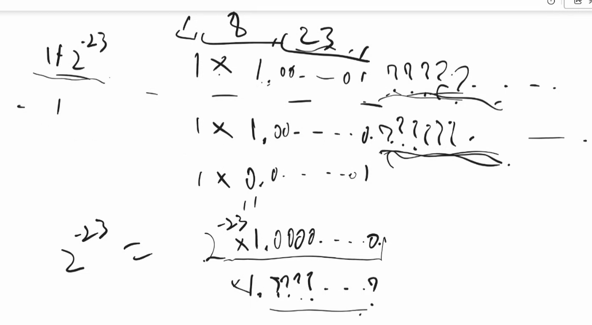
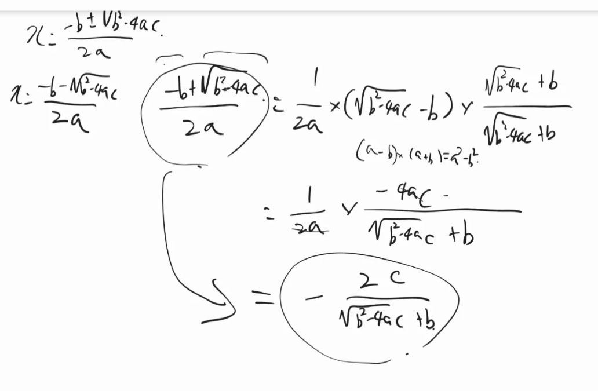
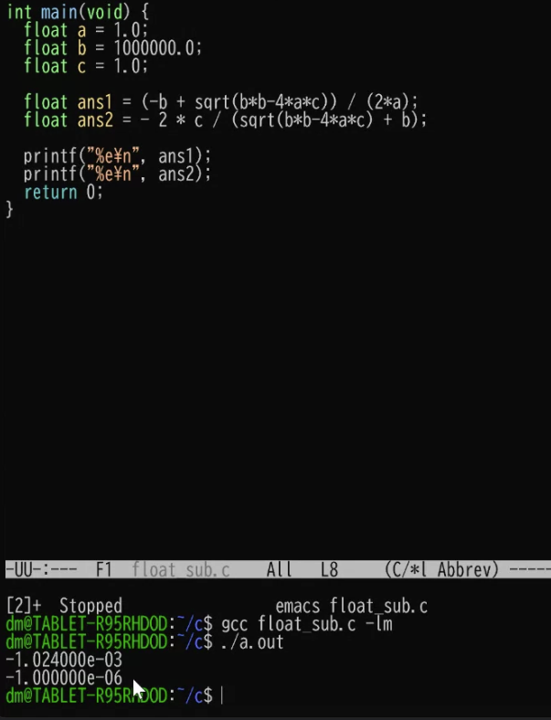
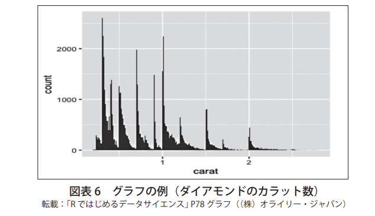

https://www.mext.go.jp/a_menu/shotou/zyouhou/detail/1416756.htm

# 第一章
https://www.mext.go.jp/content/20200722-mxt_jogai02-100013300_003.pdf

ブレインストーミングのコツ
    先に各自で10分考える、会議前に考えてきてもらう
    →他の人が頑張ってるとやらなくなる

最近のウイルスは会社の全てのpcのハードウェアを暗号化して、被害を大きくし切ってから、お金払ってね、と脅迫する

水飲み場攻撃
    オープンソースの有名なパッケージに似たような偽物を作る
    偽物をダウンロードする記事を書く

    リリースしているのが誰なの確認、公式からダウンロードする

最近は国家が後ろで糸を引いて侵入してきているケースが多い

全部防げると思うな
リスク分散しろ
モニタリングしろ→侵入された時に押し戻せる
    →敵が何してきそうなのか山を張る必要がある。重要な情報は何か

ルーターがアメリカから輸出される時に、チップ埋め込んで包装し直して輸出とかもある
などなど、ソフトウェアの脆弱性つく以外にも色々やり方がある
自分が持ってるデータの重要性によって、受ける可能性のある攻撃も変わってくる

商標はサイトで簡単に被ってないか調べられる。
カテゴリが別であれば、被っていても大丈夫。

モンスターはポケモンとかモンハンにも商標権で訴えてた
訴えられても、相手にしなくても良いかも。

特許
    これとこれを満たしたものが特許です、と決まってる
    特許を出すべきか、出さないべきかは考えるべき
    しょうもないものや、簡単に真似できるものは出さない
        (AとBとcを同時にやります)→AとBとDをやればほぼ同じ効果が得られる！と競合にヒントになる
    特許出される前からやってたんですよ、といえばその人には特許あるからやめてね、は使えない

    特許の検索は大変だから弁理士にお願いする
    最初はとりあえず走って、大型資金調達の前に身辺調査的にやったりする

個人情報
    他の情報を「容易に」照合することができ、それにより特定の個人を識別することができるものを含む
    容易に、は人による
    Tポイントカードの番号を拾っても、拾った人は容易に照合できないが、カード発行してる会社にとっては個人情報になる。
    送り手にとって個人情報だったら、個人情報
    送り手にとって個人情報じゃなくても、受け手が受け取った瞬間に個人情報になるものもある

    GoogleとかLineで広告打とうとするときに、その情報渡していいんだっけ、という話になったりする。
    プラポリはちゃんと書いておく必要がある。

消えた年金問題
    名前と生年月日と本籍でユニークキー作ってたが、丸かぶりの人が発生して困った
    メアドは、字面から本人特定できるなら個人情報になる。大きい会社はわからんから一括で個人情報としてる。
    ハンドルネームも有名人だと特定できるので個人情報

会員IDは個人情報か
    この法律において「個人識別符号」とは、次の各号のいずれかに該当する文字、番号、記号その他の符号のうち、政令で定めるものをいう。
    →政令も確認する必要あり

政令
    法律で、「政令で定めるものをいう」とあったら　OO法　施行令　と検索すると、その政令が出てくる。
    法律を管轄するお役所が出すものが政令
        政令では、指紋とか声紋は誰のかわからなくても個人情報だよ、とある
    さらに、委員会規則も関係する、とある。
    「施行規則」として入れて検索すると委員会規則が出てくる。

いろんな法律がこの階層構造になってる
    施行令は国会しなくても、お役所が決めれて、施行規則はさらに小さいワーキンググループで決められる

GDPR
    ヨーロッパの人が海外旅行中に利用したサービスも、GDPR適用して個人情報はヨーロッパで丁重に扱ってね、と結構強いことを言っている。
    普通の法律は、その国の中でどうこうしたときを縛る
    ペナルティが全世界売上のX%みたいな莫大な額になる

40代男性、とかやっても、その属性の人が1人しかいない場合はNG

人からお金を預かるのはだめ
    そのお金を払い戻しちゃうと、それは銀行業なのでout
    資金移動法、証券法とかに引っかかる。弁護士に相談しよう
    こう言う法律があるのは、お金を預かってドロンする人が結構いて、日本でビジネスできない、みたいな話になるので。
    お金に変えられそうなものとか、払い戻せそうなものとか、そういうお金と等しいと考えられうる。
    絶対に監禁できないような仕組みにしないといけない。
    商品券発行して、金額が大きいと、額の半分は法務省に預けなさい、という法律があったりする。

rfid/suica
    ユニクロのタグ分解してみよう
    suicaが一瞬で改札開くのはすごい
    金額計算が結構複雑
        距離によって金額が違ったりする
    東京→青森→東京とかすると170円で行けるルートがあったりなかったり
    A→Bの二次元テーブルを全部用意すれば良い？→No. 乗り換えが色々。
    定期券が関わるとさらに複雑
    はじめにタッチした時に、定期券だったら、定期区間までの料金とか計算しておいて、降りるときのタッチの時に、降りたとことから定期までの間とかを計算して、計算時間を間に合わせるようにしてたりする。

収入印紙
    クラウドにして電子契約にするとやらなくて良くなる
    業務委託契約書
        金額の大きさによって収入印紙作らないといけない
        一つはマスターで一つはコピーですと言って、1枚分しか貼らない人もいる

素人勧誘して未公開株を売ったらダメ(公募債)
    50人以上集めて、出資してください、と回るのはだめ

# 第二章

アナログ→デジタルの機械には、中にデジタル→アナログの機械が入っているので、こちらの方が高い
例:電圧の測定
これ何Vかな？　
    256Vの電圧作って、比較してみよ。電気こっち流れた。これより小さいな。
    じゃあ次は128V作って比較しよ。これよりは大きいな。
    ...(2分探索を続ける)

液晶
    光を通したり通さなかったりを偏光フィルタを電圧で操って色を出してる

マイク
    紙に磁石つけといて、裏に電磁石

スピーカー
    電磁石に電気かけて、磁石ついた紙を動かす

音をカクカクにしても、スピーカーから出る時に、もう少しマシになる

プリンタと
    ディスプレイは光を後ろから出して、赤フィルタとかをかけて色をコントロール
    人間の目は赤と青と緑を見ると電気信号に変える(鳥は4種類だったり、人間でも2種類の人もいる)
    赤と青と緑を全部出すと、全部の色がきてる!(白！と)認識する
    シアンは赤を吸収する塗料、マゼンタは緑を吸収する塗料、イエローは青を吸収する塗料
    同じ箇所に全部塗ったら、全ての

ハフマン方は特に条件がなければ圧縮率が一番良いので、覚えておこう。CSの常識。要復習。

    

https://www.mext.go.jp/content/20200928-mxt_jogai01-100013300_001.pdf
    ハフマン符号。面白い

『データ』はコンテクスト（文脈）によって，初めて『情報』になること。
コンテクストが伴わないものは情報ではないということ

【ストーリー（物語）の力】
　重要な情報であっても，人間は「意味」を感じないことには，自分の中に咀嚼していくことは難しい。また人
間はバラバラな情報にもストーリーを読んでしまうものである。ストーリー性は，人類が太古から引き継いでき
た「心の働き」であると捉えられる。よいストーリーを持つ情報は共感され，広く共有されるため，生き延びていく。
そこで，重要な情報は物語の力を使うことで知識化を促し，世代を超えて伝承させることが古くから行われてき
た（例：いろは歌，神話など）。物語の型は，さまざまなものがあるが，漢詩由来の「起承転結」，舞楽由来の「序
破急」，映画で構築された「三幕構成」などがあり，現代でも RPG やソーシャルゲームなどを始め，多くのコン
テンツに展開されている。インフォグラフィックス（図解）においても人を惹きつけるストーリーは重要である。

【喩（たと）えの力を使う】
　人間は，よくわからない物事を，すでに知っている似たことに重ね合わせることで推し量ろうとする（類推 /
アナロジー）。またこの認知の仕組みを使って，違う分野の言葉を喩えに使って表したりする（メタファー）。例
えば HTML の <Head> タグは，見えないが全部を司るという意味で「頭（の中）」の喩えであり，<body> タグは
目に見える「体全体」の喩えである。パソコンは我々のよく知っている事務作業を模して設計されており，デス
クトップは机の上，ファイルやフォルダは実際の事務用品である。この重ね合わせが近ければ近いほど，「わかり
やすい」となる。受け手にとって馴染みのない情報，特に目に見えないことを伝える際には，喩えの力を使うこ
とは効果的である。

情報を発信する人は，相手が求めているコトは何かを捉え
て情報を提供し，「何のために伝えているのか」という伝える目的を持つことが重要となる。

デザインには，そこに込められた「計
画」と，計画によって達成される「目的」が存在
する。例えば，広告のデザインにおいては，宣伝
する商品やサービスのターゲットとなる属性の人
達に対して訴えかけるという「目的」が存在し，
その目的を達成するための広告は，どのような素
材を用い，どのような配色で表現するのかという
「計画」を立てている。

究極の 5 個の帽子掛け

なんでもできるツールは、何にも使えないツール、になる
明確なシナリオを立てて、これを解決する、と開発始める前に決める
とりあえず紙に書いて、こんな感じ？と聞くのが大事。
htmlとか書いてから
スタートアップが死ぬ理由→資金調達してエンジニア雇って、お客さんにいらない、と言われる。
プログラム書くことだけが仕事ではない。作るものが正しくなければ、いいプログラムでもゴミ。

# 3章
https://www.mext.go.jp/content/20200722-mxt_jogai02-100013300_005.pdf

>学習指導要領解説でプログラミング言語については，「アルゴリズムを基に平易にプログラムを記述できる」と
記載されている。「平易」とは，書きやすく読みやすいことであり，誰が書いても同様のコードになることが望ま
しい。また，人工知能や統計の使用を含め，目的に沿ったライブラリなどが豊富にあれば多様な問題解決に対応
することができる。

全人類エンジニア...

Q. p102 「0.28-0.27」の計算の誤差を起こさない方法　要復習
biginteger
bigdecimalでやる。
→分数として扱う。
https://qiita.com/papi_tokei/items/37a4e31949ba8efb6897

浮動小数の仕組み　要復習
    引き算はできるだけ避ける

足し算
    大きな数から見ると、誤差。小さい数の方から見ると誤差が大きい。
    小さい数をたくさん足すと誤差が大きくなる。
    

    順番によって結果が変わる
    

引き算
    小さい数字はすでに情報がだいぶ落ちて???となっている
    元々有効桁数23だったのが、引き算した後有効桁数1になる
    
    似た数の引き算を避けて、精度を保つ
    4acが小さいと、b^2と√b^2-4acがほぼ同じになる
    
    

p108の micro:bit楽しそう

ソートとか、二分探索とか、高校生が必修でかけるようになるのか。。。

関数とwebAPIの違い
    webAPIは結果返ってこないかかもしれないし、失敗するかもしれない
    promise integerみたいなものを使う
    完了してるか完了してないか、完了した時は失敗してないか、を扱う

乱数
    メルセンヌツイスタが最近は一般的
    コンピュータは確定的なので、いつかはループする
        メモリが2Gだったら、2G通りしか用意できない
    良い乱数→次がどれか当てられない乱数
    ループまでの周期が長い方が当てにくいので良い
    メモリ大量にあればループ周期長くなるが、そうすると使用メモリが多くなるので、あまりメモリ使わずにループが長くなる方法が良い

    シード
        同じシードだったら、同じ数列が出てくる
        アプリケーション立ち上げた時のタイムスタンプをシードにすれば、ランダムにできる
        攻撃者はあり得そうなタイムスタンプ全部試したりしてくる

        風来のシレン(ポケダンみたいなゲーム)
            初期乱数と、ユーザーの行動だけを保存しておけば、マップ全体を保存しておかなくても良い

# ４章
冷蔵庫とか自動車wifiに繋がり始めてるが、何年も何年も使うけど本当にセキュリティパッチ当て続けるんだよね？は考える必要がある。

回帰分析
    広告主が多い方がオークション単価が上がるので、もっとオークション参加者増やしましょう、と営業に対して説明したり。人を説得するのに使う。

    

