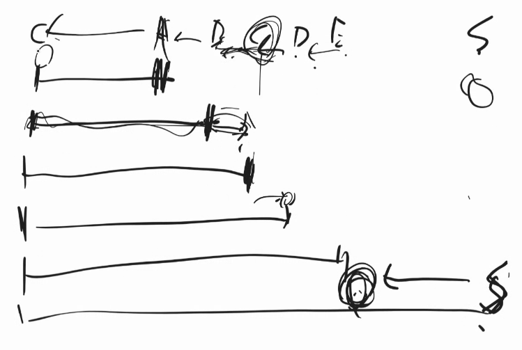
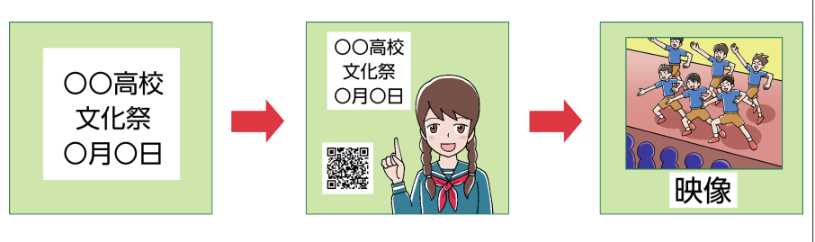
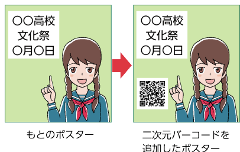
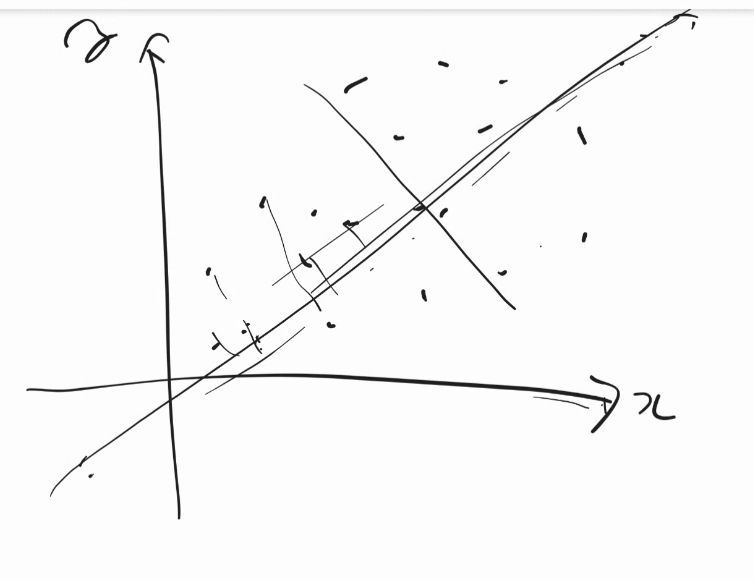
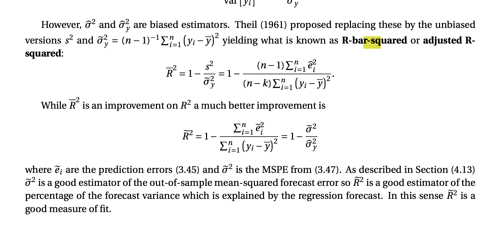
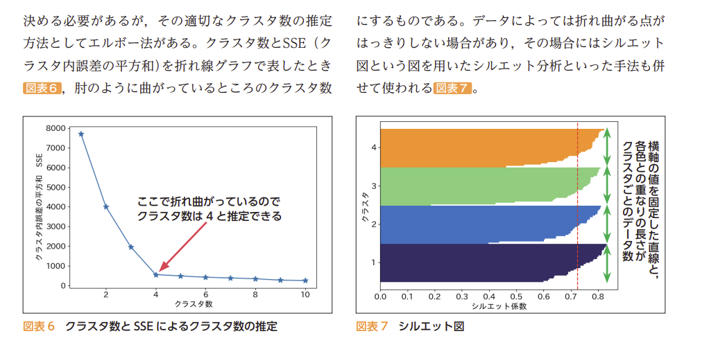
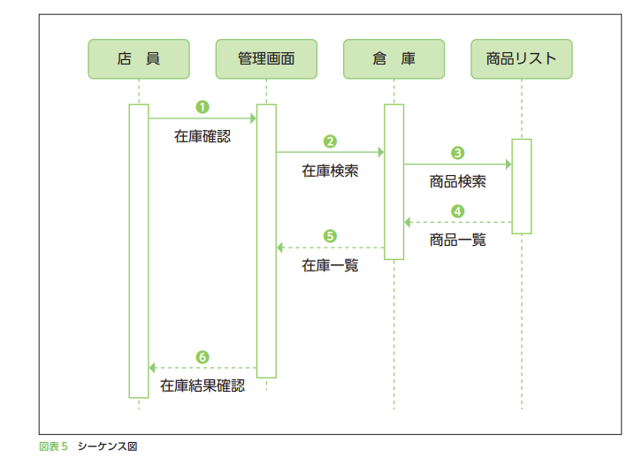

# 情報II 教員研修用教材
https://www.mext.go.jp/a_menu/shotou/zyouhou/detail/mext_00742.html

# 1章

まだムーアの法則は続いている

ハードディスクもそろそろ現解説があったが、別の技術でなんとかなった

光の周波の振幅より狭い線をprintするのは無理説があったが、複数の光重ね合わせて振幅コントロールしてなんとかしたりした。

原子より細い線はできないが、2階建てにしたりする技術も検討されているらしい。

無線LAN
    HTTPSなら繋いでも大丈夫？ウイルス入るとは？

    無線LANの暗号化とは何を暗号化している？HTTPSとは別？

        →LANとpcの間の電波を暗号化している
        暗号は玉ねぎの皮みたいなもので、何十にもかけたほうが良い
            (どれか破られてもOK)
        無線LANの暗号化がよく強調されるのは、電波だから、物的証拠が残りにくいため。
        有線だったとしても暗号化したほうが良い

オニオンルーター, tor
    サイコロ5個降って、ランダムサーバーから5個選ぶ
    クライアントとAが暗号化通信する
    A経由でBと通信

大使館とかも使ってるが、ちゃんと使うのは難しい

シルクロード
    裏社会のAmazon.麻薬とか売ってた
    torとbitcoin使ってたけど、firefoxのバグを突かれて逮捕。

秘密の質問はセキュリティを下げる
    推測な可能なパスワードでしかない。

Similar web
SensorTower
AppAnii
    アクセス数とかがわかる

2025年に哺乳類の脳のシナプスの数と半導体の数が同じになる

この人がいいと言わないと、いいという事にならない
芸術
権威的な文脈
業界構造　人間関係

理解・説得・交渉
DeNAのナンバさん。これから会う人のことを調べさせて、どんなことを発信してるかなどを調べる。

意思決定前の準備はAIになって、ひたすら意思決定をし続ける感じになるかも
世の中が加速する

決済サービスが割り勘や送金機能を入れる理由
    使ってくれる人を見つけるのが大変
    広告費かかる
    送金サービスあれば、ユーザが勝手に広めてくれる

    LINEお年玉キャンペーン
        お年玉で10円あげても、広告で獲得するのにかかる500円より安い

# 2章
https://www.mext.go.jp/content/20200609-mxt_jogai01-000007843_003.pdf

外食コンサルタント
写真が美味しそうかだけで、売り上げ変わる。
店の外にいる人に美味しそうに見せる。文字だけじゃなくて
米を頻繁に炊け1hたったら捨てる。量をコントロールする。
日本人は炊き立てを見分ける能力が異常に高い。

コンテンツ作ったら、見てもらわないといけない。
広告より、バズったりしてみてほしい
いろんな記事に取り上げてもらえるようなネタを作る。

p73
心を動かす
「文化祭がある」という情報より，「楽しそうな文化祭がある」という情報にするには，文字より画像，画像より映像の方が効果的

「誰からどのように伝えられるか」
ということも重要
ポスターで見たのか、SNSでフォローしている人がつぶやいたのか

心が動いた瞬間にすぐに調べられるよう
にしておくことで，「行動を起こす」ことにつなげる
ことができる

　「心を動かす」段階では，短くて印象的な情報が有
効であるが，「行動を起こす」段階では，納得のでき
る理由が必要なので，Webサイト等で，文化祭の内
容や，学校までの経路，過去の来場者の感想など，よ
り具体的かつ詳細な情報を提供しなければならない。

段階を追って適切な情報を提供することと，対象をスムーズに次
の段階に誘導することの両方を計画しなければならない。

メディアプランニングは，複数のメディアを用いて
不特定の対象に広く伝えること，SNSなどで特定の対
象に伝えること，地域を限定して伝えること，それが
何度も繰り返されることなど，複合的に展開するよう
にしたい

，横位置で撮影された写真は，人間の視野に
近い見え方になるため，見る人に自然で安定した感じ
を与える。また，空間の広がりを表現するのにも向い
ている 図表2 。一方，縦位置で撮影された写真は，人
間の視野とは異なる見え方になるため，見る人に非日
常性を感じさせられる。また，奥行きや高さを表現す
るのに向いている 図表3 。

カメラを上向きに構えることをローアングルという。ローアン
グルで撮影された写真は，被写体を下から見上げる
形になるため迫力や力強さを表現することができる
図表4 。カメラを下向きに構えることをハイアングル
という。ハイアングルで撮影された写真は，被写体を
上から俯瞰する形で見下ろすことになるため客観的な
状況説明をするときによく用いられる

# 3章

word 2 vec

主成分分析
    いろんな点をバラバラに捉えられる、分散が大きいように新しい軸を取る→大1軸
    そしてその後、次に分散の大きい方向を取り出す。
    
    主成分分析をすると、それぞれの軸は相関しないので、多重共線性を気にしなくて良くなり、分析が安定する。

Econometrics p123, 124

 R2 is also an inappropriate choice for model selection (it tends to select models with too many parameters) though a justification of this assertion requires a study of the theory of model selection. Unfortunately, R2 is routinely used by some economists, possibly as a hold-over from previous generations.

エルボー法、シルエット図

NNオンラインで作って遊べる
https://playground.tensorflow.org/

マルチコ
Econometrics p126

What is happening is that when the regressors are highly dependent it is statistically difficult to dis- entangle the impact of β1 from that of β2. As a consequence the precision of individual estimates are reduced.
Many early-generation textbooks overemphasized multicollinearity. An amusing parody of these texts appeared in Chapter 23.3 of Goldberger’s A Course in Econometrics (1991), part of which is reprinted below. To understand his basic point you should notice how the estimation variance σ2 £n ¡1 − ρ2¢¤−1 de- pends equally and symmetrically on the correlation ρ and the sample size n. Goldberger was pointing out that the only statistical implication of multicollinearity in the homoskedastic model is a lack of preci- sion. Small sample sizes have the exact same implication. (What both Goldberger and these other early texts missed, however, is that multicollinearity increases the bias of robust standard errors as discussed in Section 4.17.)

# 4章
シーケンス図はよく書く

複雑さとの戦い
    素直でわかりやすい良い名前をつけられると、設計の仕事としては半分
    正しい、わかりやすい名前をつけるのが本質
    短い単語に情報を圧縮する
    伝わりやすいし、頭に残る
    is_ok()みたいな名前は最悪。
    こういうの見ると中身も全て細かくみないといけなくなる。

こういうライブラリを使いたいから、この言語、と選ぶことが多い
この言語使いたい、はおかしい
こういうビジネス上の課題を解決したい
チームなのに、aさんはこの言語、bさんはこの言語、とかだと同じことやるのに無駄が発生
流行ってるからやりたいはNG
この言語やりたい、で仕事選ぶ人は、仕事
プログラムのコード10年後どうするの、が見えていない
何がしたい→どういうライブラリが必要→この言語で。
    ライブラリ選定
        技術的に正しそうな使われてないライブラリと、たくさんの人が使ってるものだったら後者
        バグは必ずあり、それが治るのは、ユーザーが文句言ってから
        いろんな人が歩き終わった道には地雷がない
        大きな会社が自分の会社の中で使ってたものを外に出したやつとかは安心
        多くの人が使ってると、メンテナンスやーめた、も起きにくい

知らない環境に飛び込んでなんとかする仕事の方が多い
なので0から作るのも大事だが、知らないもの1週間で理解する！みたいな筋トレの方が大事
