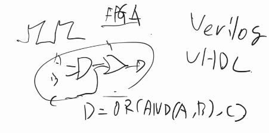
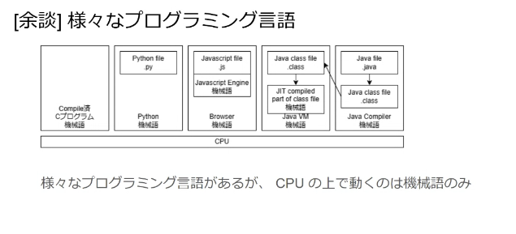
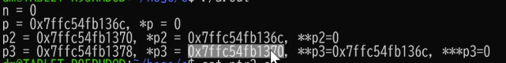

ガベージコレクションか否か
スクリプト系か否か
この２軸で両方を触ったことあれば、だいたいわかる
知らない言語だけど、3日あればなんとかするよ、と言えるといい感じ

Pythonの次はJava, Cがおすすめ
Pythonだけの人は、Javaやってれば、ガベージコレクションしなくていい系ならだいぶできる
 
-C　family-
C
メモリの保護がないので、自分で気をつけないといけないが、余計なことしないので速い

C++
拡張版。使いやすいC.関数をまとめたり

アセンブリ
--

c#
マイクロソフト系。C+++みたいな気持ち。
最近はunity(IDE)で使う
c#で書くとコンパイルして、switchとか色んなハードで動くよというもの。

obj-c
ios用のアプリ用によく使われていた。ほぼ専用。今はswiftに変わった。
cにオブジェクト機能がついたようなもの。

weak reference
a→←bの循環参照への対応

→こいつらはコンパイルすると機械語になる
-----

-Java family(Kotlin, Scala, Groovy)-
→これらはコンパイルすると仮想的な機械語(バイトコード)になる
    JVM(Java virtual machine機械語で書かれた、Javaのバイトコードを実行するもの)

Java, Kotlin
    サーバーやアンドロイドアプリに使う
    Javaはとても良い言語。思った通りに動く

Scala
    サーバー
    Java　+ 関数
    2→３バージョンが上がると、別言語化ってくらい変わるのであまりおすすめではない

Groovy
    gradleの設定の時にだけ使う。そんなに知らなくて良い。

------

Python, Ruby, Lua, (Shellスクリプト)
スクリプト系言語

Python
    ハイパフォーマンスのサーバーはなかなか難しい。思ったより性能が出ないことがある。最近改善傾向にある。
    Javaとかより一桁遅くなる。Rubyだとさらに一桁遅い

    バッチプログラムでよく使う
        Airflow, Dagstar
    MLでも。
        pandas, scikit-learn

    アメリカの学部生が全員pythonで教えられるので、みんな知ってるよね、となるのが強い

Ruby
    サーバーで使われることが多い

一秒間に何百リクエスト、とかいう話だと別の言語の方が良い

Lua
    元々のある別の言語を拡張したり

Shell スクリプト
    コマンドの羅列。5~10行になってきたらPythonで書いた方が良い。非常に難しい。
    5コマンド並んでる、くらいなら良いが
    書けたとしても他の人が読むのも大変。

Go, Rust
    C++の血を引いていて、高速に動く

Go
    C++にガベージコレクションと並列処理を足して、いらないものを取った
    RPCやHTTPのサーバーに使われる
    エラー処理もわかりやすくなってるし、並列処理が書きやすい
    googleの中で開発された言語。色んな言語作った人の最新作。
    googleは
    goのライブラリはどれくらいあるのか、というエコシステムは微妙かもだが、cのライブラリ呼べる

Rust
    firefoxを作るのに使われている
    c++のメモリ管理の大変さを性能を犠牲にせずに簡単にした

PHP, Pearl
    PHPはまだ生きてるが、Pearlはもう死んだ。レガシー

PHP
    webサーバー作るための言語
    htmlと混ぜて書きやすい(便利な関数がある)
    ジュニアなwebエンジニアに合わせて作ってあるので、使いにくい仕様もある
    wordpressもこれで書かれている
    セキュリティホールを生み出しやすいので、今からこれで、はおすすめしない
    cakePHP, Laravel

Pearl
    もう死んだが、昔これで書いたものがまだ動いている
    欠点:読みにくい
        短くかけることが正義、としたので、謎の略語が飛び交う
        詳しい人は短くかけるが、読む人は辛い
    昔はこれでwebサーバー書いていた

Javascript, typescript

Javascript
    ブラウザの上で動く何か(だった)
    node.jsというもので、nodejs実行環境というものがあると、ブラウザの外でも使えるように
typescript
    typescriptはコンパイルするとjavascriptになる。
    typescriptはまだ足りないところがあるが、よくできている言語。そんなに悪くない。
    マイクロソフトが開発した
    フロントエンドのエンジニアがそのままかくと、ちょっと大変になる。
    webサーバー書く技術と、フロントエンド書く技術は別

(Visual)Basic
    入門向けだったが、今はみんなPython
    windowsアプリやmacアプリ

R, Octove(Matlab)
R:統計向けのライブラリがたくさん
Matlabは行列計算が沢山。それのオープンオープンソース的なものが、Octove
R,matlabはプログラミング言語だと思わない方が良い。履歴書書いてもしょうがない。

-------↑ここまでは知っておいた方が良い言語達-------------------------

ここからLegacy言語

(Basic)
Fortan 数値計算
Pascal　Python--みたいな感じ
Cobol   帳簿とかを扱うのに特化しているので、金融系に残ってる。昔の改修系の仕事なのでしんどい。

ML系
LISP(~lisp)
Haskell
Ocaml
scheme
→関数型言語
    関数も値と見做して、変数に代入したり、引数に渡したりする。
    ビジネスの現場で使われることはほぼない。金融系の人が一部使う。
    なぜか
        関数がピュアでやる(副作用がない)時に力を発揮する
            ログ残したり、他のメモリいじったりしない
        普段書くプログラムは、httpリクエスト受け取ってレスポンス返すだけでなく、DBを修正したりする

Small Talk
    オブジェクト同士のやり取り

Prolog
    論理型言語
    論理式を書いていく

---ハードウェア屋さんが書く言語↓-------

verilog
VHDL
    FPGAを使うときに出てくる
    ブロックの間の線をどう繋ぐかを、ソフトウェア的に書けるように
    物理的な回路をソフトウェア的に書ける
    

例外を投げる時は、必ず例外なげる関数だよとdocstringとかに書こう
そうじゃないと使う人が知らずに使って
def func_name_or_throw()とかにする、というのもあある

デコレータの使い道
HTTPリクエスト受け取ってレスポンス返す処理する前に、ログインしてるユーザーか確認する
関数の実行時間を測ったりする

Pythonというプログラム自体が機械語で書かれていて、
そのプログラムが、.pyファイルを読んで上手いことやってる。

a.outは実行ファイル？
    コンパイルだけでなく、アセンブルやリンクもされている？

gccはコンパイルだけじゃなくて、実行ファイルになるまで全部やってくれる
オプションつければ、中間制作物を出すこともできる

malloc関数
    通常スタックに置かれるローカル変数をヒープに置きたい時に使う。
    関数を抜けた後でも、ヒープなら参照できるので、関数間でメモリ共有したい時とかに使う

pはnのアドレス
*pはpに入っているアドレスのものをたぐる。
nには0が入っているので、0
*pはpが指すアドレスに入っているもの

