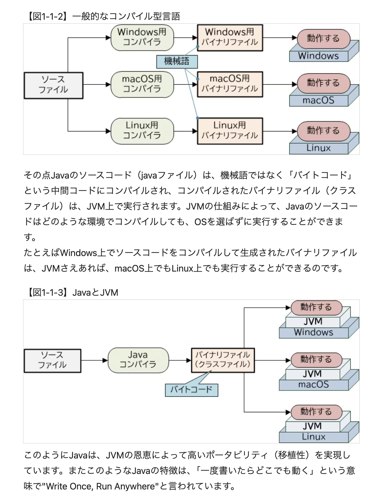
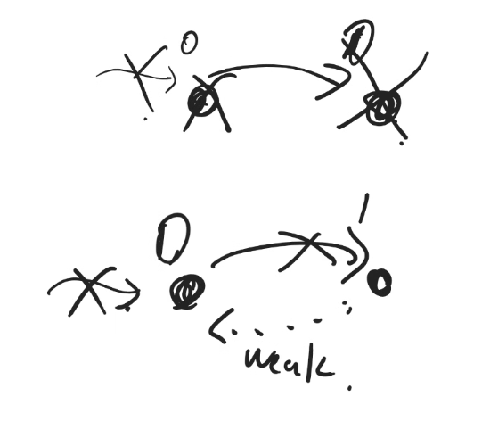
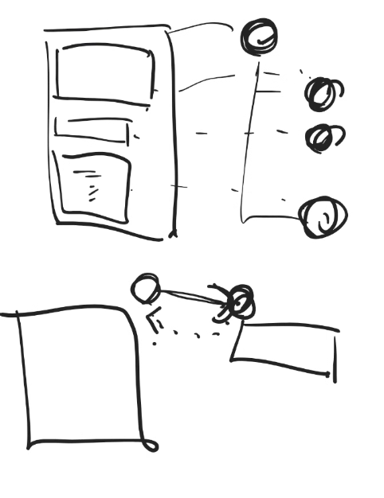
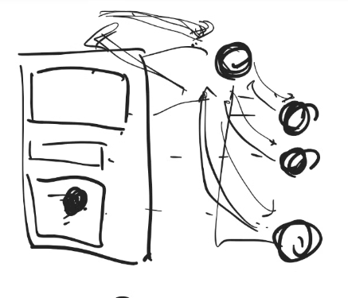

Q.

Javaはどこでも動く、のがメリットとされているが、結局、それぞれの機械語/命令セットの違いを吸収するのがコンパイラからJVMになっただけでは？
それぞれの端末にJVM入れるのではなく、コンパイラ入れておけば、他のコンパイル言語でも「どこでも動く」が達成できるのでは？
何が嬉しい？

# C++
Cとの違い
- c with classes
- namespace
- クラスが書けるようになっている
- virtual
- オペレーターオーバーロード(勘違い生みやすいので、避けた方が良い)
- 大量に機能があるが、絶対使っちゃいけないものが多い
    - 変な人が紛れ込んでも、困ることが起きないようにgoは作られている。
- Effective c++という本を読まないとまともに使えない
- more Effective c++も。
- パフォーマンスの出る良い言語だが、上記の2冊とGooglestyleGuide読んだ上で使おう
- 同じ名前の引数の違う言語が存在できる。
    - 裏でnameManglingしてくれてる

objective-cやswiftは参照カウンタ方式でメモリ管理している
子は親をweakで参照する

画面タップされると、この座標お前？と親から子供達に連絡が来る。
自分のだったら親は返事する。
つまり、両側から参照が必要。
循環参照にならないように、強い方から弱い方には強参照。逆は弱参照。

# JAVA

- 退屈な良い言語(c++のような開けてびっくりはない)
- 関数名とかをちゃんと書く文化
- 継承する時には親は一つだけ。pythonみたいに親2人はできない。
- 1番の親はオブジェクトになる。
- .jar java archiveというファイル
- jarはmahnifestファイルと.classのzipファイル
- .classは　hoge.javaをコンパイルするとできる
- ディレクトリ配下の.javaファイルをコンパイルして.classにしてこのディレクトリに入れてね、というコマンドを実行する
- JVMが.classを理解しながら動く
- kotlinとかのJVM言語はコンパイルすると.classを吐くので、JVMが動くならどこでも動かせる
- Threadでマルチスレッドができる。synchronizedでロックを取って排他制御
- シェアードライブラリ(拡張子は.so シェアードオブジェクト)を使うと、Javaからcを実行できて、そこでpython実行したりとかもできる

