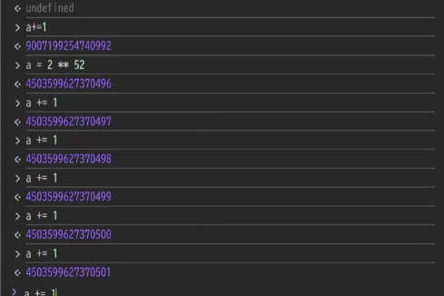
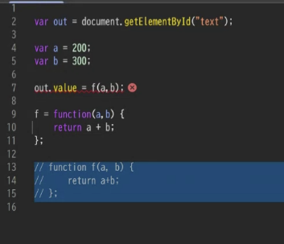
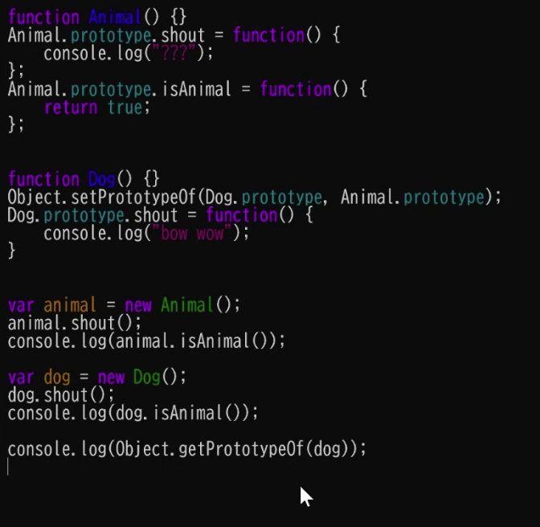

# Java Script

ツリー構造を操作するのが元々の仕事だった
windowやdocumentという変数で、画面全体にアクセスできる。
document.getElementsByClassName()で、要素にアクセスできる
ページの一部の要素を修正するためのプログラミング言語

ブラウザ戦争の中で適当に作ったものが、こんなに広まってしまうとは、という感じで広まった
このような背景なので、他のプログラミング言語よりも、変な仕様があったりする
ieのjavascript/ chromeのjavascriptとみんなバラバラだったが大変なので、ECMAscriptという統一企画作った
動く環境が、自分が用意したものではなく、ユーザーのブラウザ
javascriptをECMAの高いバージョンで書いて置いて、トランスパイラというもので古いバージョンのもの(3とか6とか)に変換して本番環境で使ったりする
CAN I useというサイトで、どのブラウザのバージョンでどの機能が使えるのかを教えてくれる

学ぶなら、MDNがチュートリアル用意してくれてるので、それが良い。
firefox作ってる非営利団体

プログラミング言語として特殊なところ
number, 文字列、オブジェクト型が存在
nullとundefindとNaN(Not a Number)が別々に用意されている。混乱の種になりがち
    NaNはあまり入りこんでくることない。入ってきたら多分どこかバグっている
    他二つは入ってくるので、ifで場合分けして対処が必要・

整数型/小数型はなくて、number(=64bit浮動小数点型)だけ

a = 2**53にして
a +1 

他のプログラミング言語と違って全て64ビット浮動小数として扱っているので、64ビット整数の扱いが困る

データベースのIDが64ビット整数だと、丸められたりする。

※要復習! 浮動小数の仕組みと、上限超えるとなぜ足せなくなるのか

文字列と数字の足し算引き算はいい感じにやってくれてしまうので、バグらないように気をつけて使う必要がある

比較演算子
    === 厳密一致
    == いい感じに解釈してくれる　2 == '2'とか
    できるだけ前者使う音がおすすめ

NaN == NaNはfalseになる。これは他のプログラミング言語でもそう。IEEEの規格がこうなってる。

ホイスティング

function f(a,b)だと、どこに書いても先頭に書いてるのでどこでも呼び出せるみたいな感じにできる。
つまり、関数定義前に呼び出してもエラーにならない

defer 
- html一番最後まで読んでからjs実行するように指定する

setTimeout()
- 関数をXm秒後に実行
setInterval()
- 関数をXm秒ごとに実行

onchange, addEventListner
- ユーザーのアクションに応じて、関数を実行する

varは事故が起きやすいので、letやconstを使う

DOM
- これはhtml
- ツリー構造になっている
- DOMのnode(getElemetでとってくる奴)

Promise
- 非同期処理でよく使われるもの()
- 約束
- この仕事しとくからさ
- 状態を持ってる
    - 仕事終わったか終わってないか
    - うまくいったのか失敗したのか
- thenメソッドで、成功した時や失敗した時のアクションを指定できる

- await p をするとpに入ってるPromiseの中身の値を返す

async awaitは何やってるのか
- jsはシングルスレッド
- awaitはasyncが正常終了するまで待って、正常終了したら、その時の終了した時の値返す
- resolve()はPromiseを終了させる。終了させるときの値を引数にとったものにする。
- jsのインタプリタ/実行環境が、関数をバラバラに切り刻んでいるイメージ
    - 切り刻んで、その実行順をawaitで指定できる感じ
- 結局シングルスレッドなので、一度に一つしかできない。

await Promise.all([p1, p2])
- 両方終わるの待つ

※要復習　jsがシングルスレッドである件と、並行/並列と業務での実際の実装
https://chuckwebtips.hatenablog.com/entry/2015/08/19/070000

prototype
- クラスの仕組みがなかったので、こんな感じでクラスやってた
- プロトタイプに設定されているものの関数を探して呼べる。
- ちょっと昔のprjはまだこの記法かも

