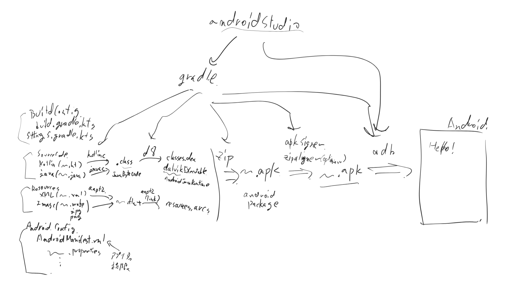
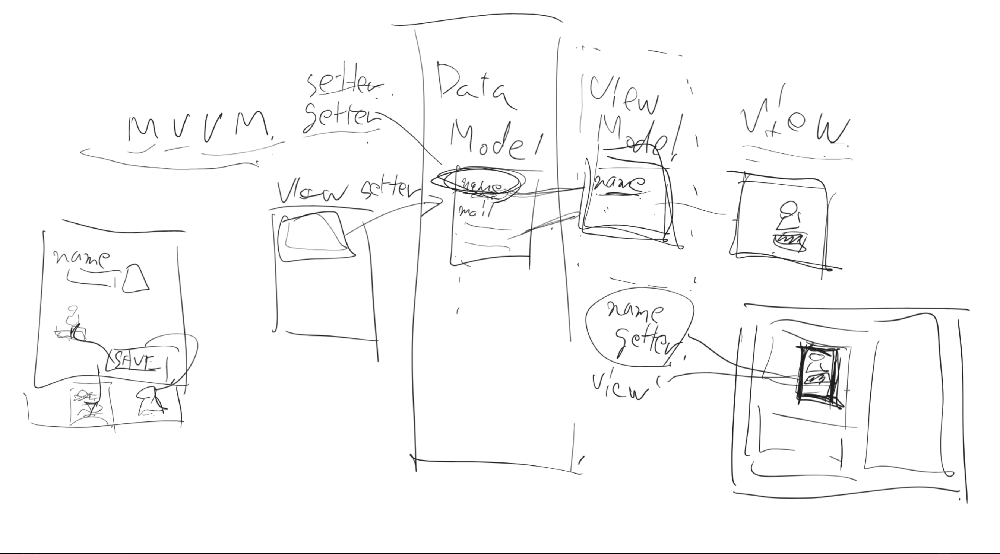

androidが動くまで

.jarの代わりにclasses.dexを作る
androidmanifestはこのアプリカメラにアクセスできるのか、とか

M-V-VM

reactもこの考え方。

DataModel(Model)　(名前とメールアドレス)
    setter
    getter

View Model(名前だけ)

View 表示するもの(名前を表示)

他のviewからデータを書き換えるシチュエーション
viewAが、nameをとるgetter使う必要がありますと宣言する
MVVMライブラリが、viewAはname使ってんな、と記憶しておく
viewBがnameをsetterで更新すると、MVVMモデルが、viewAの中の更新が必要な部分だけを更新する。

MVVMなかった頃は、nameを更新するときに更新するフォームがどのviewがname使ってたのか全部覚えておかなきゃいけなくて、開発が複雑になった。(更新漏れとか)

MVVMのライブラリを使って、nameという変数を宣言すると、それ用のsetterはこれだよ~に見たいな感じになる

Data Modelはメモリの上にあるイメージだが、DataModel更新時に一緒にDBも更新したりする。

まずは3月だけのデータモデルを作ってメモリの上に
1枚目を作る
2枚目作って遷移
ディスクへ保存する機能
4月とかへの遷移も作る

画面遷移のチュートリアルがどこかにあるはずなので確認するとよさそう
