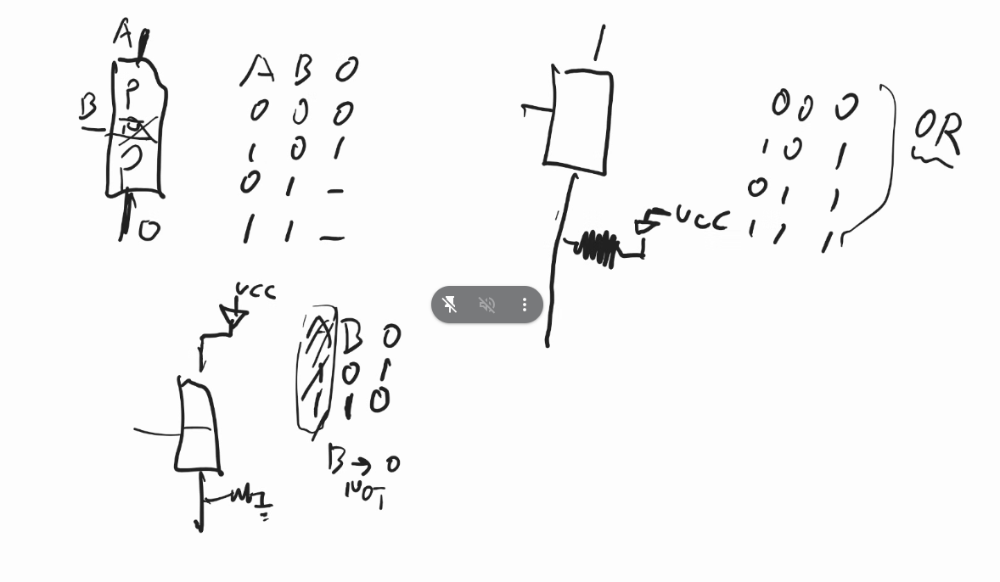
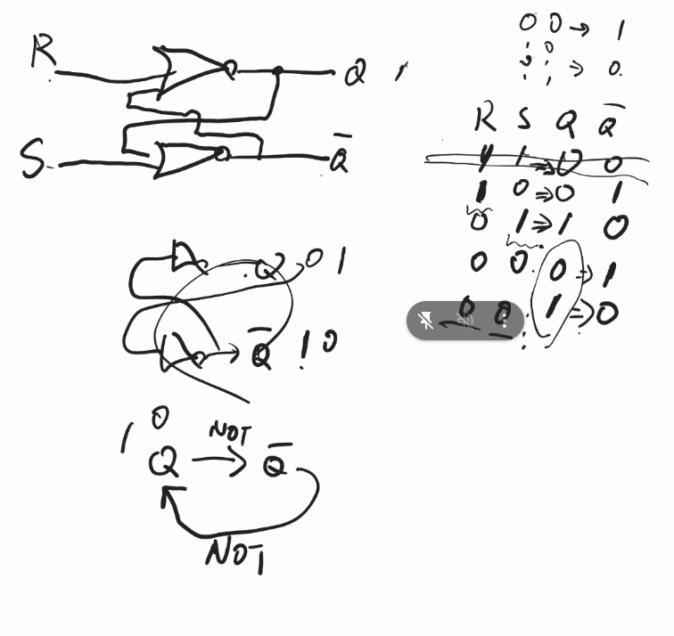
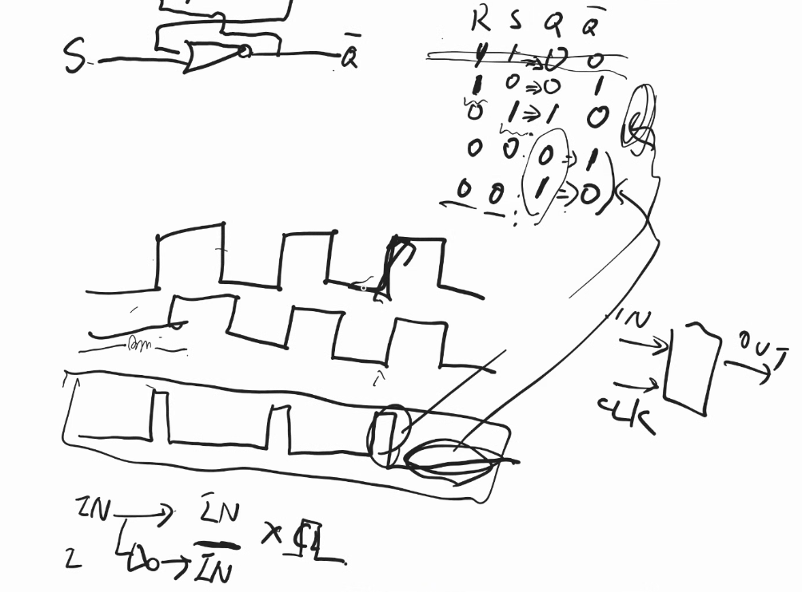
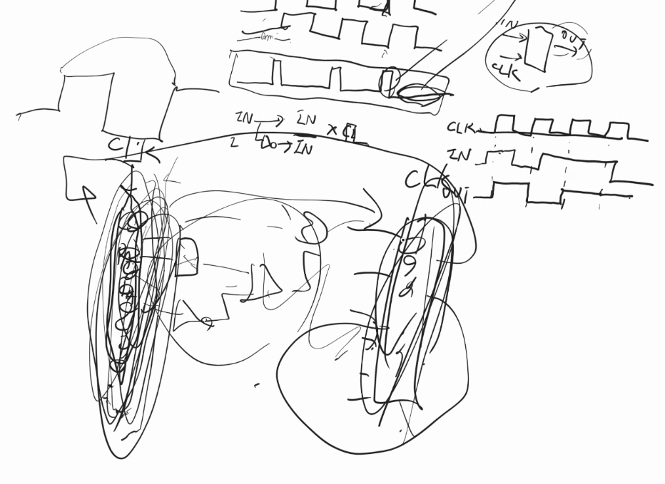

jit

 一部機械語に置き換えちゃうことによって早くしよう作戦

逆に遅くなる場合もある
 たかだか一回しか実行しないコードをコンパイルしたら、コンパイルする時間の方が長い
 →よく使うところを狙ってやる
    よく使うけど、時々例外で別の関数呼ぶとかだと、そっちもjitコンパイルするかどうか悩んだり。
    　
    制御の前までjitでやって、制御のところで元のpythonの世界に戻ったりする

javascriptはCと同じくらい速い
言語仕様はダメだが、javascriptインタプリタにbigtechがたくさん人と金を入れた結果速くなった。(速いほど金になるから)

速さ順 tier
java c c++
python
ruby

CPUの周波数どれくらい、とかメモリやコア数どれくらいなのか
自分のpcや、世の中で売れてるものどんくらいなのか知っておこう

フリップフロップ回路

クロックが立ち上がった瞬間にだけ、データを記憶して、次クロックが上がるまでは、その値をずっと出し続ける

ある瞬間のデータから、1クロックごとに、次のデータの状態になる

1番長い回路にかかる時間