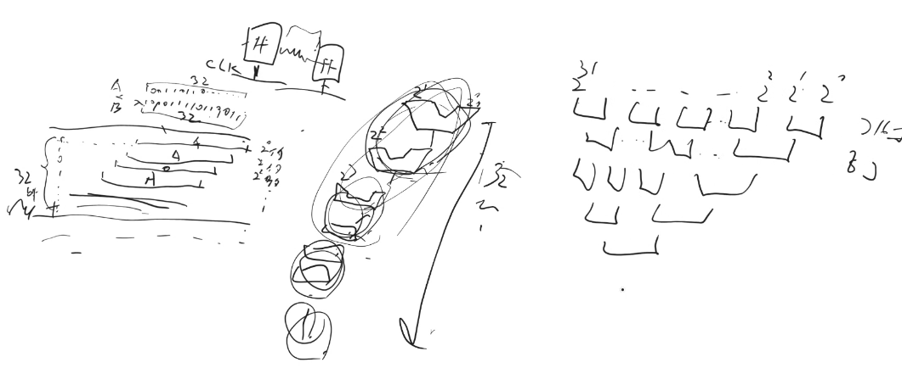
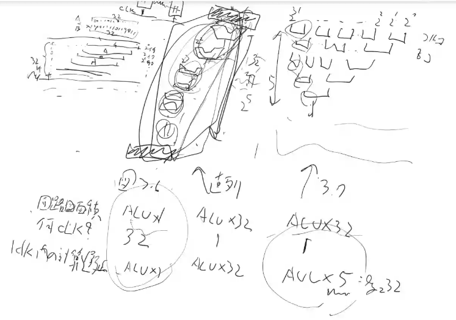
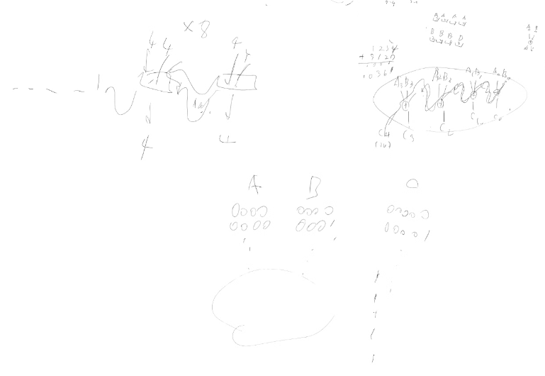
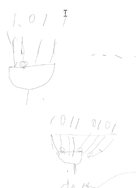

p375 -p471
3/10まで

3.2
>最も一般的な自然数の用途であるアドレス計算に関しては，オーバフローを検出する目的が見当たらないからである．
アドレスが、オーバーフローが発生するほどの数ない
オーバーフローして困るような場合はエンジニアの方でソフトウェアでなんとかする

掛け算のアーキテクチャの2個目、3個目

V字は足し算
最近はムーアの法則でALUが安くなったから、ALUたくさん使う図3.7の方が良いとなっていった

クロックは、レジスタからデータとってから、レジスタに入れるまで0

1bitずつ足すと32ターンかかる
4bitずつ足して、足したときに繰り上がりが1になるパターンを先に洗い出しておく
パターンと同じかどうかを判定するのはandゲートでさっと確認できる
1になって欲しいところは1入れて、0になって欲しい時はnotを噛ませて逆の方を入るようにしておくと、andに辿り着く頃には、全部1になってるはず。全部一致するとandが通過した時1になる

全部の組み合わせをorに最後にかける　→ 繰上げの発生するパターンのどれかに含まれる！
繰上げ発生するから、と、左の四角に連絡できる(自分の四角の計算結果がわかるのはもうちょっとあとになるが、それより前に繰り上がりがわかる)
すると、左の四角はその段階から計算始められる

これを先見加算機と呼ぶ。図3.7とかのV時の一個一個がこれ

3.6
部分語並列性

32bitの数字同士を計算するとき、前の例では、4bitずつに分けたが、
そのように分けるのはコストかからない
そこで、RGBの8bitずつと、最後のからの8bitが入った32bitをまとめて計算してしまえば、お得に計算できる(ただし繰り上がりは無視する)

3.7
これは128ビットレジスタで、もっと大きく3.6と同じような話をする
flops float operation per second
1秒に何回浮動小数点の計算ができるか
普通にレジスタAとBに入ってる数を足してCに入れると　1flopsだが、
32bit浮動小数店が8こつまってるAとBを足せば、1命令しかやってないのに8回計算ができる
これも繰り上がりは無視する
16bitが二つ並んでるものを足すよ、という命令の時は、さっきの32bitのV時の中のカイロの真ん中を切って、繰り上がりが渡らないようにする。
32bitの数二つを足すのと同じ回路使ってるけど、ちょっと使い方変えてる

数を足すときは小さな数から順番にたしていく
大きな数に足すと、小さな数が見えなくなってしまうので

似たような数同士を引き算すると、有効桁数が減ってしまうので、式を変換して、そういうことが起きないように衣装

0に近しい数で割るのはやめよう
