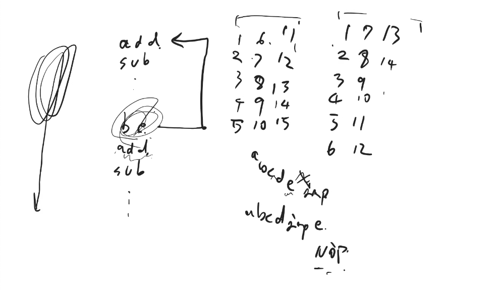
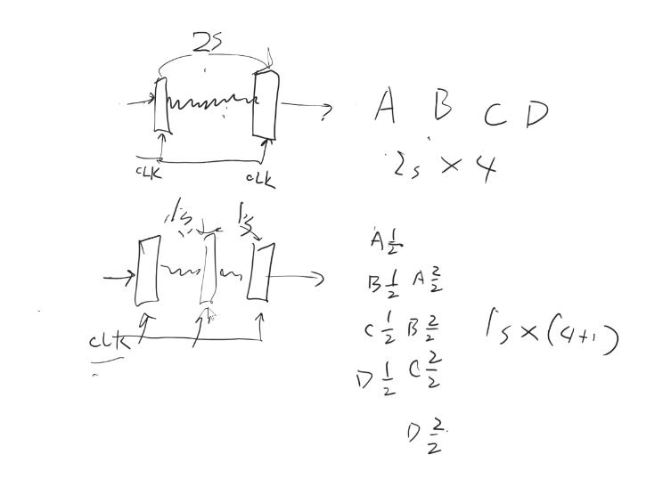
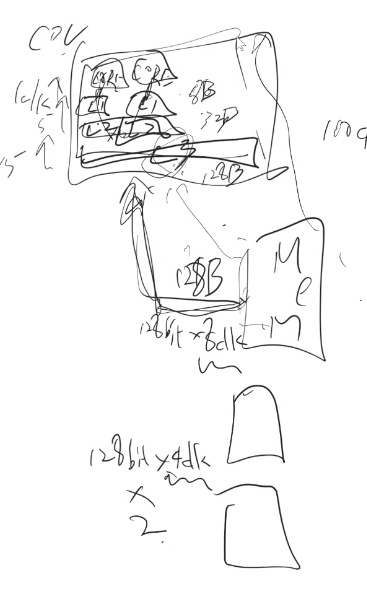

p478- 670(4.16)

1h
16:15 530
16:30 578
17:00 670

 4,6  b4.11

PC(プログラムカウンタ)を4くり上げる話
- PCに入っているのは命令のメモリアドレス 
- MIPSは全ての命令が整数同様に32bitだから、整数の時と同じように4バイト(=32bit)の倍数から始まるところに入ってる

図4.1
命令メモリ→メモリ自体というよりは、メモリアクセスをするための回路

マルチプレクサ
    入力が複数あって、どれを出力にするか
    図4.2のmux
    命令メモリの上のmux
        ジャンプするなら２段階加算した方の値を
        ジャンプしないなら4足しただけの値をPCに入れる
        どっちにするかをmuxで決めてる
        制御のところからのa==bならjumpみたいな条件を受け取ってる

regwrite
    レジスタに書き込みますか、しませんか
    レジスタに書き込まなくて良い命令がある
    regwriteが0なら書き込まない
    メモリに書き込みますよ、とかいう命令ならレジスタには書かない

    使うか使わないか、という情報を送るのは？
        半導体の中に、全ての機能をやる
        ALUには足し算引き算掛け算割り算の回路全てが入ってて、全部計算して、muxが今回は足し算の結果だけ使います、という形で使ってる
        メモリやレジスタに書き込む回路も全部やってしまうと、無駄な作業だし、必要ないもの書き込んで後に残って混乱するので、その回路は使わないで、という情報を送る必要がある。
        ALUの結果は残らないから、別にやってしまっても問題ない

RISC CISC
    Reduced instruction
        命令セットが少ないから、シンプルで色々最適化/高速化できていいよね
        CISCはRISCができてから、あれは古いcomplexなやつだよね~という悪口的に作られた単語
        intelより先に1Ghzを達成した
        結局昔のプログラムが使える、という点からx86が強いままだった
        windowsとintelの蜜月関係でシェア取れない
        RISCの良いところ取り入れて、CISCの
        MISPはインテルに喧嘩売るために作ったようなもの

遅延分岐
    - ループの次のやつも実行する
    - jumpするかどうかわからないから、次の命令実行できませんだと遅いので、次のやつやってから、jump元に戻る
    - jumpがeに依存しないなら、eを後にしてもいいよね
    
    - 現代のCPUではあまり採用されない

複数クロック
    - シングルクロック方式だと、データパスが一番長いところがボトルネックになって、一番長いパスによってCPU周波数が決まってしまう
    - 長いものは何クロックかかけてやるようにしましょうよ、というもの

OSのコンテキストスイッチの話とパイプライン
    - コンテキストスイッチは4ms　1/250秒ごと
    - 一方、パイプラインの図4.25のAにかかる時間は0.3ns(3Ghz)なので、1/30億　秒
    - パイプラインが大量に並んだものを処理して、その後コンテキストスイッチするイメージ

1clock
    - 回路の1番長いところを通るのにかかる時間
    - 図中の資格は記憶素子の集まり(フリップフロップ)
    - Aの計算を答えが出てから記憶し直すのではなく、途中結果メモするような回路にしておくと、パイプライン的にできていいよね、という話
    
    - もしやる仕事が決まってるなら、分割したほうが早くなる
        - 洗濯乾燥して、突然染み抜きが入るパターンが入る、とか、急にこれやって、とかあると、パイプラインの気持ちでやっても、理想通りのスピードにならない、むしろ余計なことして遅くなるとかもある。(途中のメモも0秒ではない)

構造ハザード
どうやって2倍速で128byte持ってくるか
メモリ二本差し
https://wa3.i-3-i.info/word15903.html

セマフォとかの話は、メモリからとってきたデータに複数のコアが同時にアクセスしないようにするもの。違う話。

4.7
五個のステージに分けて、途中結果をメモにかこう
メモをIF/IDとか呼ぼう
