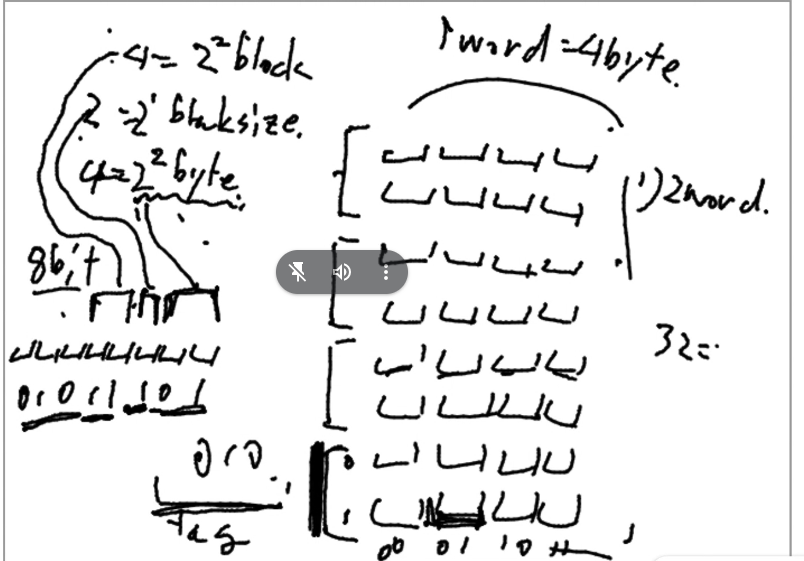
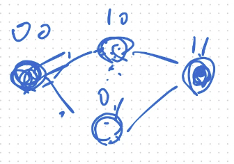
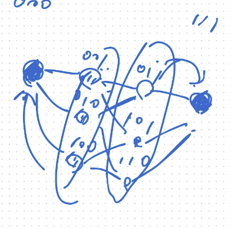
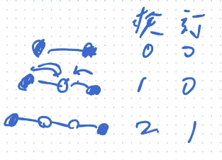
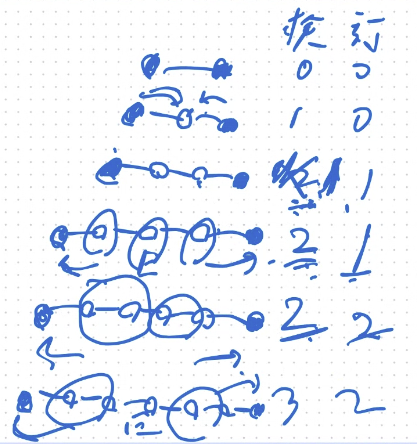

p19 - 219
5.17まで

12分時点で、5.6

5.9まで　　1トマト

5.1

Q. 根本事項
    下位レベルからデータ持ってきた時、下位レベルのものは消されるのか、そのまま下位レベルにも同じものが残るのか

    →　残る。そもそも上は32ずつ扱うが、下は64ずつ扱うとか、単位が違ったりする。下の半分持ってきたから全部消そう、とかはならない。

5.2

Q. 図5.4の直前の説明
    図5.4

DRAM
    コンデンサに電荷が入ってたら１
    電荷はちょっとずつ逃げるので、定期的に補充
    あるDRAMにアクセスするとき、行という単位でがさっと多数の周りのDRAMにもアクセスして読み取り、1だったら補充する、という動きをする

シンクロナスDRAM

Q. タグを無視する必要がある．
    →何もタグ書き込んでなくても初期値の00とかが入ってしまっている、ということ？　nullみたいなことがないから、無視する？

    →0か1かなんらかのものは回路図的に入ってしまっているので、有効じゃないなら無視する必要がある

n = 2だと
キャッシュ容量が2^2 = 4

m = 3
ブロックサイズが8語
MIPSだと1語は32ビット　＝４バイト
→8語は、32バイト　2^m+2バイト

メモリアドレスの下2けた

32箇所入れとくかしょがあるので、
ブロックサイズが大きいと、missした時に、大きいデータとってこないといけないくて時間かかる。
一方、ミス率が下がる、というメリットもある。

tagが被ることはない

32 - (m+n+2) だけtagに使う
一番下のブロックにくる可能性のあるデータのパターンの数、3bitで表せる通りの数と同じ
画面に映ってたキャッシュの大きさが32箱分(2^m+n+2)
全メモリ空間は2^32だから、均等に分けたとすると、32 - (m+n+2)パターンに対応しなきゃ。→それをtagでなんとかするにはtagがそんだけパターン必要。

CPUが複数の場合
メモリ読みにいったが、実は最新なのは別のCPUのキャッシュだった、とか複雑なことが起きる
キャッシュとメモリは同一なのか、
CPUが他のCPUにみんな持ってる？って聞くと遅くなる
このメモリ書いたよってブロードキャストする
キャッシュにあるやつに、書いたよって連絡が来たら消す作業をする
MESIプロトコル

フルアソシアティブ
    チェックするところが増える
    かかる時間は線形には増えない
    同時にチェックできる
    回路のサイズは増えちゃうけども。
    さっきのは11だったら一番下のブロックにあると決まってたが、この方式だと決まってないので、そこもチェックする必要がある

ハミング距離が2以上のデータだけ使うことにすれば、1bitずれたときにバグってることに気づける

3以上にすると、化けたとしても、元が何だったかわかる
→1bit誤りを、検出、訂正可能

2bitずれたとしても、あやまりがあることはわかる
右から2個目のデータが来た時、右から1bitずれたのか、左から2bitずれたのかはわからないが、まぁ、2bitずれることなんてないだろ、と信じて右側の方に訂正する。

