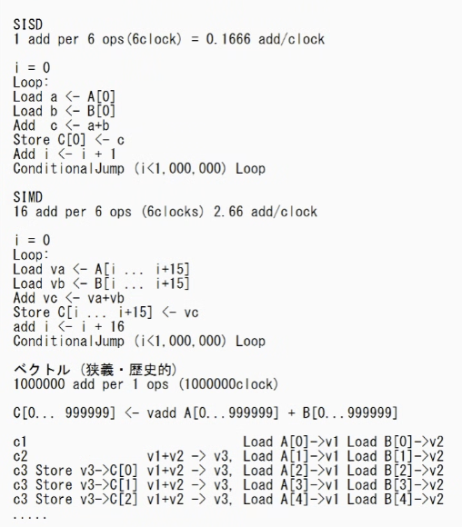

6.1 ~ 6.20 p426

2h で 10
1h で　10

1章あたり6分

18:30 に　６章
19:00 に12章

強いスケーリング
    プロセッサを2倍強くするが、メモリはそのまま
弱いスケーリング
    プロセッサを2倍強くする時、メモリも2倍

6.3

MISD
    一つのファイルに対して、パスワード解析１、パスワード解析2...をやる? そもそも世の中にあまりない。

ベクトル対スカラ
    いつでもベクトルの方が良さそうだが、、
    ベクトルの長さが一定であることが多い8とか16とか
    8個に対して全部同じ処理するならベクトルで良いが
    1個に対してしか処理しないなら、メモリバンド幅とかCPUとか、どこかが無駄になっている

補足：　大きな利点があるにもかかわらず，高性能コンピュータ以外の分野でベクトル方式があまり普及しないのは，なぜだろうか．従来，ベクトル・レジスタのサイズが大きくなると，コンテキスト・スイッチ時間が長くなり，ベクトルのロードまたはストア時のページ・フォールト処理が難しくなる，という懸念があった．またSIMD命令によって，ベクトル命令の利点の一部は実現できていた．それに加えて，命令レベル並列性の進歩により，Mooreの法則に基づいて期待される性能の向上が実現される限り，あえてアーキテクチャのスタイルを変更する理由はほとんどない．

David Patterson; John Hennessy. コンピュータの構成と設計　MIPS Edition　第6版　下 (p.293). 日経BP. Kindle 版. 

SIMD命令　＝　ベクトル命令
A + B = Cみたいなベクトルのまま計算　numpyみたいな
32個足し算できる場所(ALU)があって、同時に足し算できる

むかーしは、SIMDとベクトルは違うものだった。

6.4
図6.5
- 

6.5
今のCPUは基本NUMA型

6.6

6.7
TPUはDNNに特化してつくっているのに、皆TPUではなくNVIDIAのGPUを買っているのはなぜか

DNN以外のDSAの例：GRAPE(天体のシミュレーション)

MapReduce

- チャンクに分けて対応できるので、どれかコンピュータが壊れても、そこだけやり直せばよく、ペナルティが小さい
- 超長いドキュメント単語の出現回数を数えたい
    - 500分割して、Map (cat, 1)
    - 同じキーのものが同じreducerインスタンスに集まるようにする
    - Reducerが(cat, 2)だね、2回出てきたよ、と数える
- こまめにセーブするという方法もあるが、　毎回セーブの処理とか考えるの大変
    - チェックポイント(どこでセーブするのか)とか考えるのも管理するのも大変
- MapReduceなら、ブロックのサイズが決まってる　xx ~ yyの範囲
    - Map と　reduceだけ書けば、よしなにやってくれる
- map同士が通信すると、mapが途中で死んだ時ややこしくなるから、相違事はしない
- スパコンでやってる分子の動きのシミュレーションは、分割した空間同士の相互作用があるのでMap reduceではできない

分岐予測
キャッシュ使わないと遅い

このプログラム早いんだっけ、って時間測る時に中身分かってないと辛い
1回目だとキャッシュ乗ってないから遅い
何回もやるとばらつきでるが、それはなんでだっけ、とか

来週データ志向アプリケーションデザイン1.2章