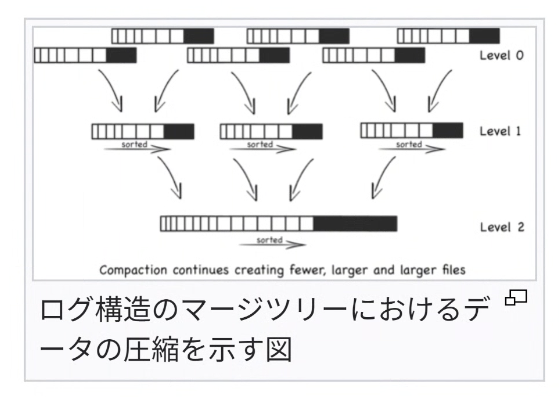
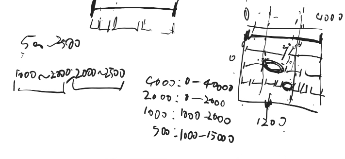

3.4章

p73
ストレージエンジン、MySQLならInnoDB一択？他のエンジン使ったりする？
基本、InnoDB
データベースにそんな機能求めるようになってしまったのはなんでだっけ、を先に考えたい
本文的には、MySQLつかうのかredis使うのか、みたいな話

csvは面倒
カンマとかダブルクォーテーションが入ったとき面倒
パースや書き込みは自力でやらず、ライブラリで
カンマで切れ目を示さずとも、他の方法で切れ目示す方法あるよね、というだけの話

p80
大量のランダムアクセスが必要になる件
- ハッシュが衝突すると、何回もディスク見に行かないといけなくなる

p84
3.1.2.3 パフォーマンスの最適化
サイズごと・階層ごと

- url: 再生回数　の項目が4つ入った集まったファイルがある
- サイズごと
    - 4つ集まったら、一つに統合
- 階層ごと
    - 一回マージしたものがn個貯まったら、2段階目のマージをやる

LSM
 SSTableがどんどんできてくので、マージしていく

p84
アルファベット順だから〜
SStableが複数あるから、それぞれのSSTableを見ないといけない
適宜マージするけども、大体2個以上は

変更があったら、基本メモリの中で変更を適用をしていく
メモリに持てなくなったら、SStableとしてダンブするイメージ

p86
バランスが保たれる、図3-7
元々一段めにあったセパレータの数字は3つ
セパレータより右側にはセパレータより大きい数字たちが、左側には小さい数字たちが。
2段目には5個しか数字入らないところに5こ入ってる状態で、一個追加したから、6個に。
6個にするには3/3で半分ずつ保存するしかない
6この数字のセパレータとして、真ん中の337を一段上に上げて、337以上/未満みたいにセパレータとしてる使う。
このように上のだんの予備スペースはだんだんなくなっていく。
予備スペース無くなったら、0段目みたいなイメージで、完全空っぽのものを足す。

p89
pページ全体を書かなければならない理由

完全に書き込んだか、全く書いてないか、にしたい。
ページの一部を書き換えたものを別の場所(新)に用意して、その後参照先を変える　or 別の場所(新)のところを見ながらそれと同じ内容を元のところに書き込む

p92
データをindexごとに保存しておくのではなく、ヒープファイルという一箇所にまとめて保存しておいた方が、更新するときの管理とか楽だよね、という話。
PKのインデックス内に保存してしまって、セカンダリインデックス以降は参照だけ保存、という方法もある

ある地点の近隣を調べたい
ヒルベルト曲線で区切った空間の端っこの時どうするのか
→周りのいくつかの区画を検索する
アメリカなら10km以内の飲食店で嬉しいけど、東京でそれやると遠すぎ、みたいなヒューリスティックがたくさん入ってる

1200円のアイテムが所持してるインデックスが、右の列
1000~2500で検索すると、範囲で検索せずとも、特定のインデックス持ってるやつだけ探す、とかで済むようになる
左の方の数字は、レンジに対して、どのインデックスで検索すれば良いかの判定
レンジスキャンまともに動かな異様なデータ量の時は、こういうこと考える

曖昧インデックス
- ダイヤモンドとダイアモンドは両方indexにはせず、片方だけ保存
- ユーザーの検索時に、ヤorアみたいな感じで検索する
- たくさんあるデータから探したい、というものなので、曖昧にindex振ってもっと増やすのは筋がわるい
- 検索するときに検索条件をうまい感じに変える

p98
ETLって具体的に何やってるのか
- バラバラなDBに対してクエリ投げるのは大変なので、一箇所にまとめたい
- 大体単純なコピーだけど、考えることは多い。1日一回でいいのか、セミリアルタイムなのかなどなど
- このユーザーはデータ分析に同意してる同意してない
